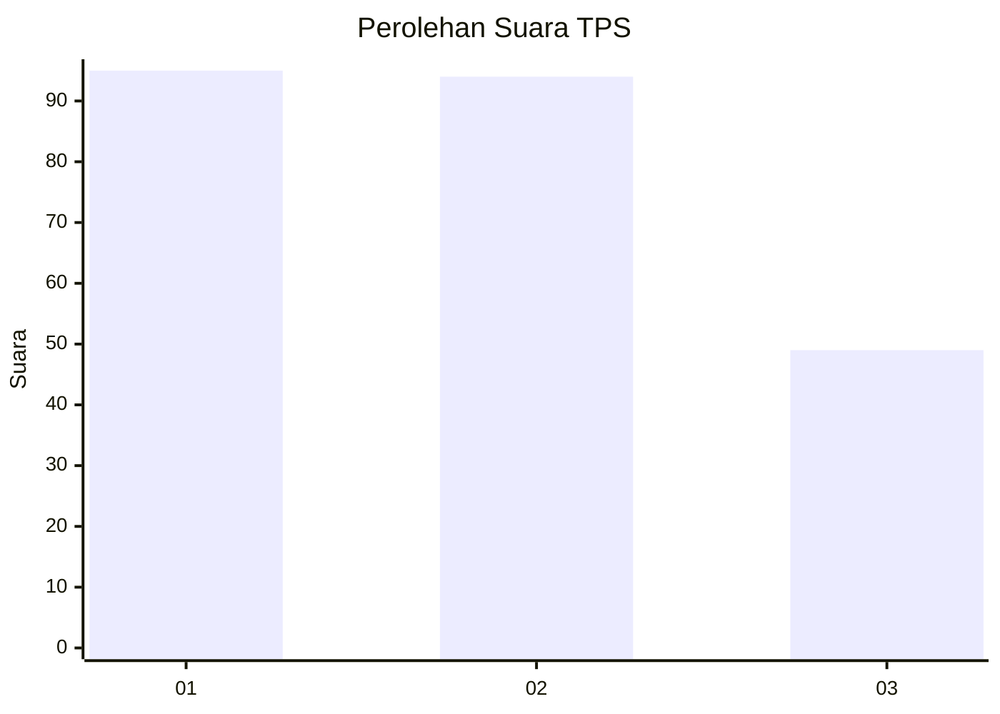
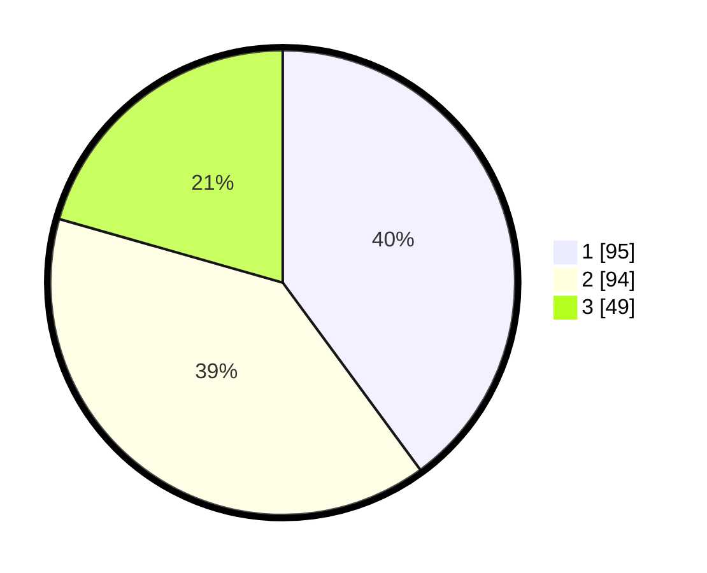

# Hasil

## Grafik

## Tabel

| No. | Nama Paslon    | Suara | Suara (raw) | Persentase |
|:--- |:-------------- | -----:| -----------:| ----------:|
| 1   | ANIES MUHAIMIN | 95    | [95][p-1]   | 39,92      |
| 2   | PRABOWO GIBRAN | 94    | [94][p-2]   | 39,50      |
| 3   | GANJAR MAHFUD  | 49    | [49][p-3]   | 20,59      |

[p-1]: https://github.com/gigit-pemilu/pemilu-2024-35-jawa-timur/blob/main/pilpres/hitung-suara/sub/35-jawa-timur/sub/78-kota-surabaya/sub/23-jambangan/sub/1002-karah/sub/032-tps/sub/paslon-1.txt
[p-2]: https://github.com/gigit-pemilu/pemilu-2024-35-jawa-timur/blob/main/pilpres/hitung-suara/sub/35-jawa-timur/sub/78-kota-surabaya/sub/23-jambangan/sub/1002-karah/sub/032-tps/sub/paslon-2.txt
[p-3]: https://github.com/gigit-pemilu/pemilu-2024-35-jawa-timur/blob/main/pilpres/hitung-suara/sub/35-jawa-timur/sub/78-kota-surabaya/sub/23-jambangan/sub/1002-karah/sub/032-tps/sub/paslon-3.txt

## Foto C Plano

https://sirekap-obj-formc.kpu.go.id/0968/pemilu/ppwp/35/78/23/10/02/3578231002032-20240215-001449--fa9b79ae-6c40-4d4a-8b94-e1fc1329413d.jpg

https://sirekap-obj-formc.kpu.go.id/0968/pemilu/ppwp/35/78/23/10/02/3578231002032-20240215-001629--73961853-cd97-4e3a-bc25-cb76a26e9b3f.jpg

https://sirekap-obj-formc.kpu.go.id/0968/pemilu/ppwp/35/78/23/10/02/3578231002032-20240215-001724--3762f0ad-f0f5-426b-8276-bd44ec962396.jpg

## Metadata

| Key        | Value               |
| ---------- | ------------------- |
| Time Stamp | 2024-02-24 22:31:28 |

