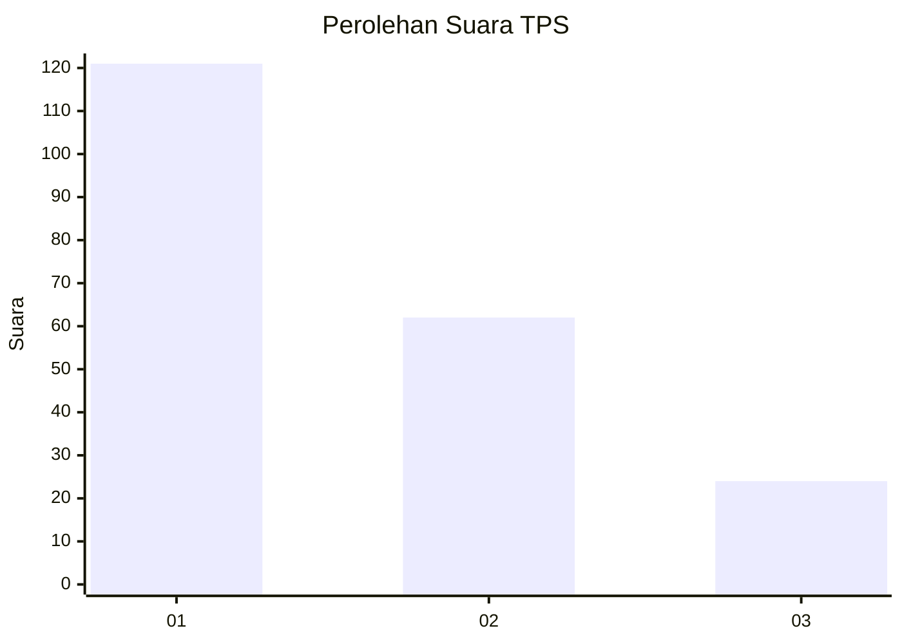
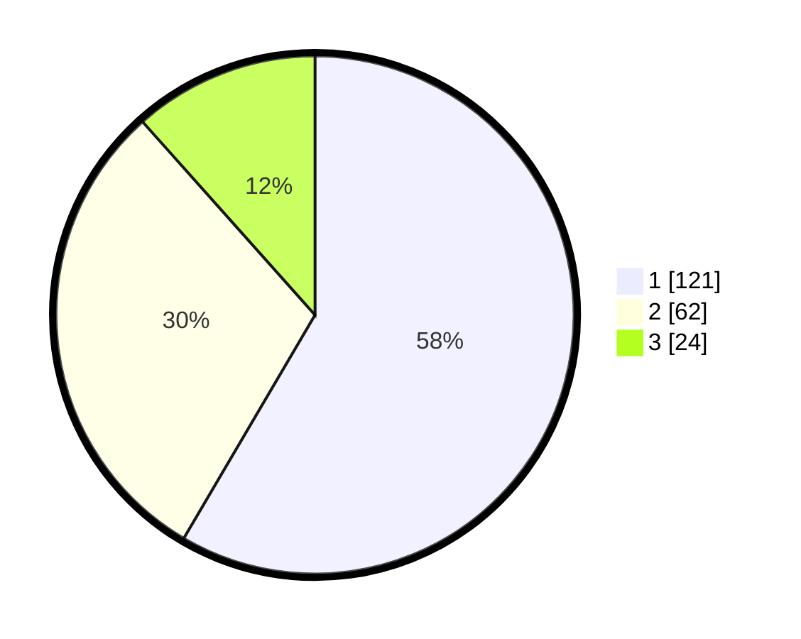

# Hasil

## Grafik

## Tabel

| No. | Nama Paslon    | Suara | Suara (raw) | Persentase |
|:--- |:-------------- | -----:| -----------:| ----------:|
| 1   | ANIES MUHAIMIN | 121   | [121][p-1]  | 58,45      |
| 2   | PRABOWO GIBRAN | 62    | [62][p-2]   | 29,95      |
| 3   | GANJAR MAHFUD  | 24    | [24][p-3]   | 11,59      |

[p-1]: https://github.com/gigit-pemilu/pemilu-2024/blob/main/pilpres/hitung-suara/sub/35-jawa-timur/sub/78-kota-surabaya/sub/23-jambangan/sub/1002-karah/sub/035-tps/sub/paslon-1.txt
[p-2]: https://github.com/gigit-pemilu/pemilu-2024/blob/main/pilpres/hitung-suara/sub/35-jawa-timur/sub/78-kota-surabaya/sub/23-jambangan/sub/1002-karah/sub/035-tps/sub/paslon-2.txt
[p-3]: https://github.com/gigit-pemilu/pemilu-2024/blob/main/pilpres/hitung-suara/sub/35-jawa-timur/sub/78-kota-surabaya/sub/23-jambangan/sub/1002-karah/sub/035-tps/sub/paslon-3.txt

## Foto C Plano

https://sirekap-obj-formc.kpu.go.id/4076/pemilu/ppwp/35/78/23/10/02/3578231002035-20240214-155054--8df771a1-864e-4a31-be7f-54b49162ba95.jpg

https://sirekap-obj-formc.kpu.go.id/4076/pemilu/ppwp/35/78/23/10/02/3578231002035-20240214-155137--5b5f458b-996a-4517-a7d3-ed66832a072d.jpg

https://sirekap-obj-formc.kpu.go.id/4076/pemilu/ppwp/35/78/23/10/02/3578231002035-20240215-024818--377489c8-0849-407f-8a24-3ed8798eea59.jpg

## Metadata

| Key        | Value               |
| ---------- | ------------------- |
| Time Stamp | 2024-02-25 17:00:00 |

