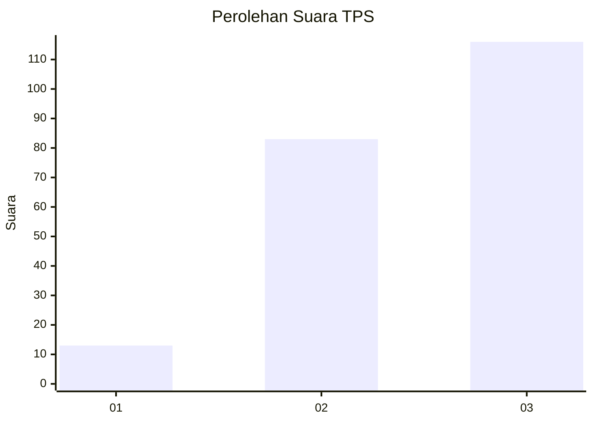
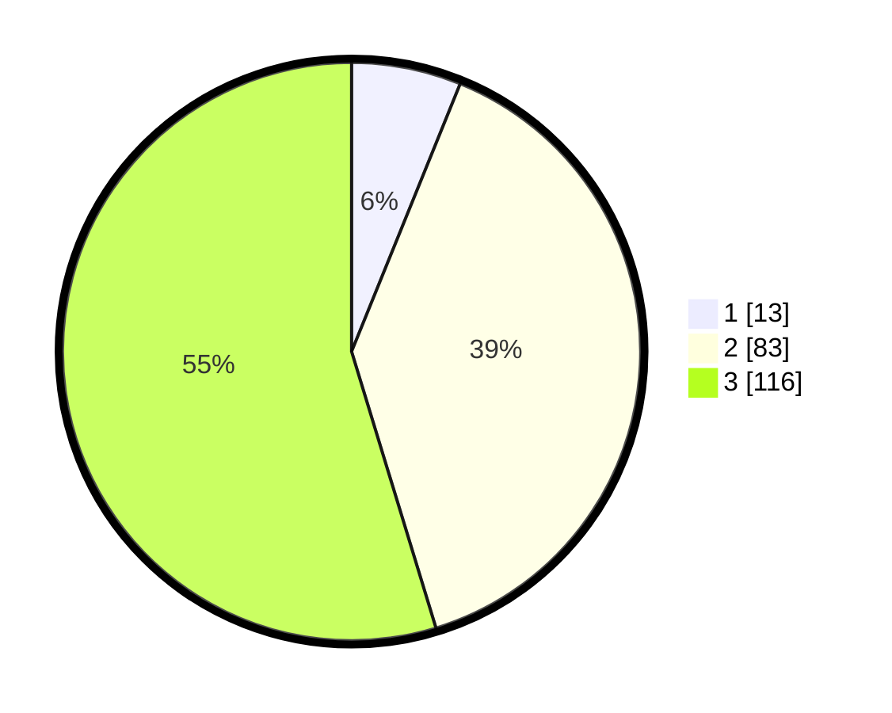

# Hasil

## Grafik

## Tabel

| No. | Nama Paslon    | Suara | Suara (raw) | Persentase |
|:--- |:-------------- | -----:| -----------:| ----------:|
| 1   | ANIES MUHAIMIN | 13    | [13][p-1]   | 6,13       |
| 2   | PRABOWO GIBRAN | 83    | [83][p-2]   | 39,15      |
| 3   | GANJAR MAHFUD  | 116   | [116][p-3]  | 54,72      |

[p-1]: https://github.com/gigit-pemilu/pemilu-2024/blob/main/pilpres/hitung-suara/sub/35-jawa-timur/sub/78-kota-surabaya/sub/24-tenggilis-mejoyo/sub/1001-kutisari/sub/038-tps/sub/paslon-1.txt
[p-2]: https://github.com/gigit-pemilu/pemilu-2024/blob/main/pilpres/hitung-suara/sub/35-jawa-timur/sub/78-kota-surabaya/sub/24-tenggilis-mejoyo/sub/1001-kutisari/sub/038-tps/sub/paslon-2.txt
[p-3]: https://github.com/gigit-pemilu/pemilu-2024/blob/main/pilpres/hitung-suara/sub/35-jawa-timur/sub/78-kota-surabaya/sub/24-tenggilis-mejoyo/sub/1001-kutisari/sub/038-tps/sub/paslon-3.txt

## Foto C Plano

https://sirekap-obj-formc.kpu.go.id/589e/pemilu/ppwp/35/78/24/10/01/3578241001038-20240214-212427--c1875b60-5844-4ab1-bdb9-0582cef44905.jpg

https://sirekap-obj-formc.kpu.go.id/589e/pemilu/ppwp/35/78/24/10/01/3578241001038-20240214-200150--f3f06c12-02e6-42b6-bdd2-29851e8b96fe.jpg

https://sirekap-obj-formc.kpu.go.id/589e/pemilu/ppwp/35/78/24/10/01/3578241001038-20240214-200304--d1a6dbd3-ed9b-4ada-9ad6-0dcacccb6eb5.jpg

## Metadata

| Key        | Value               |
| ---------- | ------------------- |
| Time Stamp | 2024-02-25 16:00:00 |

