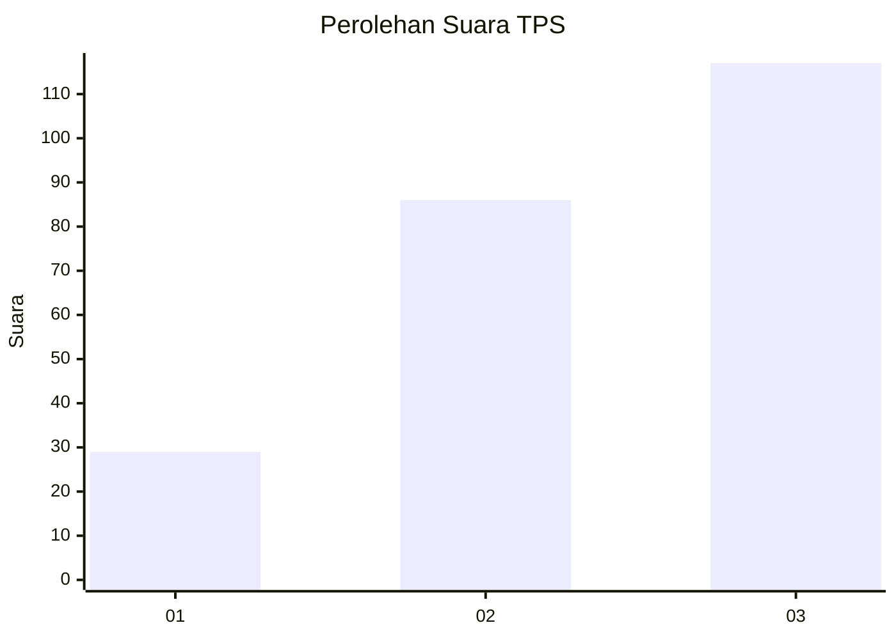
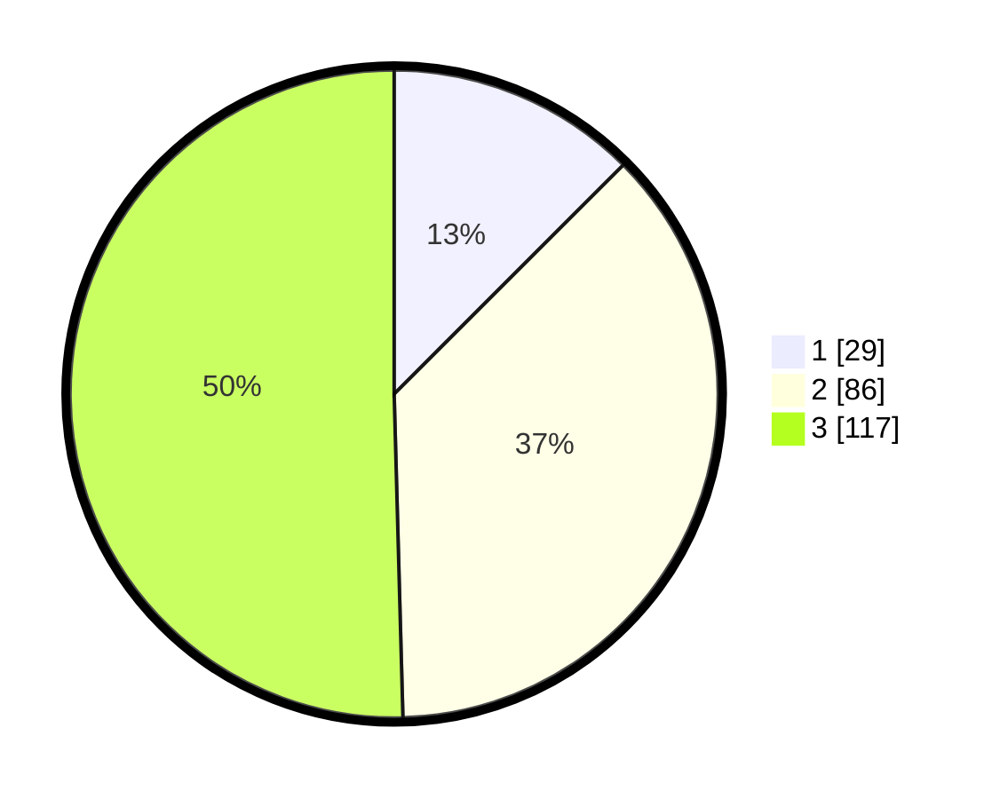

# Hasil

## Grafik

## Tabel

| No. | Nama Paslon    | Suara | Suara (raw) | Persentase |
|:--- |:-------------- | -----:| -----------:| ----------:|
| 1   | ANIES MUHAIMIN | 29    | [29][p-1]   | 12,50      |
| 2   | PRABOWO GIBRAN | 86    | [86][p-2]   | 37,07      |
| 3   | GANJAR MAHFUD  | 117   | [117][p-3]  | 50,43      |

[p-1]: https://github.com/gigit-pemilu/pemilu-2024/blob/main/pilpres/hitung-suara/sub/35-jawa-timur/sub/78-kota-surabaya/sub/24-tenggilis-mejoyo/sub/1001-kutisari/sub/040-tps/sub/paslon-1.txt
[p-2]: https://github.com/gigit-pemilu/pemilu-2024/blob/main/pilpres/hitung-suara/sub/35-jawa-timur/sub/78-kota-surabaya/sub/24-tenggilis-mejoyo/sub/1001-kutisari/sub/040-tps/sub/paslon-2.txt
[p-3]: https://github.com/gigit-pemilu/pemilu-2024/blob/main/pilpres/hitung-suara/sub/35-jawa-timur/sub/78-kota-surabaya/sub/24-tenggilis-mejoyo/sub/1001-kutisari/sub/040-tps/sub/paslon-3.txt

## Foto C Plano

https://sirekap-obj-formc.kpu.go.id/2122/pemilu/ppwp/35/78/24/10/01/3578241001040-20240215-041824--31172aa2-48f0-4bc3-9702-e5800faa1ccd.jpg

https://sirekap-obj-formc.kpu.go.id/2122/pemilu/ppwp/35/78/24/10/01/3578241001040-20240215-041857--44d3419c-0976-412a-a3b0-30062951338e.jpg

https://sirekap-obj-formc.kpu.go.id/2122/pemilu/ppwp/35/78/24/10/01/3578241001040-20240215-041927--6c39e244-2f1f-4682-997d-10beffac337d.jpg

## Metadata

| Key        | Value               |
| ---------- | ------------------- |
| Time Stamp | 2024-03-01 22:00:00 |

