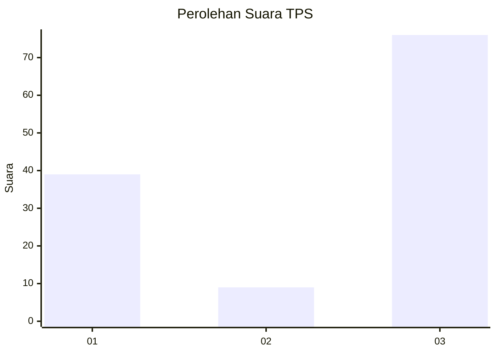
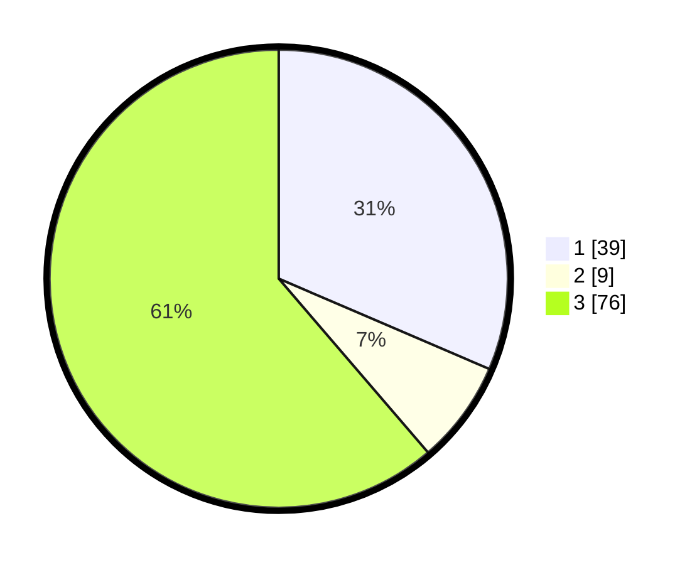

# Hasil

## Grafik

## Tabel

| No. | Nama Paslon    | Suara | Suara (raw) | Persentase |
|:--- |:-------------- | -----:| -----------:| ----------:|
| 1   | ANIES MUHAIMIN | 39    | [39][p-1]   | 31,45      |
| 2   | PRABOWO GIBRAN | 9     | [9][p-2]    | 7,26       |
| 3   | GANJAR MAHFUD  | 76    | [76][p-3]   | 61,29      |

[p-1]: https://github.com/gigit-pemilu/pemilu-2024-35-jawa-timur/blob/main/pilpres/hitung-suara/sub/35-jawa-timur/sub/78-kota-surabaya/sub/24-tenggilis-mejoyo/sub/1001-kutisari/sub/042-tps/sub/paslon-1.txt
[p-2]: https://github.com/gigit-pemilu/pemilu-2024-35-jawa-timur/blob/main/pilpres/hitung-suara/sub/35-jawa-timur/sub/78-kota-surabaya/sub/24-tenggilis-mejoyo/sub/1001-kutisari/sub/042-tps/sub/paslon-2.txt
[p-3]: https://github.com/gigit-pemilu/pemilu-2024-35-jawa-timur/blob/main/pilpres/hitung-suara/sub/35-jawa-timur/sub/78-kota-surabaya/sub/24-tenggilis-mejoyo/sub/1001-kutisari/sub/042-tps/sub/paslon-3.txt

## Foto C Plano

https://sirekap-obj-formc.kpu.go.id/2222/pemilu/ppwp/35/78/24/10/01/3578241001042-20240219-144424--af1d8e9a-ce7b-41ba-94a8-8b6abfd15d16.jpg

https://sirekap-obj-formc.kpu.go.id/2222/pemilu/ppwp/35/78/24/10/01/3578241001042-20240219-144501--00c37f9e-83e4-41e1-b335-c56850d565be.jpg

https://sirekap-obj-formc.kpu.go.id/2222/pemilu/ppwp/35/78/24/10/01/3578241001042-20240219-144556--d3afab66-d1ff-4a22-832b-e555a766cc4a.jpg

## Metadata

| Key        | Value               |
| ---------- | ------------------- |
| Time Stamp | 2024-02-25 12:00:00 |

