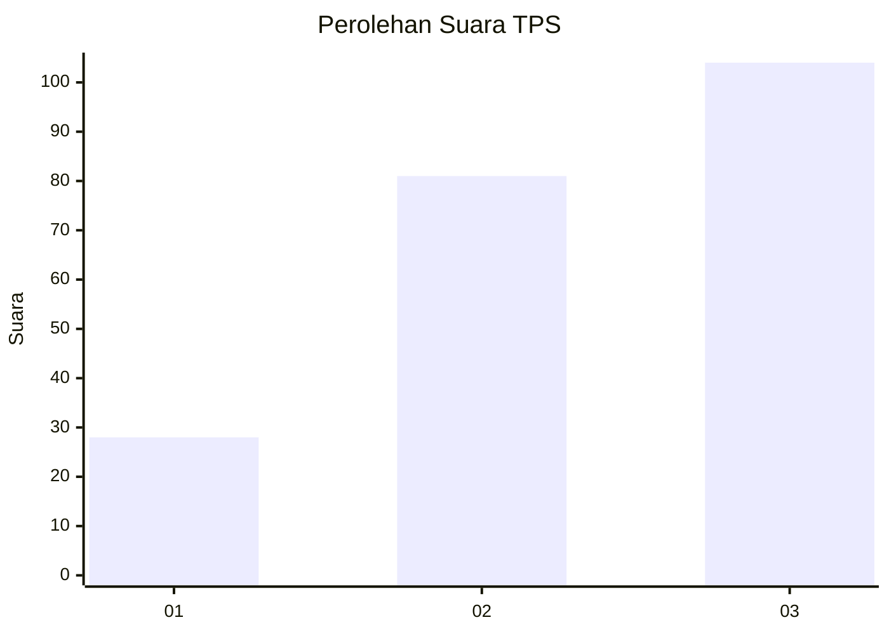
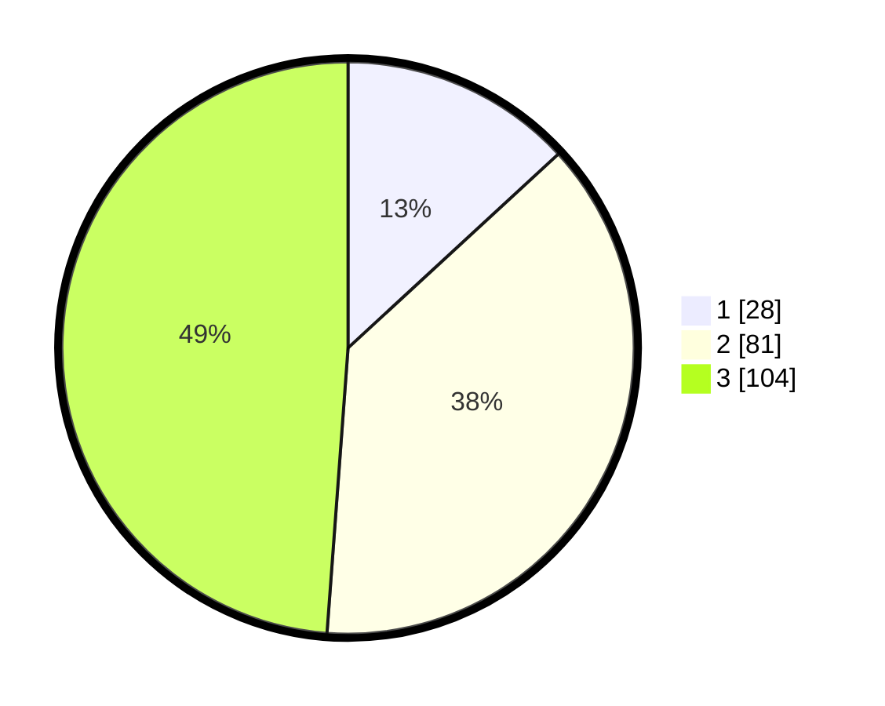

# Hasil

## Grafik

## Tabel

| No. | Nama Paslon    | Suara | Suara (raw) | Persentase |
|:--- |:-------------- | -----:| -----------:| ----------:|
| 1   | ANIES MUHAIMIN | 28    | [28][p-1]   | 13,15      |
| 2   | PRABOWO GIBRAN | 81    | [81][p-2]   | 38,03      |
| 3   | GANJAR MAHFUD  | 104   | [104][p-3]  | 48,83      |

[p-1]: https://github.com/gigit-pemilu/pemilu-2024-35-jawa-timur/blob/main/pilpres/hitung-suara/sub/35-jawa-timur/sub/78-kota-surabaya/sub/24-tenggilis-mejoyo/sub/1001-kutisari/sub/047-tps/sub/paslon-1.txt
[p-2]: https://github.com/gigit-pemilu/pemilu-2024-35-jawa-timur/blob/main/pilpres/hitung-suara/sub/35-jawa-timur/sub/78-kota-surabaya/sub/24-tenggilis-mejoyo/sub/1001-kutisari/sub/047-tps/sub/paslon-2.txt
[p-3]: https://github.com/gigit-pemilu/pemilu-2024-35-jawa-timur/blob/main/pilpres/hitung-suara/sub/35-jawa-timur/sub/78-kota-surabaya/sub/24-tenggilis-mejoyo/sub/1001-kutisari/sub/047-tps/sub/paslon-3.txt

## Foto C Plano

https://sirekap-obj-formc.kpu.go.id/15ac/pemilu/ppwp/35/78/24/10/01/3578241001047-20240219-143235--154cf2ec-a13e-4165-8861-f918772791c6.jpg

https://sirekap-obj-formc.kpu.go.id/15ac/pemilu/ppwp/35/78/24/10/01/3578241001047-20240219-143321--759a0308-3847-49da-8199-cf171e14a6d9.jpg

https://sirekap-obj-formc.kpu.go.id/15ac/pemilu/ppwp/35/78/24/10/01/3578241001047-20240219-143412--f8a3c617-3af0-45ba-a8dd-8cfa292e2c02.jpg

## Metadata

| Key        | Value               |
| ---------- | ------------------- |
| Time Stamp | 2024-02-25 16:00:00 |

