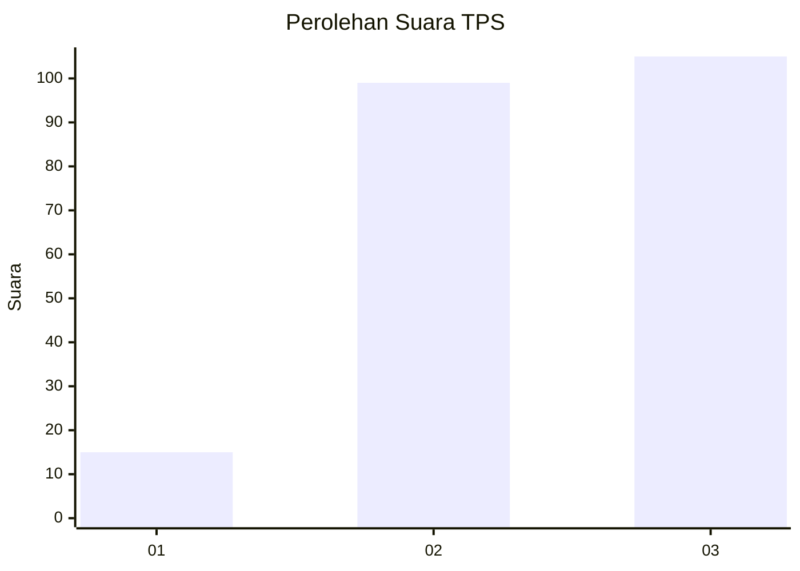
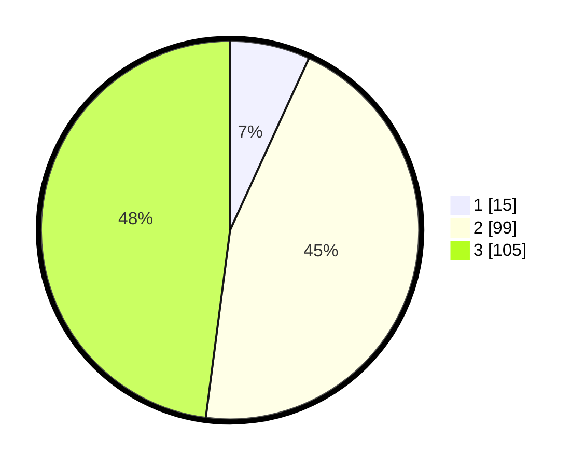

# Hasil

## Grafik

## Tabel

| No. | Nama Paslon    | Suara | Suara (raw) | Persentase |
|:--- |:-------------- | -----:| -----------:| ----------:|
| 1   | ANIES MUHAIMIN | 15    | [15][p-1]   | 6,85       |
| 2   | PRABOWO GIBRAN | 99    | [99][p-2]   | 45,21      |
| 3   | GANJAR MAHFUD  | 105   | [105][p-3]  | 47,95      |

[p-1]: https://github.com/gigit-pemilu/pemilu-2024-35-jawa-timur/blob/main/pilpres/hitung-suara/sub/35-jawa-timur/sub/78-kota-surabaya/sub/24-tenggilis-mejoyo/sub/1001-kutisari/sub/050-tps/sub/paslon-1.txt
[p-2]: https://github.com/gigit-pemilu/pemilu-2024-35-jawa-timur/blob/main/pilpres/hitung-suara/sub/35-jawa-timur/sub/78-kota-surabaya/sub/24-tenggilis-mejoyo/sub/1001-kutisari/sub/050-tps/sub/paslon-2.txt
[p-3]: https://github.com/gigit-pemilu/pemilu-2024-35-jawa-timur/blob/main/pilpres/hitung-suara/sub/35-jawa-timur/sub/78-kota-surabaya/sub/24-tenggilis-mejoyo/sub/1001-kutisari/sub/050-tps/sub/paslon-3.txt

## Foto C Plano

https://sirekap-obj-formc.kpu.go.id/373b/pemilu/ppwp/35/78/24/10/01/3578241001050-20240219-150151--11c4c794-6251-4de3-a707-bdb282058df5.jpg

https://sirekap-obj-formc.kpu.go.id/373b/pemilu/ppwp/35/78/24/10/01/3578241001050-20240214-235118--bb45805a-761c-4372-ad08-66d5217a77ba.jpg

https://sirekap-obj-formc.kpu.go.id/373b/pemilu/ppwp/35/78/24/10/01/3578241001050-20240214-235125--3f9f4900-e884-448f-b3e2-10a930e4ea39.jpg

## Metadata

| Key        | Value               |
| ---------- | ------------------- |
| Time Stamp | 2024-02-24 22:31:28 |

