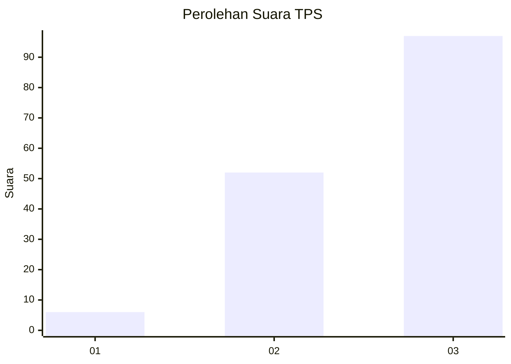
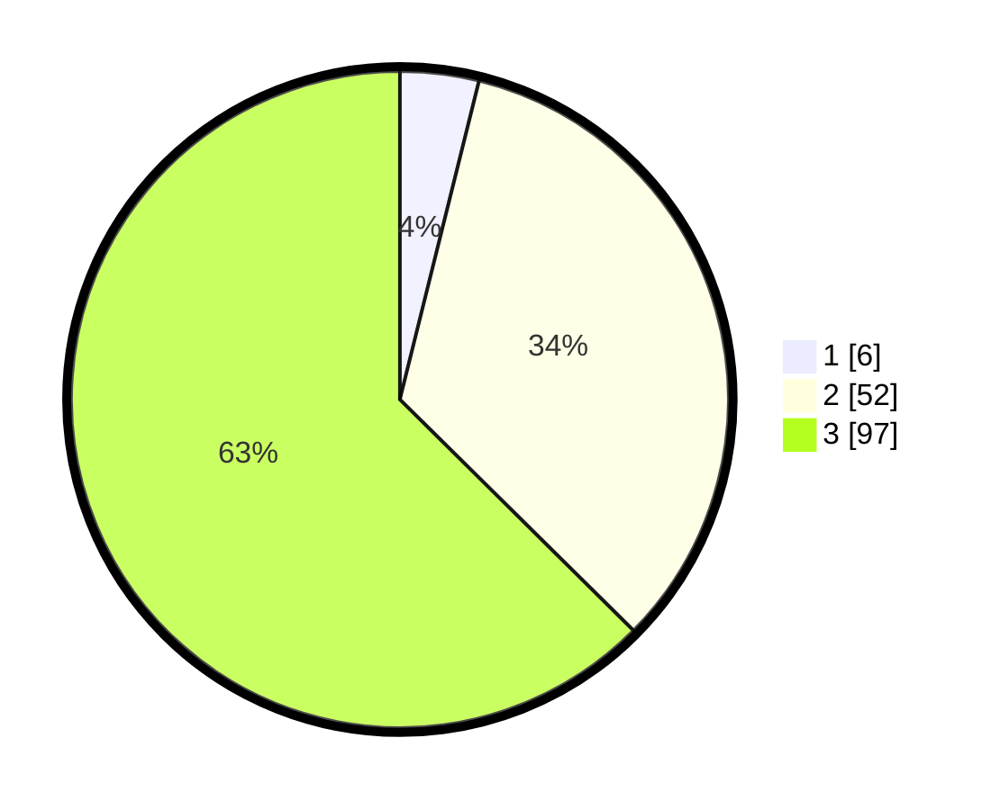

# Hasil

## Grafik

## Tabel

| No. | Nama Paslon    | Suara | Suara (raw) | Persentase |
|:--- |:-------------- | -----:| -----------:| ----------:|
| 1   | ANIES MUHAIMIN | 6     | [6][p-1]    | 3,87       |
| 2   | PRABOWO GIBRAN | 52    | [52][p-2]   | 33,55      |
| 3   | GANJAR MAHFUD  | 97    | [97][p-3]   | 62,58      |

[p-1]: https://github.com/gigit-pemilu/pemilu-2024/blob/main/pilpres/hitung-suara/sub/35-jawa-timur/sub/78-kota-surabaya/sub/26-mulyorejo/sub/1002-manyar-sabrangan/sub/033-tps/sub/paslon-1.txt
[p-2]: https://github.com/gigit-pemilu/pemilu-2024/blob/main/pilpres/hitung-suara/sub/35-jawa-timur/sub/78-kota-surabaya/sub/26-mulyorejo/sub/1002-manyar-sabrangan/sub/033-tps/sub/paslon-2.txt
[p-3]: https://github.com/gigit-pemilu/pemilu-2024/blob/main/pilpres/hitung-suara/sub/35-jawa-timur/sub/78-kota-surabaya/sub/26-mulyorejo/sub/1002-manyar-sabrangan/sub/033-tps/sub/paslon-3.txt

## Foto C Plano

https://sirekap-obj-formc.kpu.go.id/3b29/pemilu/ppwp/35/78/26/10/02/3578261002033-20240214-201812--e6d25e76-d4aa-43f3-ba19-21f37f92f108.jpg

https://sirekap-obj-formc.kpu.go.id/3b29/pemilu/ppwp/35/78/26/10/02/3578261002033-20240214-201906--c8bef943-12ac-4087-9391-62c08ef61414.jpg

https://sirekap-obj-formc.kpu.go.id/3b29/pemilu/ppwp/35/78/26/10/02/3578261002033-20240214-201943--a6880bce-80ec-4ca2-ac1a-aa84c605dfd9.jpg

## Metadata

| Key        | Value               |
| ---------- | ------------------- |
| Time Stamp | 2024-02-25 16:00:00 |

