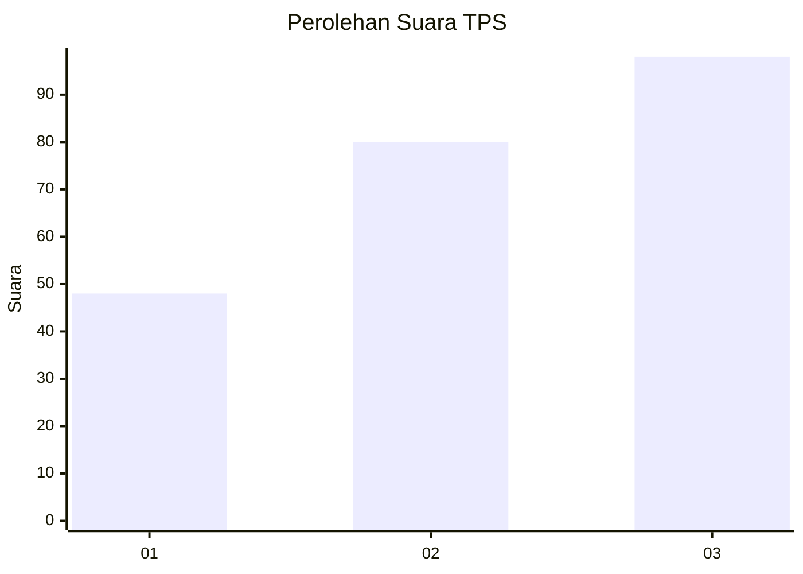
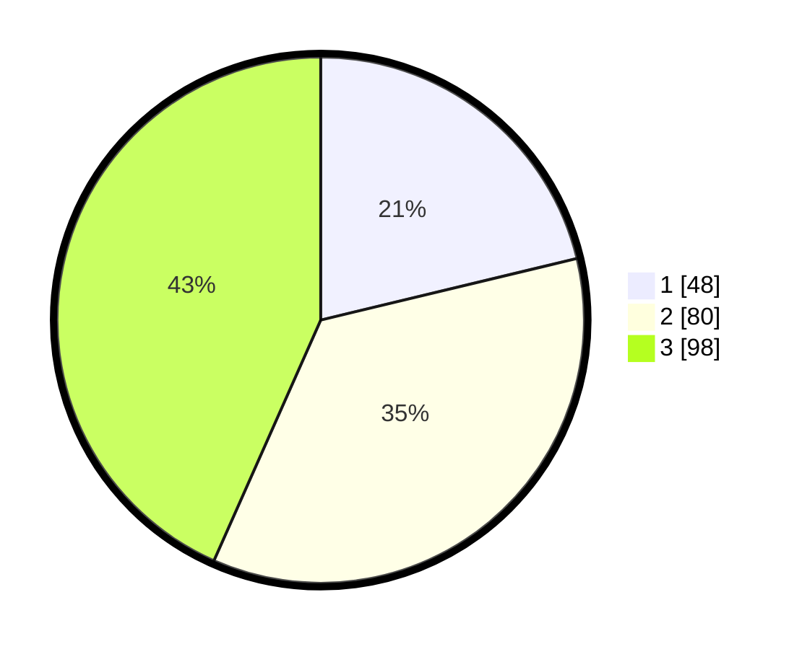

# Hasil

## Grafik

## Tabel

| No. | Nama Paslon    | Suara | Suara (raw) | Persentase |
|:--- |:-------------- | -----:| -----------:| ----------:|
| 1   | ANIES MUHAIMIN | 48    | [48][p-1]   | 21,24      |
| 2   | PRABOWO GIBRAN | 80    | [80][p-2]   | 35,40      |
| 3   | GANJAR MAHFUD  | 98    | [98][p-3]   | 43,36      |

[p-1]: https://github.com/gigit-pemilu/pemilu-2024-35-jawa-timur/blob/main/pilpres/hitung-suara/sub/35-jawa-timur/sub/78-kota-surabaya/sub/26-mulyorejo/sub/1004-kalisari/sub/002-tps/sub/paslon-1.txt
[p-2]: https://github.com/gigit-pemilu/pemilu-2024-35-jawa-timur/blob/main/pilpres/hitung-suara/sub/35-jawa-timur/sub/78-kota-surabaya/sub/26-mulyorejo/sub/1004-kalisari/sub/002-tps/sub/paslon-2.txt
[p-3]: https://github.com/gigit-pemilu/pemilu-2024-35-jawa-timur/blob/main/pilpres/hitung-suara/sub/35-jawa-timur/sub/78-kota-surabaya/sub/26-mulyorejo/sub/1004-kalisari/sub/002-tps/sub/paslon-3.txt

## Foto C Plano

https://sirekap-obj-formc.kpu.go.id/6952/pemilu/ppwp/35/78/26/10/04/3578261004002-20240214-220846--2310d30b-5f42-424f-9db3-cfe5b48a8073.jpg

https://sirekap-obj-formc.kpu.go.id/6952/pemilu/ppwp/35/78/26/10/04/3578261004002-20240214-220903--50f82b5f-22e3-4ea4-a82d-2e9725080b3c.jpg

https://sirekap-obj-formc.kpu.go.id/6952/pemilu/ppwp/35/78/26/10/04/3578261004002-20240214-220908--40dbb360-a101-499c-a9a1-0f0dd78233d5.jpg

## Metadata

| Key        | Value               |
| ---------- | ------------------- |
| Time Stamp | 2024-02-17 12:00:00 |

