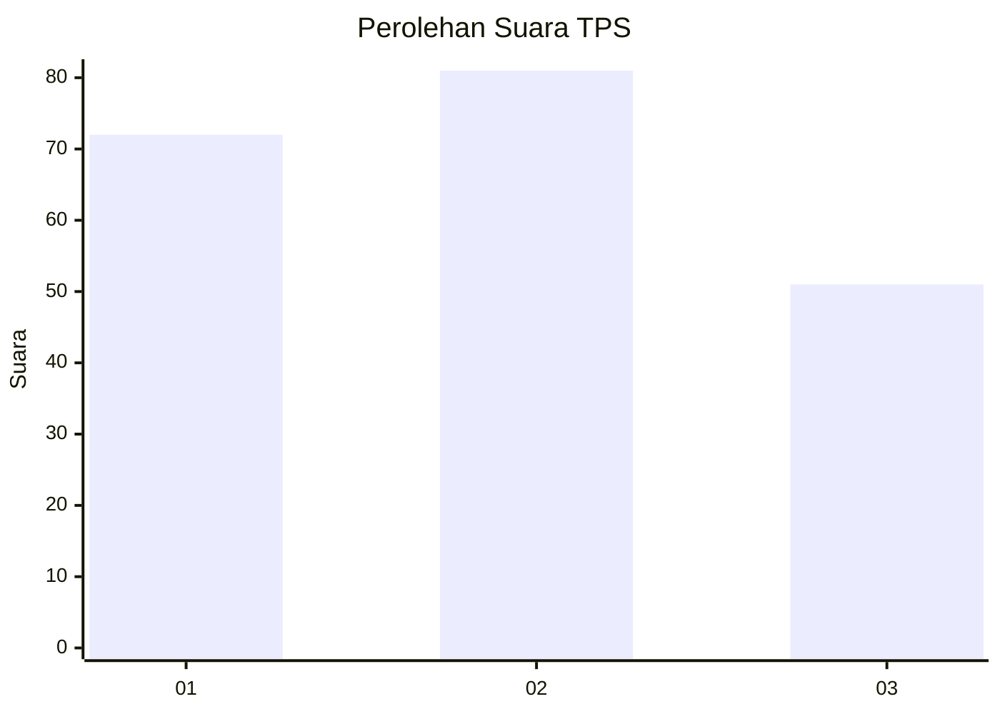
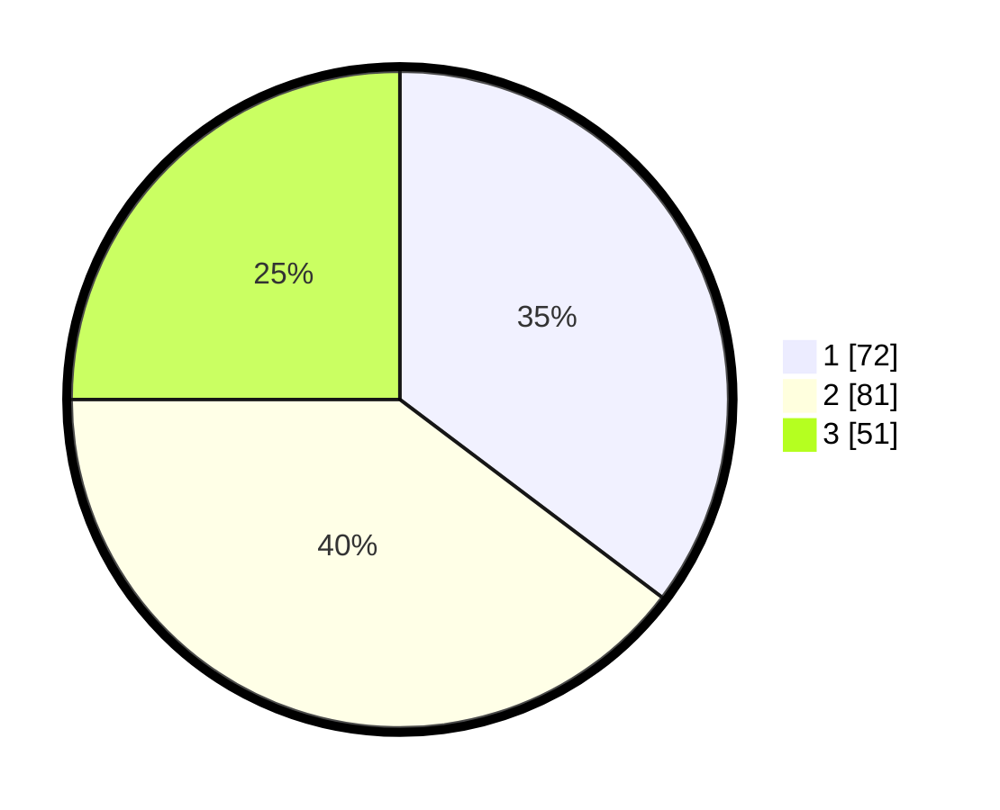

# Hasil

## Grafik

## Tabel

| No. | Nama Paslon    | Suara | Suara (raw) | Persentase |
|:--- |:-------------- | -----:| -----------:| ----------:|
| 1   | ANIES MUHAIMIN | 72    | [72][p-1]   | 35,29      |
| 2   | PRABOWO GIBRAN | 81    | [81][p-2]   | 39,71      |
| 3   | GANJAR MAHFUD  | 51    | [51][p-3]   | 25,00      |

[p-1]: https://github.com/gigit-pemilu/pemilu-2024/blob/main/pilpres/hitung-suara/sub/35-jawa-timur/sub/78-kota-surabaya/sub/26-mulyorejo/sub/1004-kalisari/sub/005-tps/sub/paslon-1.txt
[p-2]: https://github.com/gigit-pemilu/pemilu-2024/blob/main/pilpres/hitung-suara/sub/35-jawa-timur/sub/78-kota-surabaya/sub/26-mulyorejo/sub/1004-kalisari/sub/005-tps/sub/paslon-2.txt
[p-3]: https://github.com/gigit-pemilu/pemilu-2024/blob/main/pilpres/hitung-suara/sub/35-jawa-timur/sub/78-kota-surabaya/sub/26-mulyorejo/sub/1004-kalisari/sub/005-tps/sub/paslon-3.txt

## Foto C Plano

https://sirekap-obj-formc.kpu.go.id/ebed/pemilu/ppwp/35/78/26/10/04/3578261004005-20240227-144204--ec5db325-6019-4c75-8219-2509f200563a.jpg

https://sirekap-obj-formc.kpu.go.id/ebed/pemilu/ppwp/35/78/26/10/04/3578261004005-20240227-144248--4ca6bf73-ab81-46c2-b63e-c615bdc85a56.jpg

https://sirekap-obj-formc.kpu.go.id/ebed/pemilu/ppwp/35/78/26/10/04/3578261004005-20240227-144326--bb9bb0bd-8a73-429b-92d4-2cd70e55f9e9.jpg

## Metadata

| Key        | Value               |
| ---------- | ------------------- |
| Time Stamp | 2024-02-28 21:00:00 |

