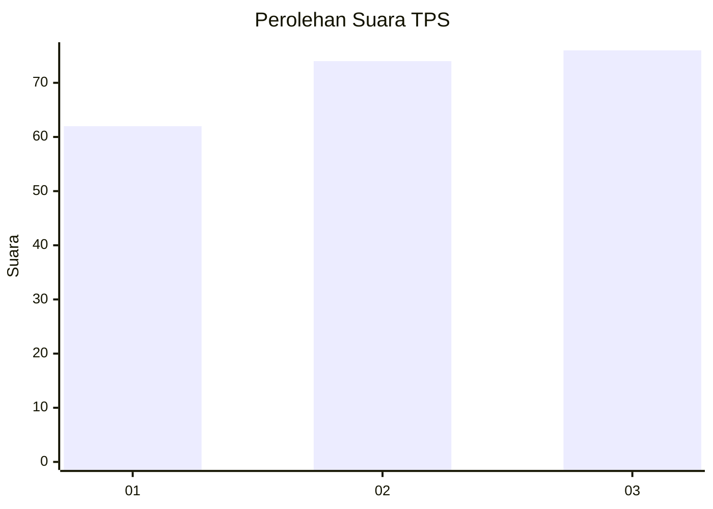
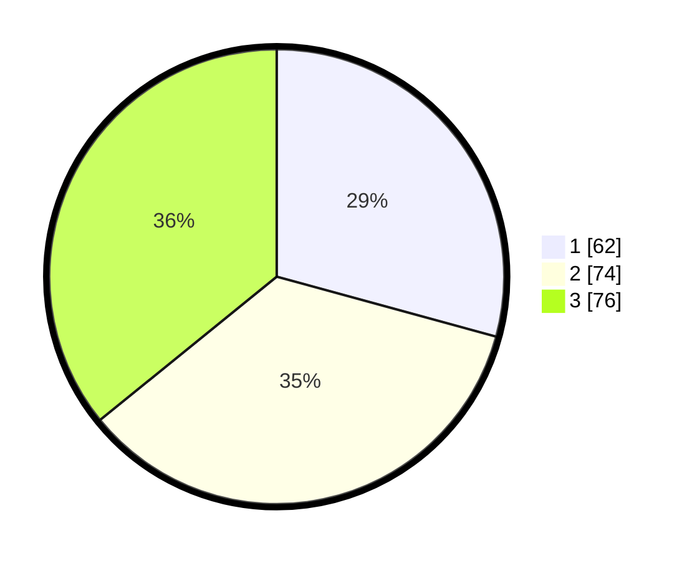

# Hasil

## Grafik

## Tabel

| No. | Nama Paslon    | Suara | Suara (raw) | Persentase |
|:--- |:-------------- | -----:| -----------:| ----------:|
| 1   | ANIES MUHAIMIN | 62    | [62][p-1]   | 29,25      |
| 2   | PRABOWO GIBRAN | 74    | [74][p-2]   | 34,91      |
| 3   | GANJAR MAHFUD  | 76    | [76][p-3]   | 35,85      |

[p-1]: https://github.com/gigit-pemilu/pemilu-2024/blob/main/pilpres/hitung-suara/sub/35-jawa-timur/sub/78-kota-surabaya/sub/26-mulyorejo/sub/1004-kalisari/sub/018-tps/sub/paslon-1.txt
[p-2]: https://github.com/gigit-pemilu/pemilu-2024/blob/main/pilpres/hitung-suara/sub/35-jawa-timur/sub/78-kota-surabaya/sub/26-mulyorejo/sub/1004-kalisari/sub/018-tps/sub/paslon-2.txt
[p-3]: https://github.com/gigit-pemilu/pemilu-2024/blob/main/pilpres/hitung-suara/sub/35-jawa-timur/sub/78-kota-surabaya/sub/26-mulyorejo/sub/1004-kalisari/sub/018-tps/sub/paslon-3.txt

## Foto C Plano

https://sirekap-obj-formc.kpu.go.id/f901/pemilu/ppwp/35/78/26/10/04/3578261004018-20240215-025139--e49deebe-8323-4c1c-8225-16294f655c73.jpg

https://sirekap-obj-formc.kpu.go.id/f901/pemilu/ppwp/35/78/26/10/04/3578261004018-20240214-232516--6080b1fd-e29f-454a-995e-43d11278dc20.jpg

https://sirekap-obj-formc.kpu.go.id/f901/pemilu/ppwp/35/78/26/10/04/3578261004018-20240214-232559--156e4ebf-5fe9-4c1c-9b3d-d3f22a0f3507.jpg

## Metadata

| Key        | Value               |
| ---------- | ------------------- |
| Time Stamp | 2024-02-17 12:00:00 |

