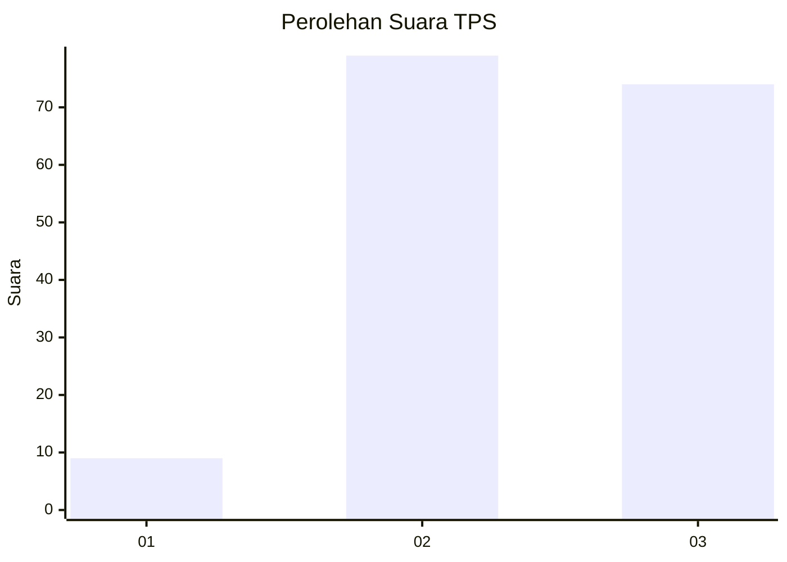
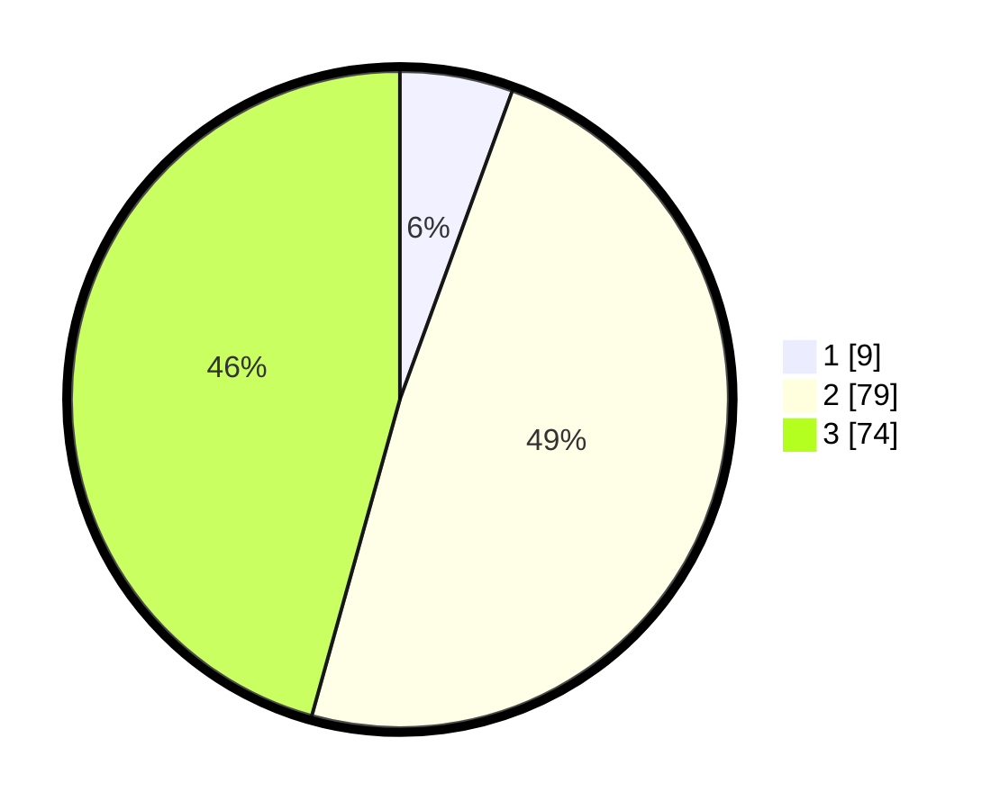

# Hasil

## Grafik

## Tabel

| No. | Nama Paslon    | Suara | Suara (raw) | Persentase |
|:--- |:-------------- | -----:| -----------:| ----------:|
| 1   | ANIES MUHAIMIN | 9     | [9][p-1]    | 5,56       |
| 2   | PRABOWO GIBRAN | 79    | [79][p-2]   | 48,77      |
| 3   | GANJAR MAHFUD  | 74    | [74][p-3]   | 45,68      |

[p-1]: https://github.com/gigit-pemilu/pemilu-2024/blob/main/pilpres/hitung-suara/sub/35-jawa-timur/sub/78-kota-surabaya/sub/26-mulyorejo/sub/1004-kalisari/sub/021-tps/sub/paslon-1.txt
[p-2]: https://github.com/gigit-pemilu/pemilu-2024/blob/main/pilpres/hitung-suara/sub/35-jawa-timur/sub/78-kota-surabaya/sub/26-mulyorejo/sub/1004-kalisari/sub/021-tps/sub/paslon-2.txt
[p-3]: https://github.com/gigit-pemilu/pemilu-2024/blob/main/pilpres/hitung-suara/sub/35-jawa-timur/sub/78-kota-surabaya/sub/26-mulyorejo/sub/1004-kalisari/sub/021-tps/sub/paslon-3.txt

## Foto C Plano

https://sirekap-obj-formc.kpu.go.id/2396/pemilu/ppwp/35/78/26/10/04/3578261004021-20240214-230727--38ae1def-7531-4dfc-b5d5-1674eb9e01c1.jpg

https://sirekap-obj-formc.kpu.go.id/2396/pemilu/ppwp/35/78/26/10/04/3578261004021-20240214-231001--370b939b-41e6-4ed9-892c-e9ab71af93d0.jpg

https://sirekap-obj-formc.kpu.go.id/2396/pemilu/ppwp/35/78/26/10/04/3578261004021-20240214-231128--c37a67c5-7a77-46cd-97c4-d7a9dacdb72c.jpg

## Metadata

| Key        | Value               |
| ---------- | ------------------- |
| Time Stamp | 2024-02-17 12:00:00 |

