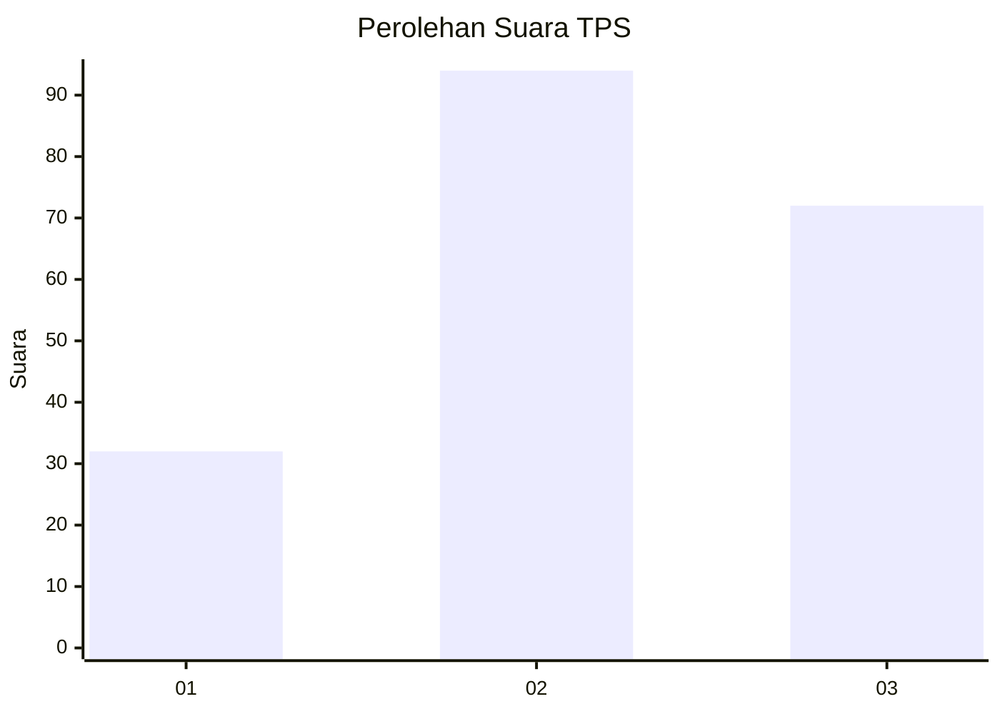
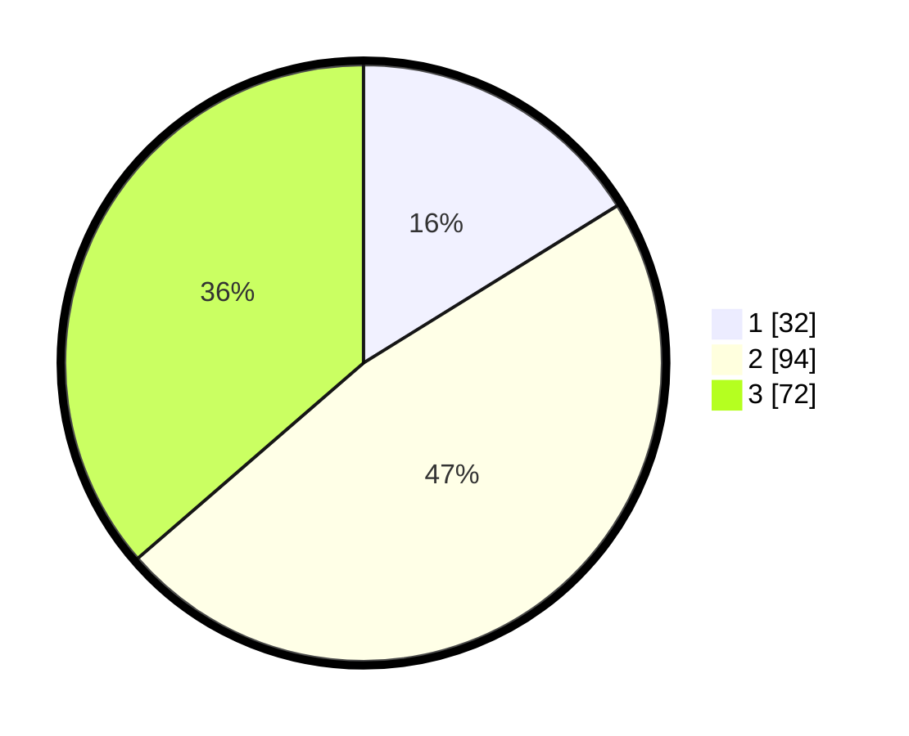

# Hasil

## Grafik

## Tabel

| No. | Nama Paslon    | Suara | Suara (raw) | Persentase |
|:--- |:-------------- | -----:| -----------:| ----------:|
| 1   | ANIES MUHAIMIN | 32    | [32][p-1]   | 16,16      |
| 2   | PRABOWO GIBRAN | 94    | [94][p-2]   | 47,47      |
| 3   | GANJAR MAHFUD  | 72    | [72][p-3]   | 36,36      |

[p-1]: https://github.com/gigit-pemilu/pemilu-2024-35-jawa-timur/blob/main/pilpres/hitung-suara/sub/35-jawa-timur/sub/78-kota-surabaya/sub/26-mulyorejo/sub/1004-kalisari/sub/027-tps/sub/paslon-1.txt
[p-2]: https://github.com/gigit-pemilu/pemilu-2024-35-jawa-timur/blob/main/pilpres/hitung-suara/sub/35-jawa-timur/sub/78-kota-surabaya/sub/26-mulyorejo/sub/1004-kalisari/sub/027-tps/sub/paslon-2.txt
[p-3]: https://github.com/gigit-pemilu/pemilu-2024-35-jawa-timur/blob/main/pilpres/hitung-suara/sub/35-jawa-timur/sub/78-kota-surabaya/sub/26-mulyorejo/sub/1004-kalisari/sub/027-tps/sub/paslon-3.txt

## Foto C Plano

https://sirekap-obj-formc.kpu.go.id/95da/pemilu/ppwp/35/78/26/10/04/3578261004027-20240214-221346--545e4fcd-c0a4-4bcf-bae4-79a2c8e4f536.jpg

https://sirekap-obj-formc.kpu.go.id/95da/pemilu/ppwp/35/78/26/10/04/3578261004027-20240214-221446--00779dd3-da89-4bb4-9139-d4cbaab46705.jpg

https://sirekap-obj-formc.kpu.go.id/95da/pemilu/ppwp/35/78/26/10/04/3578261004027-20240214-221212--94615b0c-9b3b-4098-9f48-bf995b219537.jpg

## Metadata

| Key        | Value               |
| ---------- | ------------------- |
| Time Stamp | 2024-02-17 12:00:00 |

