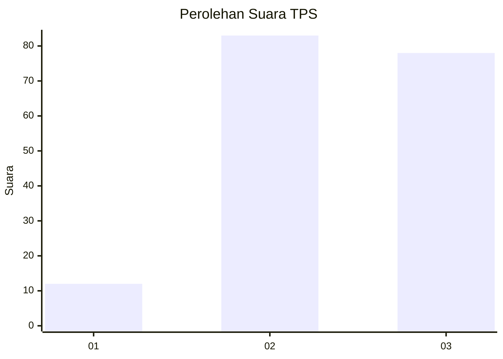
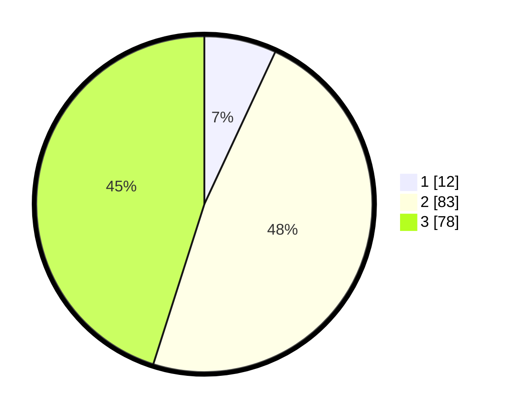

# Hasil

## Grafik

## Tabel

| No. | Nama Paslon    | Suara | Suara (raw) | Persentase |
|:--- |:-------------- | -----:| -----------:| ----------:|
| 1   | ANIES MUHAIMIN | 12    | [12][p-1]   | 6,94       |
| 2   | PRABOWO GIBRAN | 83    | [83][p-2]   | 47,98      |
| 3   | GANJAR MAHFUD  | 78    | [78][p-3]   | 45,09      |

[p-1]: https://github.com/gigit-pemilu/pemilu-2024/blob/main/pilpres/hitung-suara/sub/35-jawa-timur/sub/78-kota-surabaya/sub/26-mulyorejo/sub/1004-kalisari/sub/029-tps/sub/paslon-1.txt
[p-2]: https://github.com/gigit-pemilu/pemilu-2024/blob/main/pilpres/hitung-suara/sub/35-jawa-timur/sub/78-kota-surabaya/sub/26-mulyorejo/sub/1004-kalisari/sub/029-tps/sub/paslon-2.txt
[p-3]: https://github.com/gigit-pemilu/pemilu-2024/blob/main/pilpres/hitung-suara/sub/35-jawa-timur/sub/78-kota-surabaya/sub/26-mulyorejo/sub/1004-kalisari/sub/029-tps/sub/paslon-3.txt

## Foto C Plano

https://sirekap-obj-formc.kpu.go.id/7562/pemilu/ppwp/35/78/26/10/04/3578261004029-20240214-213335--b6c54545-7c60-4c6f-926d-b32aa1f0869b.jpg

https://sirekap-obj-formc.kpu.go.id/7562/pemilu/ppwp/35/78/26/10/04/3578261004029-20240214-213357--41fee9c8-3c97-4169-ad90-2fa39382abe1.jpg

https://sirekap-obj-formc.kpu.go.id/7562/pemilu/ppwp/35/78/26/10/04/3578261004029-20240214-213433--8a4a36f2-e889-47d3-89f0-938dbfe2498b.jpg

## Metadata

| Key        | Value               |
| ---------- | ------------------- |
| Time Stamp | 2024-02-17 12:00:00 |

