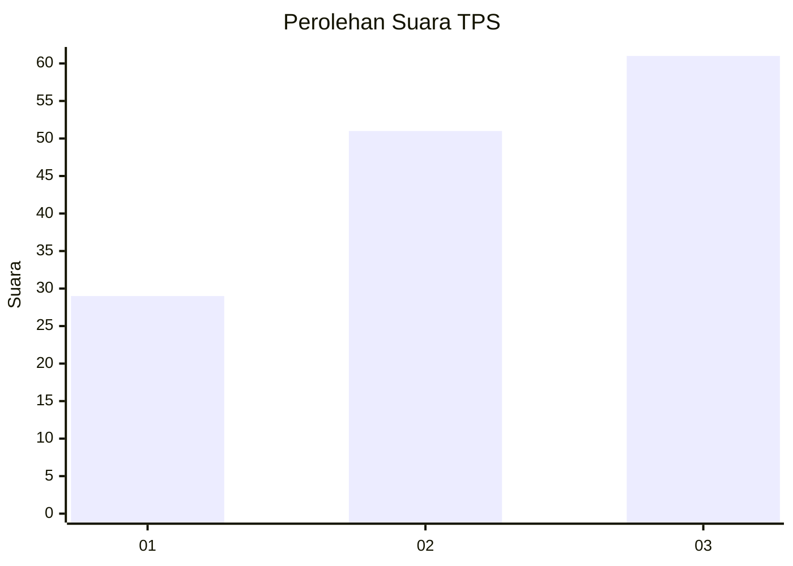
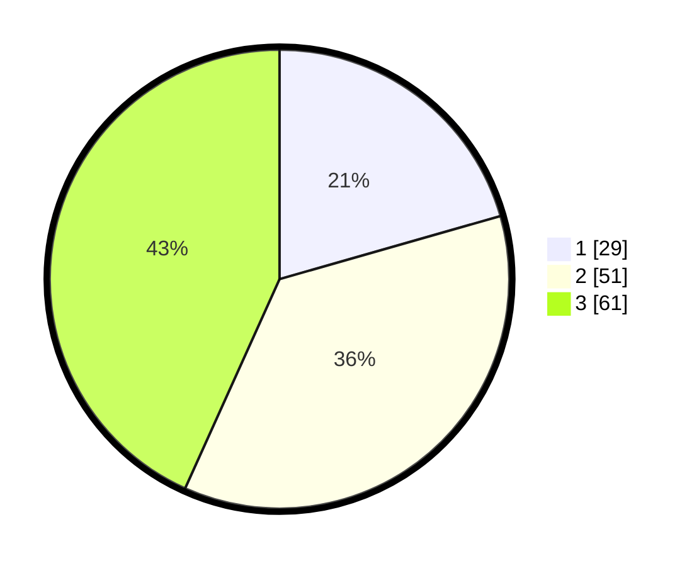

# Hasil

## Grafik

## Tabel

| No. | Nama Paslon    | Suara | Suara (raw) | Persentase |
|:--- |:-------------- | -----:| -----------:| ----------:|
| 1   | ANIES MUHAIMIN | 29    | [29][p-1]   | 20,57      |
| 2   | PRABOWO GIBRAN | 51    | [51][p-2]   | 36,17      |
| 3   | GANJAR MAHFUD  | 61    | [61][p-3]   | 43,26      |

[p-1]: https://github.com/gigit-pemilu/pemilu-2024/blob/main/pilpres/hitung-suara/sub/35-jawa-timur/sub/78-kota-surabaya/sub/26-mulyorejo/sub/1004-kalisari/sub/034-tps/sub/paslon-1.txt
[p-2]: https://github.com/gigit-pemilu/pemilu-2024/blob/main/pilpres/hitung-suara/sub/35-jawa-timur/sub/78-kota-surabaya/sub/26-mulyorejo/sub/1004-kalisari/sub/034-tps/sub/paslon-2.txt
[p-3]: https://github.com/gigit-pemilu/pemilu-2024/blob/main/pilpres/hitung-suara/sub/35-jawa-timur/sub/78-kota-surabaya/sub/26-mulyorejo/sub/1004-kalisari/sub/034-tps/sub/paslon-3.txt

## Foto C Plano

https://sirekap-obj-formc.kpu.go.id/342a/pemilu/ppwp/35/78/26/10/04/3578261004034-20240214-202012--191481a0-ea9e-46e1-8060-d9c98cf4c441.jpg

https://sirekap-obj-formc.kpu.go.id/342a/pemilu/ppwp/35/78/26/10/04/3578261004034-20240214-202232--4088dbdd-66a3-4938-b02e-24d441c848e3.jpg

https://sirekap-obj-formc.kpu.go.id/342a/pemilu/ppwp/35/78/26/10/04/3578261004034-20240214-202448--ca6005ea-d7ea-436d-b446-4afcb2ead8da.jpg

## Metadata

| Key        | Value               |
| ---------- | ------------------- |
| Time Stamp | 2024-02-17 12:00:00 |

