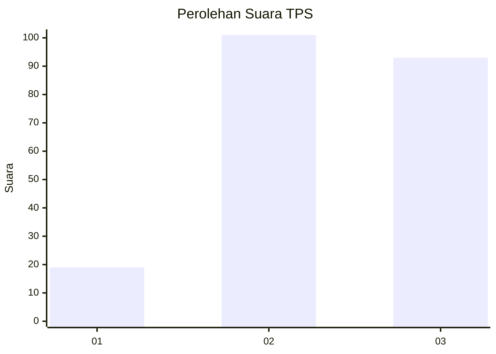
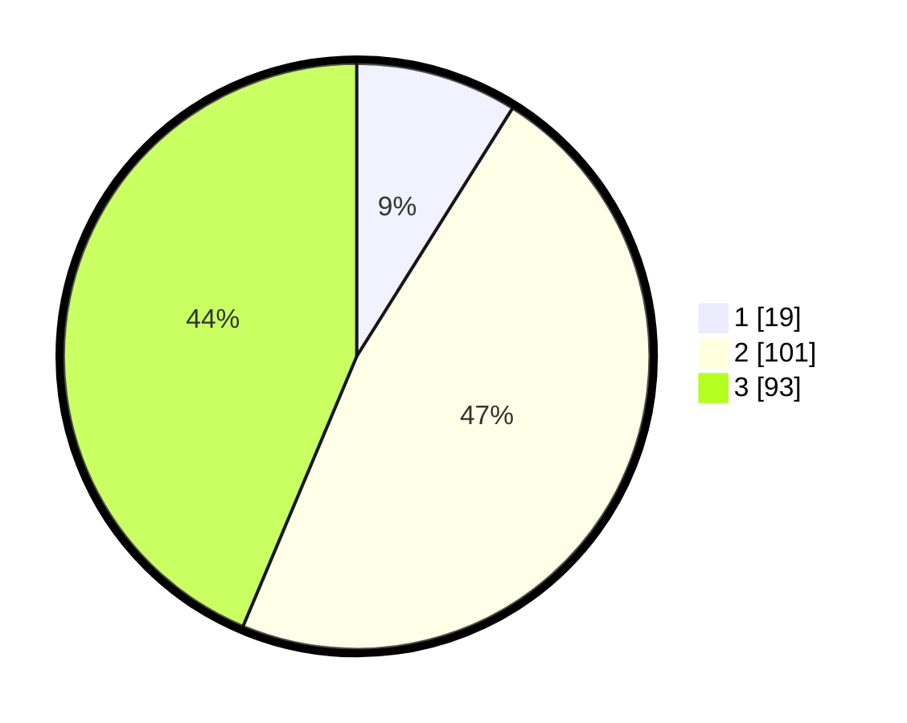

# Hasil

## Grafik

## Tabel

| No. | Nama Paslon    | Suara | Suara (raw) | Persentase |
|:--- |:-------------- | -----:| -----------:| ----------:|
| 1   | ANIES MUHAIMIN | 19    | [19][p-1]   | 8,92       |
| 2   | PRABOWO GIBRAN | 101   | [101][p-2]  | 47,42      |
| 3   | GANJAR MAHFUD  | 93    | [93][p-3]   | 43,66      |

[p-1]: https://github.com/gigit-pemilu/pemilu-2024-35-jawa-timur/blob/main/pilpres/hitung-suara/sub/35-jawa-timur/sub/78-kota-surabaya/sub/26-mulyorejo/sub/1004-kalisari/sub/037-tps/sub/paslon-1.txt
[p-2]: https://github.com/gigit-pemilu/pemilu-2024-35-jawa-timur/blob/main/pilpres/hitung-suara/sub/35-jawa-timur/sub/78-kota-surabaya/sub/26-mulyorejo/sub/1004-kalisari/sub/037-tps/sub/paslon-2.txt
[p-3]: https://github.com/gigit-pemilu/pemilu-2024-35-jawa-timur/blob/main/pilpres/hitung-suara/sub/35-jawa-timur/sub/78-kota-surabaya/sub/26-mulyorejo/sub/1004-kalisari/sub/037-tps/sub/paslon-3.txt

## Foto C Plano

https://sirekap-obj-formc.kpu.go.id/af27/pemilu/ppwp/35/78/26/10/04/3578261004037-20240215-003256--d680f19f-a11e-44fa-a3bb-0a7d979977c3.jpg

https://sirekap-obj-formc.kpu.go.id/af27/pemilu/ppwp/35/78/26/10/04/3578261004037-20240215-003359--483dc1b9-415a-486d-bb5b-963995d1ae37.jpg

https://sirekap-obj-formc.kpu.go.id/af27/pemilu/ppwp/35/78/26/10/04/3578261004037-20240215-003714--e5492e39-21fb-4dd1-b791-b78ee348f0b9.jpg

## Metadata

| Key        | Value               |
| ---------- | ------------------- |
| Time Stamp | 2024-02-17 13:37:34 |

