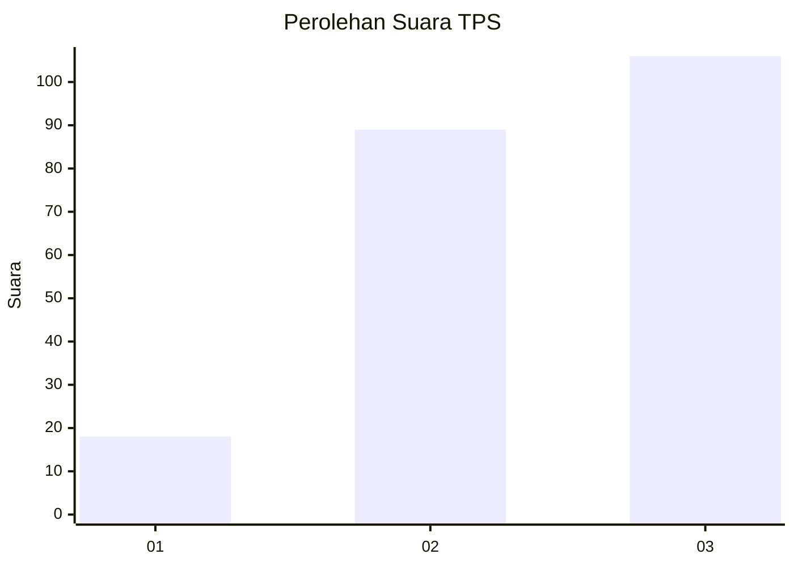
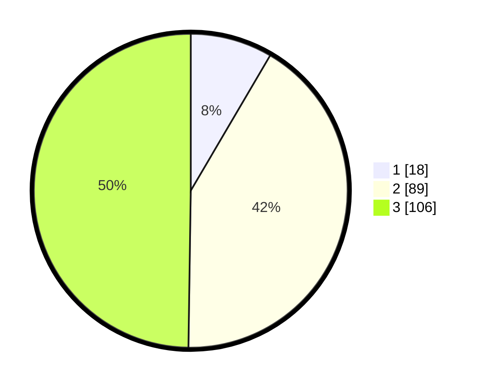

# Hasil

## Grafik

## Tabel

| No. | Nama Paslon    | Suara | Suara (raw) | Persentase |
|:--- |:-------------- | -----:| -----------:| ----------:|
| 1   | ANIES MUHAIMIN | 18    | [18][p-1]   | 8,45       |
| 2   | PRABOWO GIBRAN | 89    | [89][p-2]   | 41,78      |
| 3   | GANJAR MAHFUD  | 106   | [106][p-3]  | 49,77      |

[p-1]: https://github.com/gigit-pemilu/pemilu-2024/blob/main/pilpres/hitung-suara/sub/35-jawa-timur/sub/78-kota-surabaya/sub/26-mulyorejo/sub/1004-kalisari/sub/040-tps/sub/paslon-1.txt
[p-2]: https://github.com/gigit-pemilu/pemilu-2024/blob/main/pilpres/hitung-suara/sub/35-jawa-timur/sub/78-kota-surabaya/sub/26-mulyorejo/sub/1004-kalisari/sub/040-tps/sub/paslon-2.txt
[p-3]: https://github.com/gigit-pemilu/pemilu-2024/blob/main/pilpres/hitung-suara/sub/35-jawa-timur/sub/78-kota-surabaya/sub/26-mulyorejo/sub/1004-kalisari/sub/040-tps/sub/paslon-3.txt

## Foto C Plano

https://sirekap-obj-formc.kpu.go.id/cade/pemilu/ppwp/35/78/26/10/04/3578261004040-20240215-010846--456fa99a-b68b-4647-802b-35b34a340f8e.jpg

https://sirekap-obj-formc.kpu.go.id/cade/pemilu/ppwp/35/78/26/10/04/3578261004040-20240215-010946--0fd1919b-0a8c-4c31-9914-f846a55d58c8.jpg

https://sirekap-obj-formc.kpu.go.id/cade/pemilu/ppwp/35/78/26/10/04/3578261004040-20240215-011035--cf733b27-4dae-4e1c-ac3c-f2fb91a87a66.jpg

## Metadata

| Key        | Value               |
| ---------- | ------------------- |
| Time Stamp | 2024-02-24 22:31:28 |

