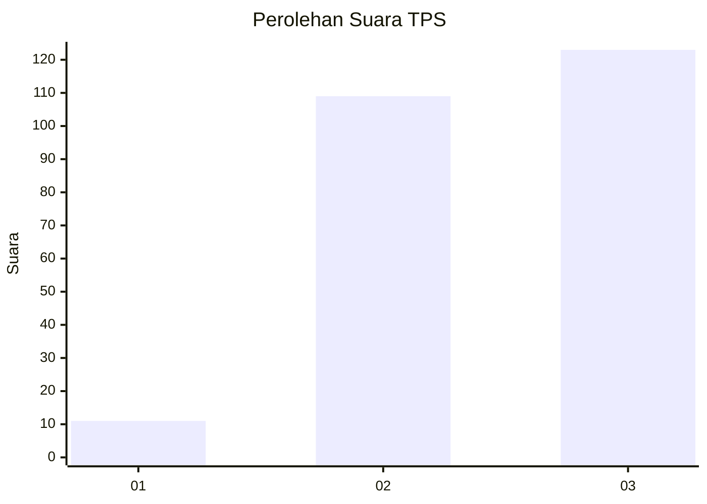
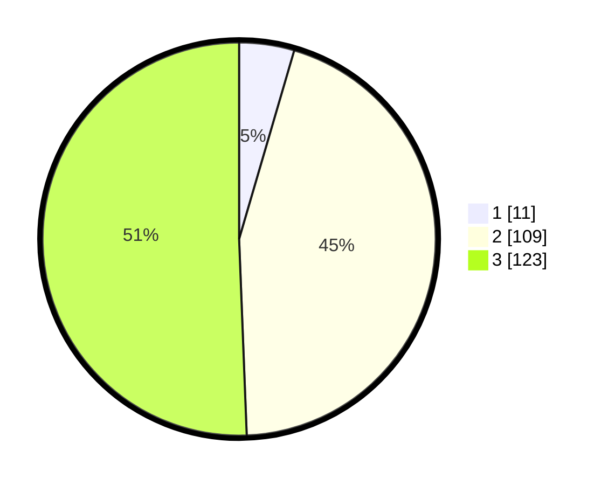

# Hasil

## Grafik

## Tabel

| No. | Nama Paslon    | Suara | Suara (raw) | Persentase |
|:--- |:-------------- | -----:| -----------:| ----------:|
| 1   | ANIES MUHAIMIN | 11    | [11][p-1]   | 4,53       |
| 2   | PRABOWO GIBRAN | 109   | [109][p-2]  | 44,86      |
| 3   | GANJAR MAHFUD  | 123   | [123][p-3]  | 50,62      |

[p-1]: https://github.com/gigit-pemilu/pemilu-2024/blob/main/pilpres/hitung-suara/sub/35-jawa-timur/sub/78-kota-surabaya/sub/26-mulyorejo/sub/1004-kalisari/sub/041-tps/sub/paslon-1.txt
[p-2]: https://github.com/gigit-pemilu/pemilu-2024/blob/main/pilpres/hitung-suara/sub/35-jawa-timur/sub/78-kota-surabaya/sub/26-mulyorejo/sub/1004-kalisari/sub/041-tps/sub/paslon-2.txt
[p-3]: https://github.com/gigit-pemilu/pemilu-2024/blob/main/pilpres/hitung-suara/sub/35-jawa-timur/sub/78-kota-surabaya/sub/26-mulyorejo/sub/1004-kalisari/sub/041-tps/sub/paslon-3.txt

## Foto C Plano

https://sirekap-obj-formc.kpu.go.id/bcac/pemilu/ppwp/35/78/26/10/04/3578261004041-20240214-223954--e2427bdd-0537-4476-b963-02909c081e39.jpg

https://sirekap-obj-formc.kpu.go.id/bcac/pemilu/ppwp/35/78/26/10/04/3578261004041-20240214-224054--4a0118a4-633d-4318-8bb9-b1187ea48955.jpg

https://sirekap-obj-formc.kpu.go.id/bcac/pemilu/ppwp/35/78/26/10/04/3578261004041-20240214-224328--e9abca35-0a7b-4a07-b758-d44c0b8ebf1b.jpg

## Metadata

| Key        | Value               |
| ---------- | ------------------- |
| Time Stamp | 2024-02-16 16:25:10 |

