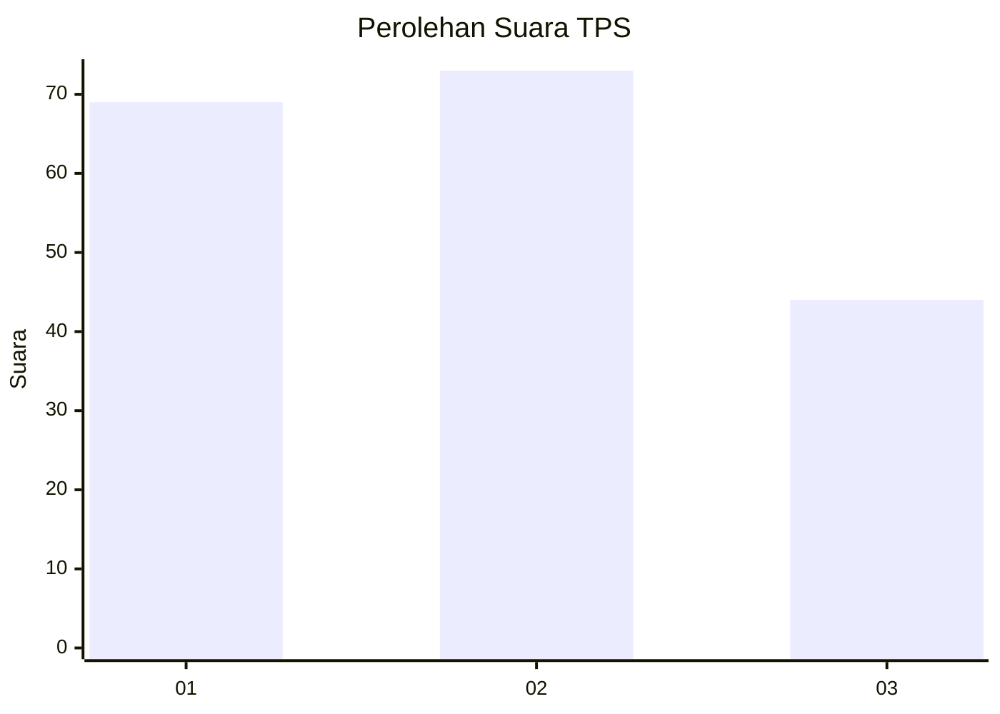
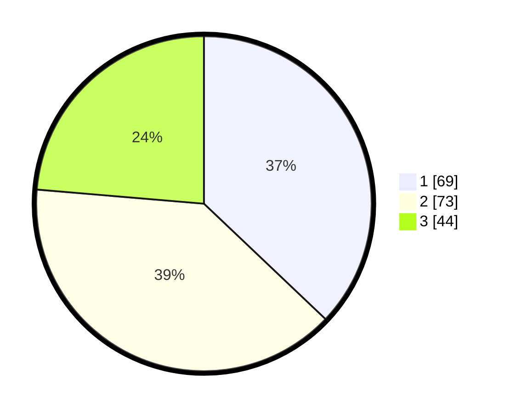

# Hasil

## Grafik

## Tabel

| No. | Nama Paslon    | Suara | Suara (raw) | Persentase |
|:--- |:-------------- | -----:| -----------:| ----------:|
| 1   | ANIES MUHAIMIN | 69    | [69][p-1]   | 37,10      |
| 2   | PRABOWO GIBRAN | 73    | [73][p-2]   | 39,25      |
| 3   | GANJAR MAHFUD  | 44    | [44][p-3]   | 23,66      |

[p-1]: https://github.com/gigit-pemilu/pemilu-2024-35-jawa-timur/blob/main/pilpres/hitung-suara/sub/35-jawa-timur/sub/78-kota-surabaya/sub/26-mulyorejo/sub/1006-kalijudan/sub/019-tps/sub/paslon-1.txt
[p-2]: https://github.com/gigit-pemilu/pemilu-2024-35-jawa-timur/blob/main/pilpres/hitung-suara/sub/35-jawa-timur/sub/78-kota-surabaya/sub/26-mulyorejo/sub/1006-kalijudan/sub/019-tps/sub/paslon-2.txt
[p-3]: https://github.com/gigit-pemilu/pemilu-2024-35-jawa-timur/blob/main/pilpres/hitung-suara/sub/35-jawa-timur/sub/78-kota-surabaya/sub/26-mulyorejo/sub/1006-kalijudan/sub/019-tps/sub/paslon-3.txt

## Foto C Plano

https://sirekap-obj-formc.kpu.go.id/c0fe/pemilu/ppwp/35/78/26/10/06/3578261006019-20240220-130043--22418160-f238-42ea-9564-9643d896c0c8.jpg

https://sirekap-obj-formc.kpu.go.id/c0fe/pemilu/ppwp/35/78/26/10/06/3578261006019-20240220-125809--c2aa5d10-2f1c-4078-9c76-e72afa478bf7.jpg

https://sirekap-obj-formc.kpu.go.id/c0fe/pemilu/ppwp/35/78/26/10/06/3578261006019-20240220-130151--95c7c637-8fa5-465b-af81-f845865116a8.jpg

## Metadata

| Key        | Value               |
| ---------- | ------------------- |
| Time Stamp | 2024-02-21 13:00:00 |

