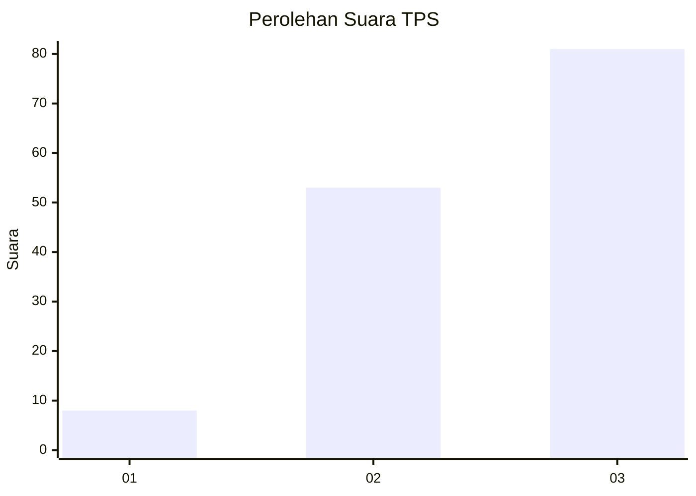
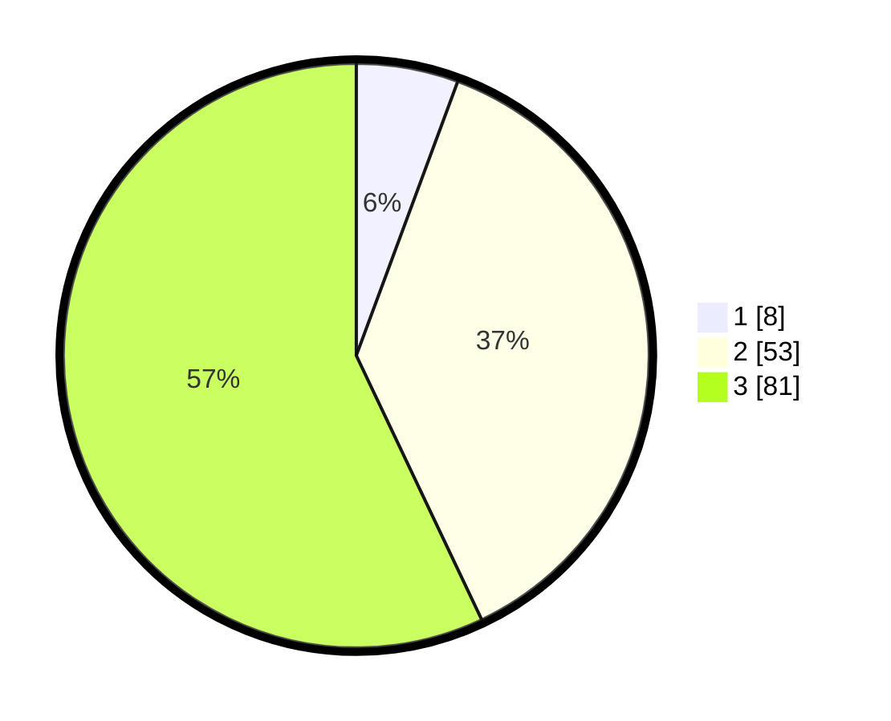

# Hasil

## Grafik

## Tabel

| No. | Nama Paslon    | Suara | Suara (raw) | Persentase |
|:--- |:-------------- | -----:| -----------:| ----------:|
| 1   | ANIES MUHAIMIN | 8     | [8][p-1]    | 5,63       |
| 2   | PRABOWO GIBRAN | 53    | [53][p-2]   | 37,32      |
| 3   | GANJAR MAHFUD  | 81    | [81][p-3]   | 57,04      |

[p-1]: https://github.com/gigit-pemilu/pemilu-2024/blob/main/pilpres/hitung-suara/sub/35-jawa-timur/sub/78-kota-surabaya/sub/26-mulyorejo/sub/1006-kalijudan/sub/038-tps/sub/paslon-1.txt
[p-2]: https://github.com/gigit-pemilu/pemilu-2024/blob/main/pilpres/hitung-suara/sub/35-jawa-timur/sub/78-kota-surabaya/sub/26-mulyorejo/sub/1006-kalijudan/sub/038-tps/sub/paslon-2.txt
[p-3]: https://github.com/gigit-pemilu/pemilu-2024/blob/main/pilpres/hitung-suara/sub/35-jawa-timur/sub/78-kota-surabaya/sub/26-mulyorejo/sub/1006-kalijudan/sub/038-tps/sub/paslon-3.txt

## Foto C Plano

https://sirekap-obj-formc.kpu.go.id/42e4/pemilu/ppwp/35/78/26/10/06/3578261006038-20240215-045013--5bdfb40d-c509-41ba-95cd-5fc90a0a514f.jpg

https://sirekap-obj-formc.kpu.go.id/42e4/pemilu/ppwp/35/78/26/10/06/3578261006038-20240215-045041--de091064-3dbe-4550-954f-e5264a345a70.jpg

https://sirekap-obj-formc.kpu.go.id/42e4/pemilu/ppwp/35/78/26/10/06/3578261006038-20240215-045106--d728e594-75db-439e-80d3-22bcb4c29d51.jpg

## Metadata

| Key        | Value               |
| ---------- | ------------------- |
| Time Stamp | 2024-02-17 12:00:00 |

