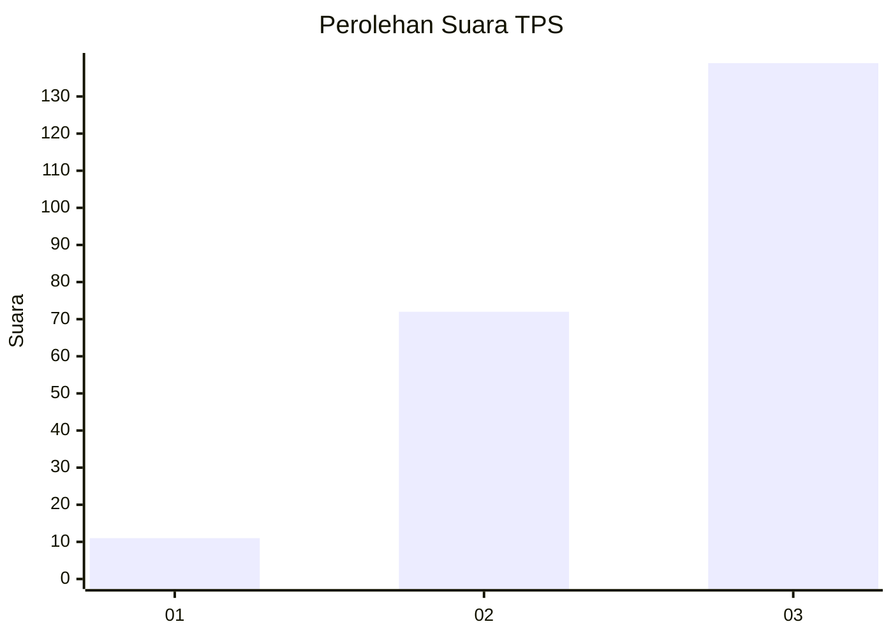
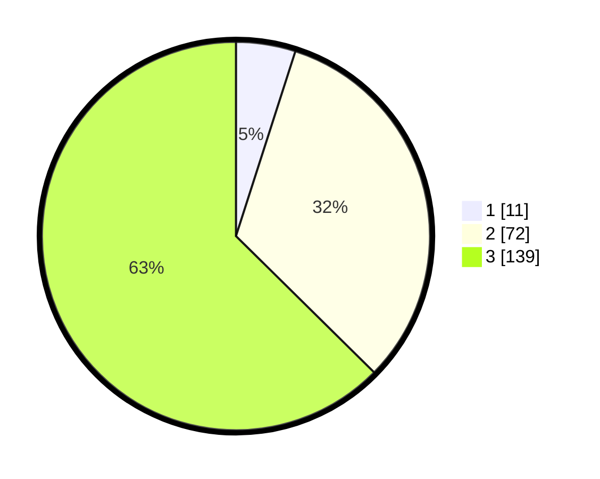

# Hasil

## Grafik

## Tabel

| No. | Nama Paslon    | Suara | Suara (raw) | Persentase |
|:--- |:-------------- | -----:| -----------:| ----------:|
| 1   | ANIES MUHAIMIN | 11    | [11][p-1]   | 4,95       |
| 2   | PRABOWO GIBRAN | 72    | [72][p-2]   | 32,43      |
| 3   | GANJAR MAHFUD  | 139   | [139][p-3]  | 62,61      |

[p-1]: https://github.com/gigit-pemilu/pemilu-2024-35-jawa-timur/blob/main/pilpres/hitung-suara/sub/35-jawa-timur/sub/78-kota-surabaya/sub/27-sukomanunggal/sub/1002-tanjungsari/sub/002-tps/sub/paslon-1.txt
[p-2]: https://github.com/gigit-pemilu/pemilu-2024-35-jawa-timur/blob/main/pilpres/hitung-suara/sub/35-jawa-timur/sub/78-kota-surabaya/sub/27-sukomanunggal/sub/1002-tanjungsari/sub/002-tps/sub/paslon-2.txt
[p-3]: https://github.com/gigit-pemilu/pemilu-2024-35-jawa-timur/blob/main/pilpres/hitung-suara/sub/35-jawa-timur/sub/78-kota-surabaya/sub/27-sukomanunggal/sub/1002-tanjungsari/sub/002-tps/sub/paslon-3.txt

## Foto C Plano

https://sirekap-obj-formc.kpu.go.id/ac75/pemilu/ppwp/35/78/27/10/02/3578271002002-20240214-203230--79b07619-a1c4-4c10-8ce6-b3c25679db3f.jpg

https://sirekap-obj-formc.kpu.go.id/ac75/pemilu/ppwp/35/78/27/10/02/3578271002002-20240214-203421--f0ab04eb-45c3-402a-97e8-e0b43671521e.jpg

https://sirekap-obj-formc.kpu.go.id/ac75/pemilu/ppwp/35/78/27/10/02/3578271002002-20240214-203656--5dbbc732-af70-4e83-8138-d66e8874c6b1.jpg

## Metadata

| Key        | Value               |
| ---------- | ------------------- |
| Time Stamp | 2024-02-24 22:31:28 |

