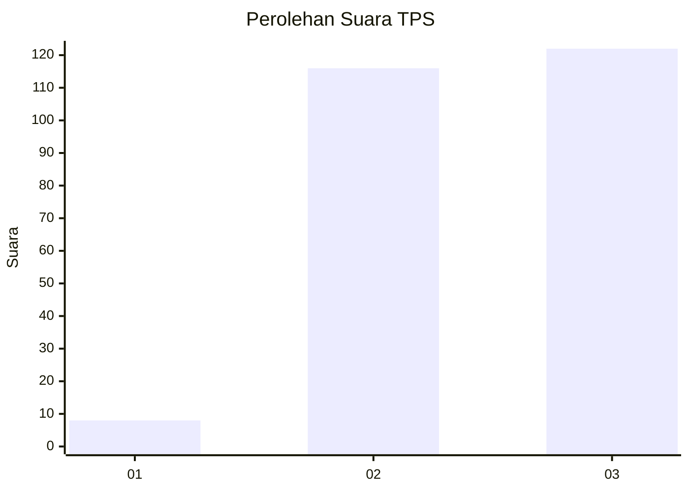
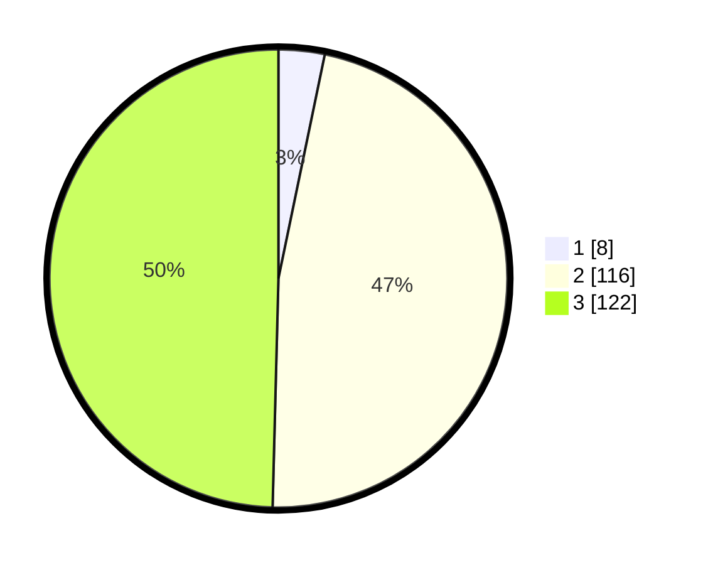

# Hasil

## Grafik

## Tabel

| No. | Nama Paslon    | Suara | Suara (raw) | Persentase |
|:--- |:-------------- | -----:| -----------:| ----------:|
| 1   | ANIES MUHAIMIN | 8     | [8][p-1]    | 3,25       |
| 2   | PRABOWO GIBRAN | 116   | [116][p-2]  | 47,15      |
| 3   | GANJAR MAHFUD  | 122   | [122][p-3]  | 49,59      |

[p-1]: https://github.com/gigit-pemilu/pemilu-2024/blob/main/pilpres/hitung-suara/sub/35-jawa-timur/sub/78-kota-surabaya/sub/27-sukomanunggal/sub/1002-tanjungsari/sub/030-tps/sub/paslon-1.txt
[p-2]: https://github.com/gigit-pemilu/pemilu-2024/blob/main/pilpres/hitung-suara/sub/35-jawa-timur/sub/78-kota-surabaya/sub/27-sukomanunggal/sub/1002-tanjungsari/sub/030-tps/sub/paslon-2.txt
[p-3]: https://github.com/gigit-pemilu/pemilu-2024/blob/main/pilpres/hitung-suara/sub/35-jawa-timur/sub/78-kota-surabaya/sub/27-sukomanunggal/sub/1002-tanjungsari/sub/030-tps/sub/paslon-3.txt

## Foto C Plano

https://sirekap-obj-formc.kpu.go.id/746f/pemilu/ppwp/35/78/27/10/02/3578271002030-20240217-193839--ef41e1a4-6620-4792-ad13-3c43ad458dd0.jpg

https://sirekap-obj-formc.kpu.go.id/746f/pemilu/ppwp/35/78/27/10/02/3578271002030-20240217-213125--89a53c98-678b-48a3-bdda-f10827d0409e.jpg

https://sirekap-obj-formc.kpu.go.id/746f/pemilu/ppwp/35/78/27/10/02/3578271002030-20240217-194211--2e427b34-9fdc-4449-ae04-586d29eae0eb.jpg

## Metadata

| Key        | Value               |
| ---------- | ------------------- |
| Time Stamp | 2024-02-19 06:16:00 |

## DATA PEMILIH TETAP

Jumlah pemilih dalam DPT: **292**.
 * L: **144**.
 * P: **148**.

## DATA PENGGUNA HAK PILIH

Jumlah pengguna hak pilih dalam DPT: **138**.
 * L: **116**.
 * P: **122**.

Jumlah pengguna hak pilih dalam DPTb: **86**.
 * L: **802**.
 * P: **884**.

Jumlah pengguna hak pilih dalam DPK: **3**.
 * L: **806**.
 * P: **882**.

Jumlah pengguna hak pilih: **247**.
 * L: **119**.
 * P: **728**.

## JUMLAH SUARA SAH DAN TIDAK SAH

JUMLAH SELURUH SUARA SAH: **246**.

JUMLAH SUARA TIDAK SAH: **1**.

JUMLAH SELURUH SUARA SAH DAN SUARA TIDAK SAH: **247**.

