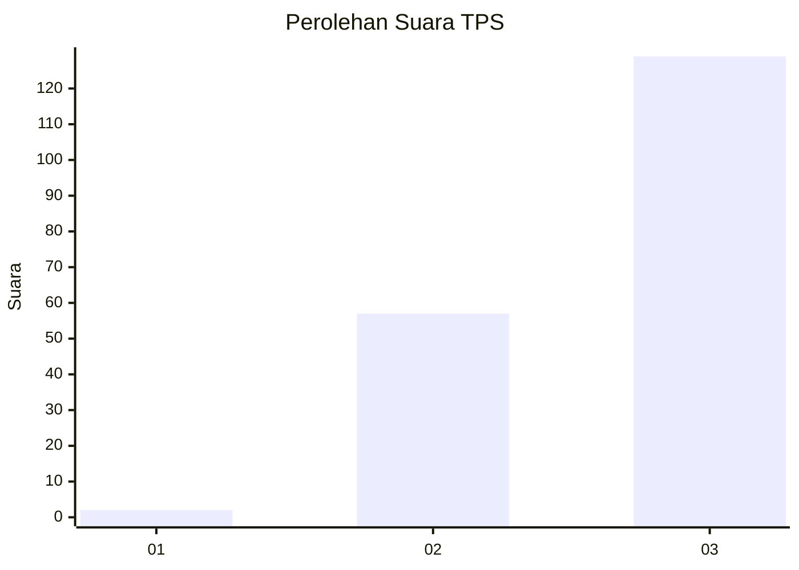
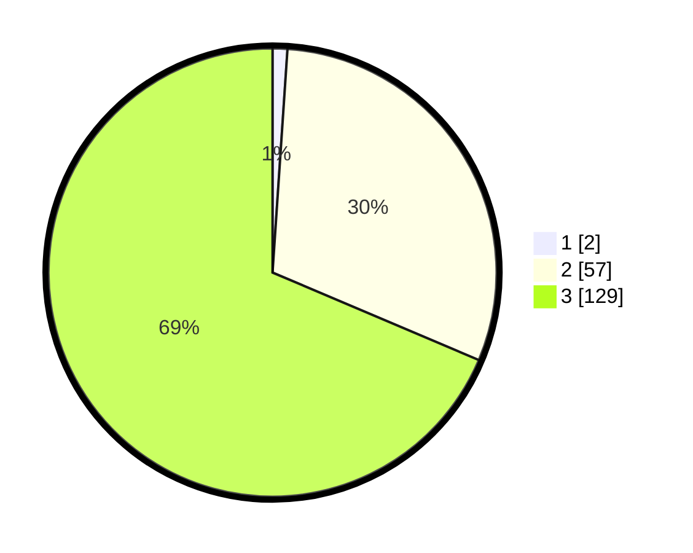

# Hasil

## Grafik

## Tabel

| No. | Nama Paslon    | Suara | Suara (raw) | Persentase |
|:--- |:-------------- | -----:| -----------:| ----------:|
| 1   | ANIES MUHAIMIN | 2     | [2][p-1]    | 1,06       |
| 2   | PRABOWO GIBRAN | 57    | [57][p-2]   | 30,32      |
| 3   | GANJAR MAHFUD  | 129   | [129][p-3]  | 68,62      |

[p-1]: https://github.com/gigit-pemilu/pemilu-2024/blob/main/pilpres/hitung-suara/sub/35-jawa-timur/sub/78-kota-surabaya/sub/27-sukomanunggal/sub/1002-tanjungsari/sub/032-tps/sub/paslon-1.txt
[p-2]: https://github.com/gigit-pemilu/pemilu-2024/blob/main/pilpres/hitung-suara/sub/35-jawa-timur/sub/78-kota-surabaya/sub/27-sukomanunggal/sub/1002-tanjungsari/sub/032-tps/sub/paslon-2.txt
[p-3]: https://github.com/gigit-pemilu/pemilu-2024/blob/main/pilpres/hitung-suara/sub/35-jawa-timur/sub/78-kota-surabaya/sub/27-sukomanunggal/sub/1002-tanjungsari/sub/032-tps/sub/paslon-3.txt

## Foto C Plano

https://sirekap-obj-formc.kpu.go.id/a908/pemilu/ppwp/35/78/27/10/02/3578271002032-20240214-225805--fd90a162-6091-406d-ad02-0fef55710293.jpg

https://sirekap-obj-formc.kpu.go.id/a908/pemilu/ppwp/35/78/27/10/02/3578271002032-20240214-230045--3d766812-518a-4040-bc47-c96b0ea79494.jpg

https://sirekap-obj-formc.kpu.go.id/a908/pemilu/ppwp/35/78/27/10/02/3578271002032-20240214-230220--32608a66-ad83-43c2-94ea-738bacafa26c.jpg

## Metadata

| Key        | Value               |
| ---------- | ------------------- |
| Time Stamp | 2024-02-25 18:00:00 |

