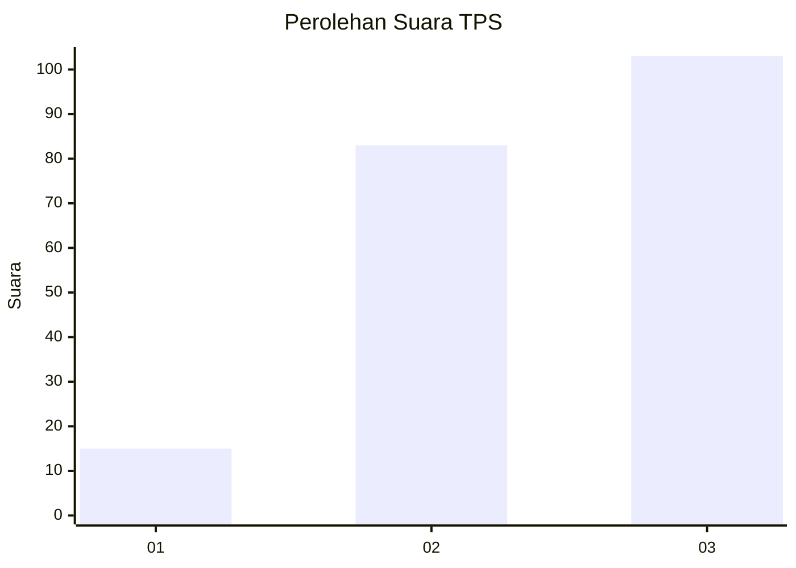
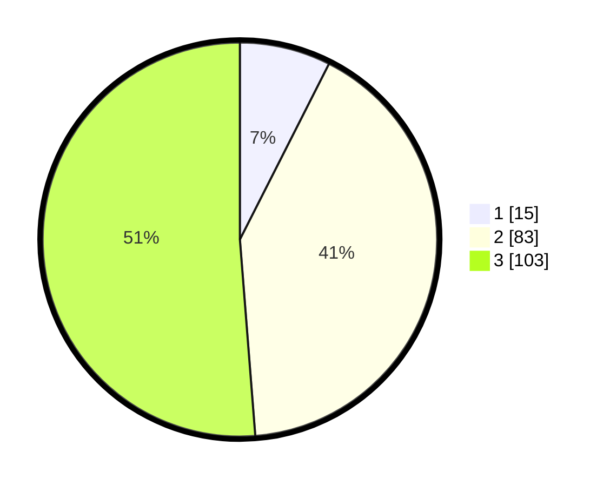

# Hasil

## Grafik

## Tabel

| No. | Nama Paslon    | Suara | Suara (raw) | Persentase |
|:--- |:-------------- | -----:| -----------:| ----------:|
| 1   | ANIES MUHAIMIN | 15    | [15][p-1]   | 7,46       |
| 2   | PRABOWO GIBRAN | 83    | [83][p-2]   | 41,29      |
| 3   | GANJAR MAHFUD  | 103   | [103][p-3]  | 51,24      |

[p-1]: https://github.com/gigit-pemilu/pemilu-2024-35-jawa-timur/blob/main/pilpres/hitung-suara/sub/35-jawa-timur/sub/78-kota-surabaya/sub/27-sukomanunggal/sub/1003-sonokwijenan/sub/001-tps/sub/paslon-1.txt
[p-2]: https://github.com/gigit-pemilu/pemilu-2024-35-jawa-timur/blob/main/pilpres/hitung-suara/sub/35-jawa-timur/sub/78-kota-surabaya/sub/27-sukomanunggal/sub/1003-sonokwijenan/sub/001-tps/sub/paslon-2.txt
[p-3]: https://github.com/gigit-pemilu/pemilu-2024-35-jawa-timur/blob/main/pilpres/hitung-suara/sub/35-jawa-timur/sub/78-kota-surabaya/sub/27-sukomanunggal/sub/1003-sonokwijenan/sub/001-tps/sub/paslon-3.txt

## Foto C Plano

https://sirekap-obj-formc.kpu.go.id/8302/pemilu/ppwp/35/78/27/10/03/3578271003001-20240214-203002--7ba6f1b7-5449-474b-910d-d8dbbe424f4b.jpg

https://sirekap-obj-formc.kpu.go.id/8302/pemilu/ppwp/35/78/27/10/03/3578271003001-20240214-203053--8fc518cb-eff0-4c00-a6ab-b6c206bf7a54.jpg

https://sirekap-obj-formc.kpu.go.id/8302/pemilu/ppwp/35/78/27/10/03/3578271003001-20240214-203134--55e52ff9-962c-40cd-b467-5b5007dc1aff.jpg

## Metadata

| Key        | Value               |
| ---------- | ------------------- |
| Time Stamp | 2024-02-19 06:16:00 |

## DATA PEMILIH TETAP

Jumlah pemilih dalam DPT: **289**.
 * L: **554**.
 * P: **555**.

## DATA PENGGUNA HAK PILIH

Jumlah pengguna hak pilih dalam DPT: **555**.
 * L: **552**.
 * P: **255**.

Jumlah pengguna hak pilih dalam DPTb: **555**.
 * L: **881**.
 * P: **877**.

Jumlah pengguna hak pilih dalam DPK: **11**.
 * L: **87**.
 * P: **84**.

Jumlah pengguna hak pilih: **204**.
 * L: **844**.
 * P: **114**.

## JUMLAH SUARA SAH DAN TIDAK SAH

JUMLAH SELURUH SUARA SAH: **201**.

JUMLAH SUARA TIDAK SAH: **3**.

JUMLAH SELURUH SUARA SAH DAN SUARA TIDAK SAH: **204**.

