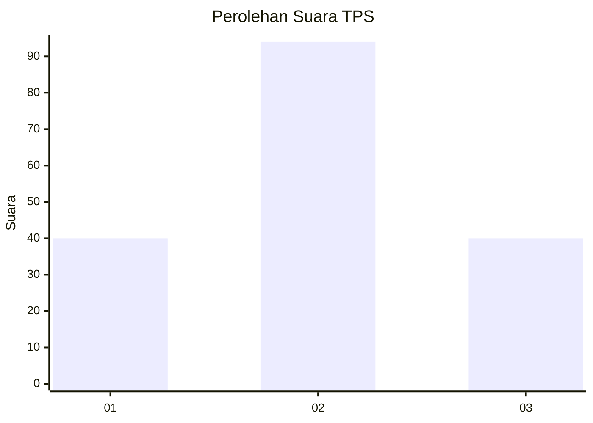
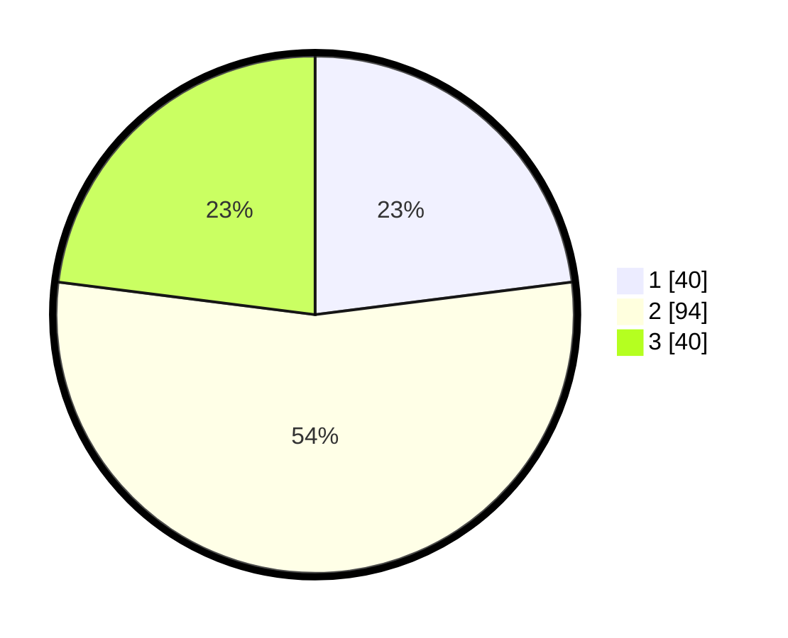

# Hasil

## Grafik

## Tabel

| No. | Nama Paslon    | Suara | Suara (raw) | Persentase |
|:--- |:-------------- | -----:| -----------:| ----------:|
| 1   | ANIES MUHAIMIN | 40    | [40][p-1]   | 22,99      |
| 2   | PRABOWO GIBRAN | 94    | [94][p-2]   | 54,02      |
| 3   | GANJAR MAHFUD  | 40    | [40][p-3]   | 22,99      |

[p-1]: https://github.com/gigit-pemilu/pemilu-2024-35-jawa-timur/blob/main/pilpres/hitung-suara/sub/35-jawa-timur/sub/78-kota-surabaya/sub/27-sukomanunggal/sub/1006-simomulyo-baru/sub/085-tps/sub/paslon-1.txt
[p-2]: https://github.com/gigit-pemilu/pemilu-2024-35-jawa-timur/blob/main/pilpres/hitung-suara/sub/35-jawa-timur/sub/78-kota-surabaya/sub/27-sukomanunggal/sub/1006-simomulyo-baru/sub/085-tps/sub/paslon-2.txt
[p-3]: https://github.com/gigit-pemilu/pemilu-2024-35-jawa-timur/blob/main/pilpres/hitung-suara/sub/35-jawa-timur/sub/78-kota-surabaya/sub/27-sukomanunggal/sub/1006-simomulyo-baru/sub/085-tps/sub/paslon-3.txt

## Foto C Plano

https://sirekap-obj-formc.kpu.go.id/e214/pemilu/ppwp/35/78/27/10/06/3578271006085-20240214-141253--013cfabc-821a-44a9-8453-a2c7c0b9484e.jpg

https://sirekap-obj-formc.kpu.go.id/e214/pemilu/ppwp/35/78/27/10/06/3578271006085-20240214-140953--a4bb71ce-607d-4b6b-86bd-da785da8cb54.jpg

https://sirekap-obj-formc.kpu.go.id/e214/pemilu/ppwp/35/78/27/10/06/3578271006085-20240214-141109--c11d3329-7b6b-463d-85ed-2eae55e6df4d.jpg

## Metadata

| Key        | Value               |
| ---------- | ------------------- |
| Time Stamp | 2024-02-24 22:31:28 |

