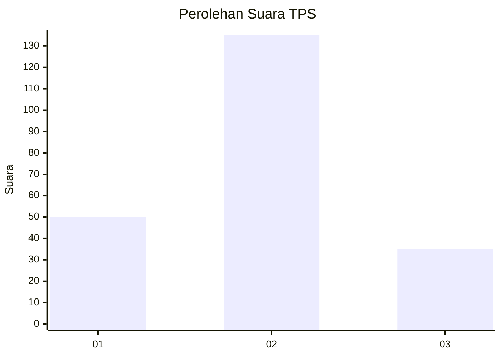
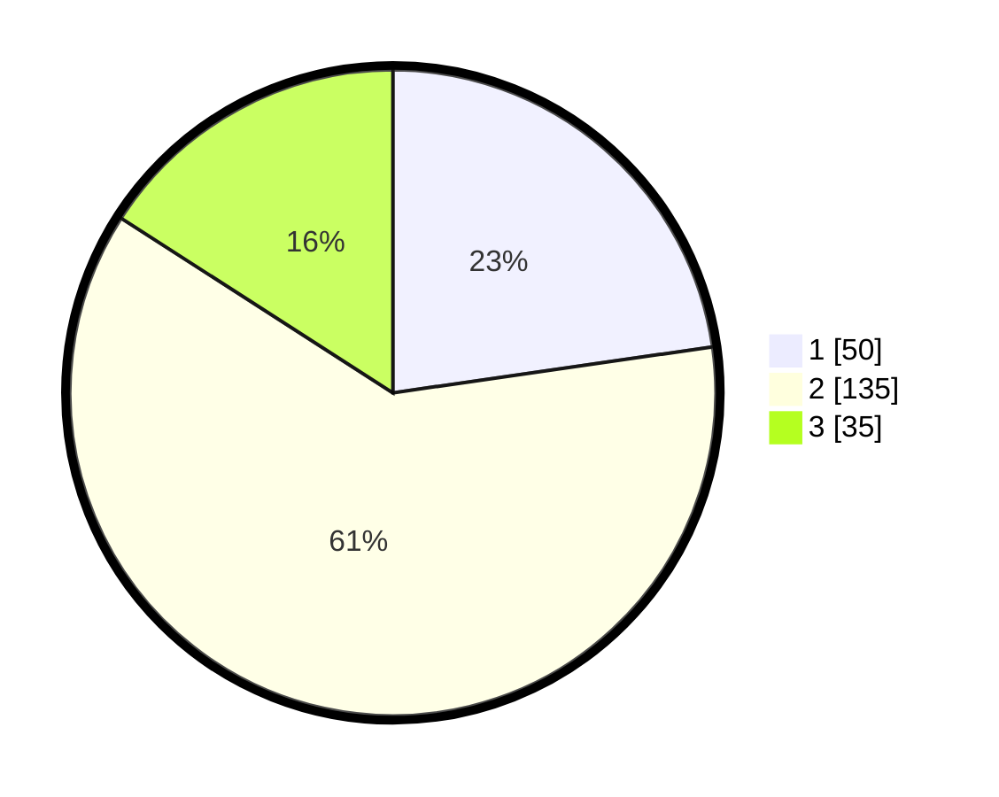

# Hasil

## Grafik

## Tabel

| No. | Nama Paslon    | Suara | Suara (raw) | Persentase |
|:--- |:-------------- | -----:| -----------:| ----------:|
| 1   | ANIES MUHAIMIN | 50    | [50][p-1]   | 22,73      |
| 2   | PRABOWO GIBRAN | 135   | [135][p-2]  | 61,36      |
| 3   | GANJAR MAHFUD  | 35    | [35][p-3]   | 15,91      |

[p-1]: https://github.com/gigit-pemilu/pemilu-2024/blob/main/pilpres/hitung-suara/sub/35-jawa-timur/sub/78-kota-surabaya/sub/28-asem-rowo/sub/1001-asem-rowo/sub/003-tps/sub/paslon-1.txt
[p-2]: https://github.com/gigit-pemilu/pemilu-2024/blob/main/pilpres/hitung-suara/sub/35-jawa-timur/sub/78-kota-surabaya/sub/28-asem-rowo/sub/1001-asem-rowo/sub/003-tps/sub/paslon-2.txt
[p-3]: https://github.com/gigit-pemilu/pemilu-2024/blob/main/pilpres/hitung-suara/sub/35-jawa-timur/sub/78-kota-surabaya/sub/28-asem-rowo/sub/1001-asem-rowo/sub/003-tps/sub/paslon-3.txt

## Foto C Plano

https://sirekap-obj-formc.kpu.go.id/f612/pemilu/ppwp/35/78/28/10/01/3578281001003-20240215-004209--1fbcbff9-2775-4409-9300-b4b58e176eaa.jpg

https://sirekap-obj-formc.kpu.go.id/f612/pemilu/ppwp/35/78/28/10/01/3578281001003-20240215-004307--2bdbb94a-7239-42f4-8cce-c224bd963249.jpg

https://sirekap-obj-formc.kpu.go.id/f612/pemilu/ppwp/35/78/28/10/01/3578281001003-20240215-004356--cd6d2eef-3f4a-400d-90a8-181422938dcc.jpg

## Metadata

| Key        | Value               |
| ---------- | ------------------- |
| Time Stamp | 2024-02-25 12:00:00 |

