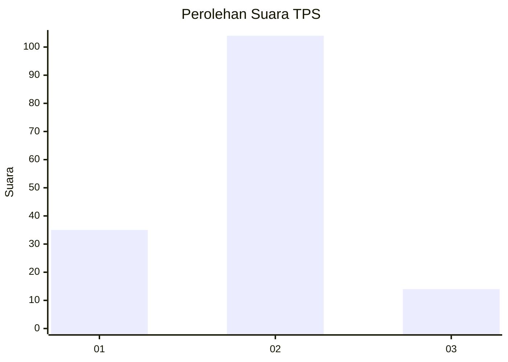

# Hasil

## Grafik

## Tabel

| No. | Nama Paslon    | Suara | Suara (raw) | Persentase |
|:--- |:-------------- | -----:| -----------:| ----------:|
| 1   | ANIES MUHAIMIN | 35    | [35][p-1]   | 22,88      |
| 2   | PRABOWO GIBRAN | 104   | [104][p-2]  | 67,97      |
| 3   | GANJAR MAHFUD  | 14    | [14][p-3]   | 9,15       |

[p-1]: https://github.com/gigit-pemilu/pemilu-2024-35-jawa-timur/blob/main/pilpres/hitung-suara/sub/35-jawa-timur/sub/78-kota-surabaya/sub/28-asem-rowo/sub/1001-asem-rowo/sub/057-tps/sub/paslon-1.txt
[p-2]: https://github.com/gigit-pemilu/pemilu-2024-35-jawa-timur/blob/main/pilpres/hitung-suara/sub/35-jawa-timur/sub/78-kota-surabaya/sub/28-asem-rowo/sub/1001-asem-rowo/sub/057-tps/sub/paslon-2.txt
[p-3]: https://github.com/gigit-pemilu/pemilu-2024-35-jawa-timur/blob/main/pilpres/hitung-suara/sub/35-jawa-timur/sub/78-kota-surabaya/sub/28-asem-rowo/sub/1001-asem-rowo/sub/057-tps/sub/paslon-3.txt

## Foto C Plano

https://sirekap-obj-formc.kpu.go.id/feb9/pemilu/ppwp/35/78/28/10/01/3578281001057-20240215-051020--e9d9e6e0-c696-416f-ab1c-e0ff8e65af04.jpg

https://sirekap-obj-formc.kpu.go.id/feb9/pemilu/ppwp/35/78/28/10/01/3578281001057-20240215-051134--1dd0d484-d36a-4e89-9278-d8f5c675750a.jpg

https://sirekap-obj-formc.kpu.go.id/feb9/pemilu/ppwp/35/78/28/10/01/3578281001057-20240215-051236--630e896a-2655-412f-9edd-cf6ae36ad967.jpg

## Metadata

| Key        | Value               |
| ---------- | ------------------- |
| Time Stamp | 2024-02-25 12:00:00 |

