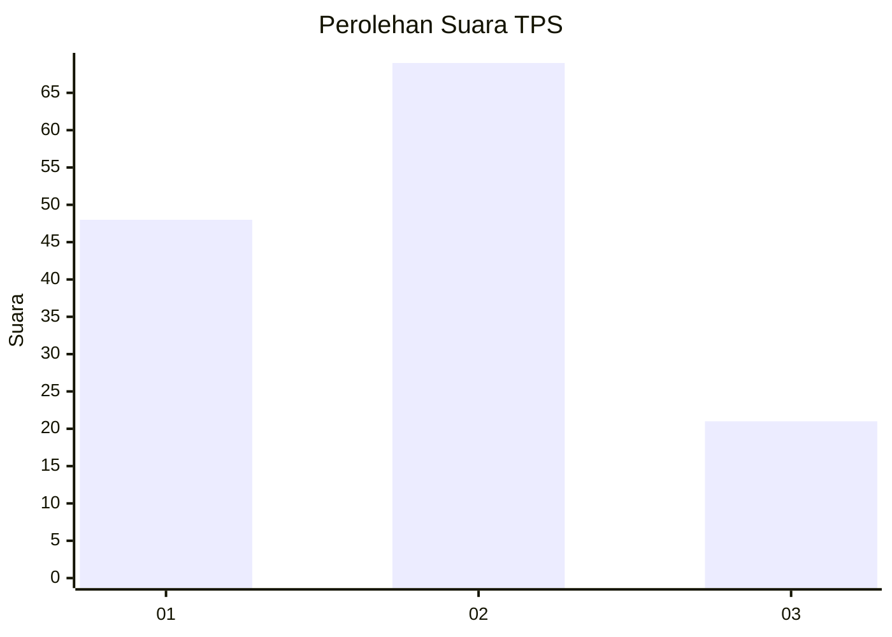
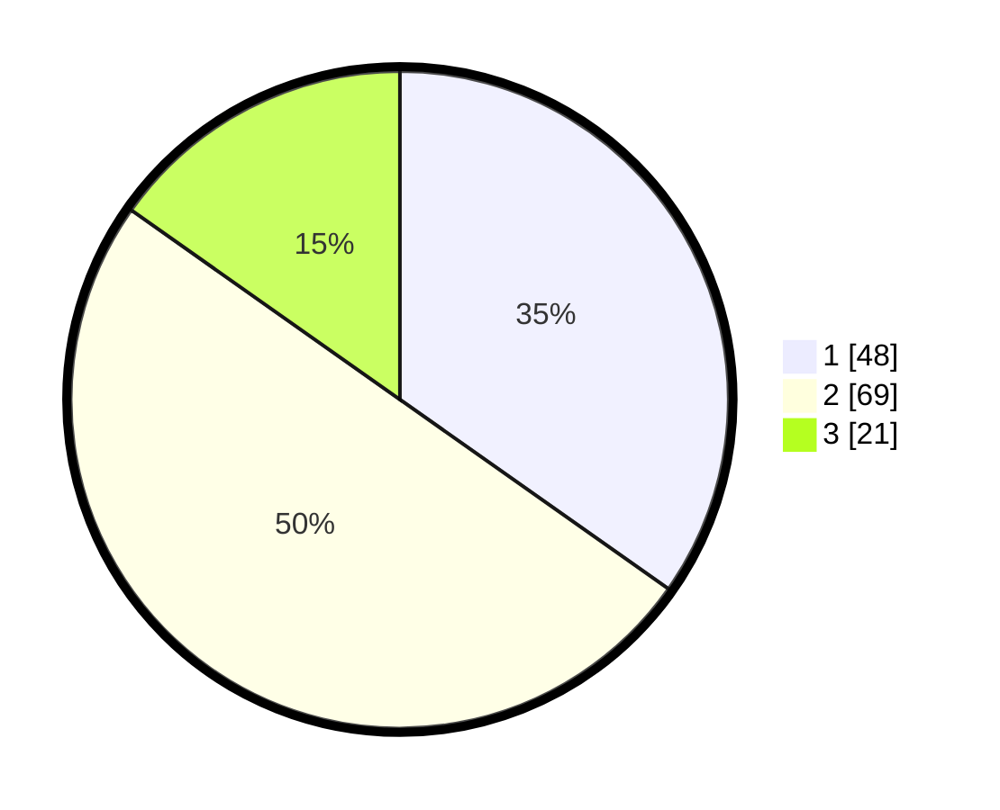

# Hasil

## Grafik

## Tabel

| No. | Nama Paslon    | Suara | Suara (raw) | Persentase |
|:--- |:-------------- | -----:| -----------:| ----------:|
| 1   | ANIES MUHAIMIN | 48    | [48][p-1]   | 34,78      |
| 2   | PRABOWO GIBRAN | 69    | [69][p-2]   | 50,00      |
| 3   | GANJAR MAHFUD  | 21    | [21][p-3]   | 15,22      |

[p-1]: https://github.com/gigit-pemilu/pemilu-2024/blob/main/pilpres/hitung-suara/sub/35-jawa-timur/sub/78-kota-surabaya/sub/28-asem-rowo/sub/1001-asem-rowo/sub/074-tps/sub/paslon-1.txt
[p-2]: https://github.com/gigit-pemilu/pemilu-2024/blob/main/pilpres/hitung-suara/sub/35-jawa-timur/sub/78-kota-surabaya/sub/28-asem-rowo/sub/1001-asem-rowo/sub/074-tps/sub/paslon-2.txt
[p-3]: https://github.com/gigit-pemilu/pemilu-2024/blob/main/pilpres/hitung-suara/sub/35-jawa-timur/sub/78-kota-surabaya/sub/28-asem-rowo/sub/1001-asem-rowo/sub/074-tps/sub/paslon-3.txt

## Foto C Plano

https://sirekap-obj-formc.kpu.go.id/062f/pemilu/ppwp/35/78/28/10/01/3578281001074-20240215-005827--e7023be7-160a-4b84-b73e-82bc560c9a0c.jpg

https://sirekap-obj-formc.kpu.go.id/062f/pemilu/ppwp/35/78/28/10/01/3578281001074-20240215-005929--56d89c80-75b5-4b82-ac4f-a569454210e2.jpg

https://sirekap-obj-formc.kpu.go.id/062f/pemilu/ppwp/35/78/28/10/01/3578281001074-20240215-010017--129f4df5-bda0-4a72-abab-8b10bd6770d2.jpg

## Metadata

| Key        | Value               |
| ---------- | ------------------- |
| Time Stamp | 2024-02-25 01:00:00 |

