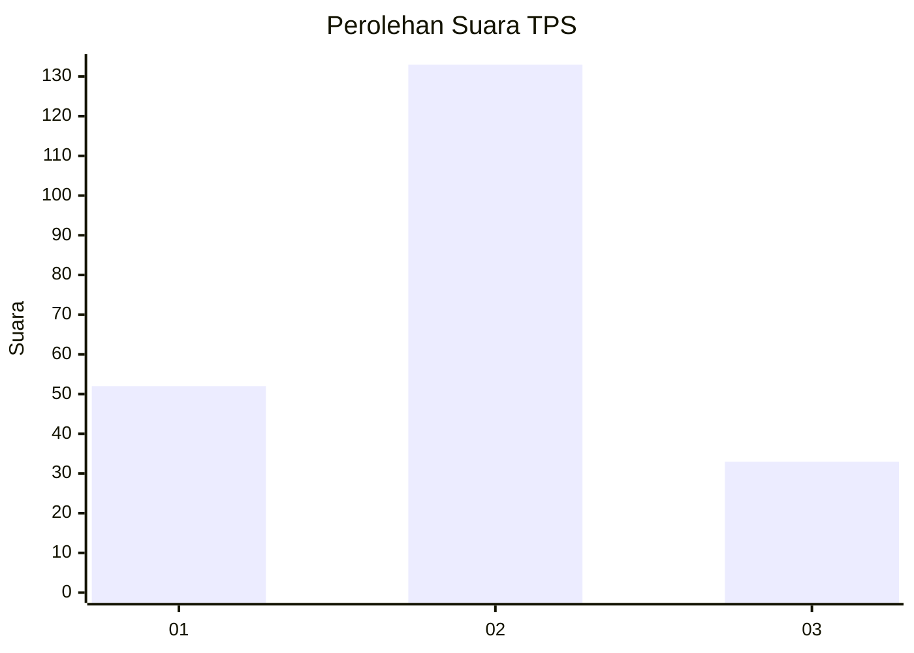
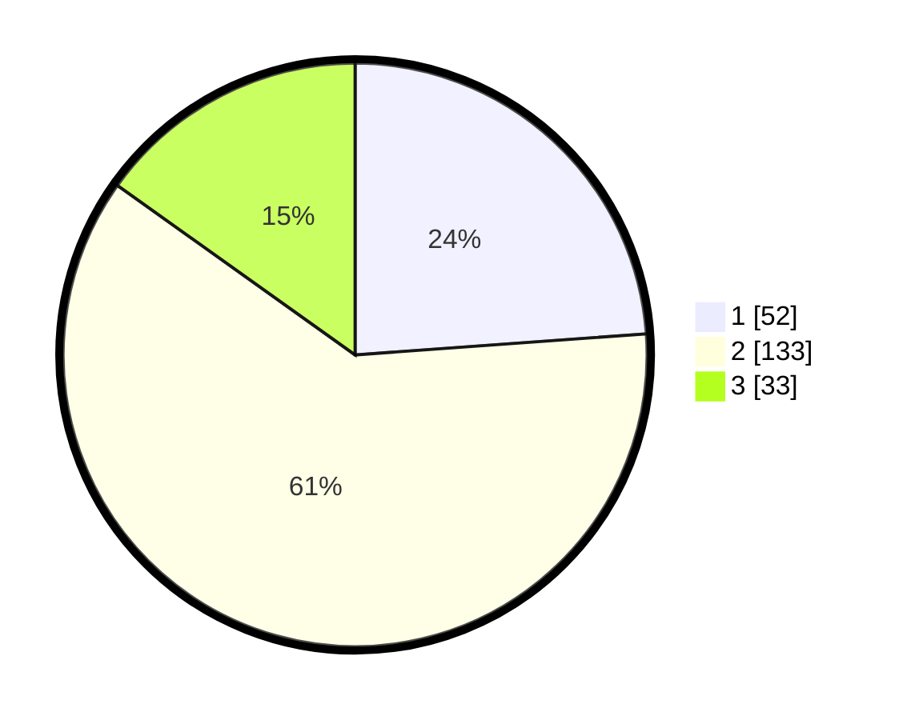

# Hasil

## Grafik

## Tabel

| No. | Nama Paslon    | Suara | Suara (raw) | Persentase |
|:--- |:-------------- | -----:| -----------:| ----------:|
| 1   | ANIES MUHAIMIN | 52    | [52][p-1]   | 23,85      |
| 2   | PRABOWO GIBRAN | 133   | [133][p-2]  | 61,01      |
| 3   | GANJAR MAHFUD  | 33    | [33][p-3]   | 15,14      |

[p-1]: https://github.com/gigit-pemilu/pemilu-2024/blob/main/pilpres/hitung-suara/sub/35-jawa-timur/sub/78-kota-surabaya/sub/28-asem-rowo/sub/1002-genting-kalianak/sub/018-tps/sub/paslon-1.txt
[p-2]: https://github.com/gigit-pemilu/pemilu-2024/blob/main/pilpres/hitung-suara/sub/35-jawa-timur/sub/78-kota-surabaya/sub/28-asem-rowo/sub/1002-genting-kalianak/sub/018-tps/sub/paslon-2.txt
[p-3]: https://github.com/gigit-pemilu/pemilu-2024/blob/main/pilpres/hitung-suara/sub/35-jawa-timur/sub/78-kota-surabaya/sub/28-asem-rowo/sub/1002-genting-kalianak/sub/018-tps/sub/paslon-3.txt

## Foto C Plano

https://sirekap-obj-formc.kpu.go.id/ce7d/pemilu/ppwp/35/78/28/10/02/3578281002018-20240214-213533--0e8b90fe-72b5-4346-89c4-a21ace20998d.jpg

https://sirekap-obj-formc.kpu.go.id/ce7d/pemilu/ppwp/35/78/28/10/02/3578281002018-20240214-213539--af331612-d9ad-4aed-a6bb-8672b0142bca.jpg

https://sirekap-obj-formc.kpu.go.id/ce7d/pemilu/ppwp/35/78/28/10/02/3578281002018-20240214-213548--317dc8af-a534-4b44-a5af-9c1e8cfe8b73.jpg

## Metadata

| Key        | Value               |
| ---------- | ------------------- |
| Time Stamp | 2024-02-24 22:31:28 |

