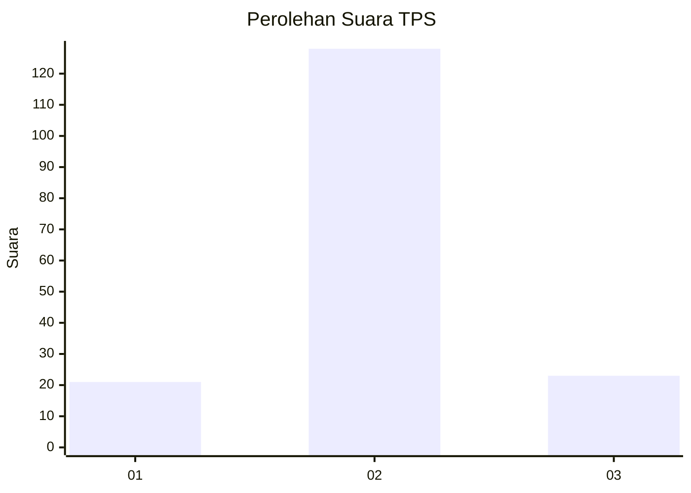
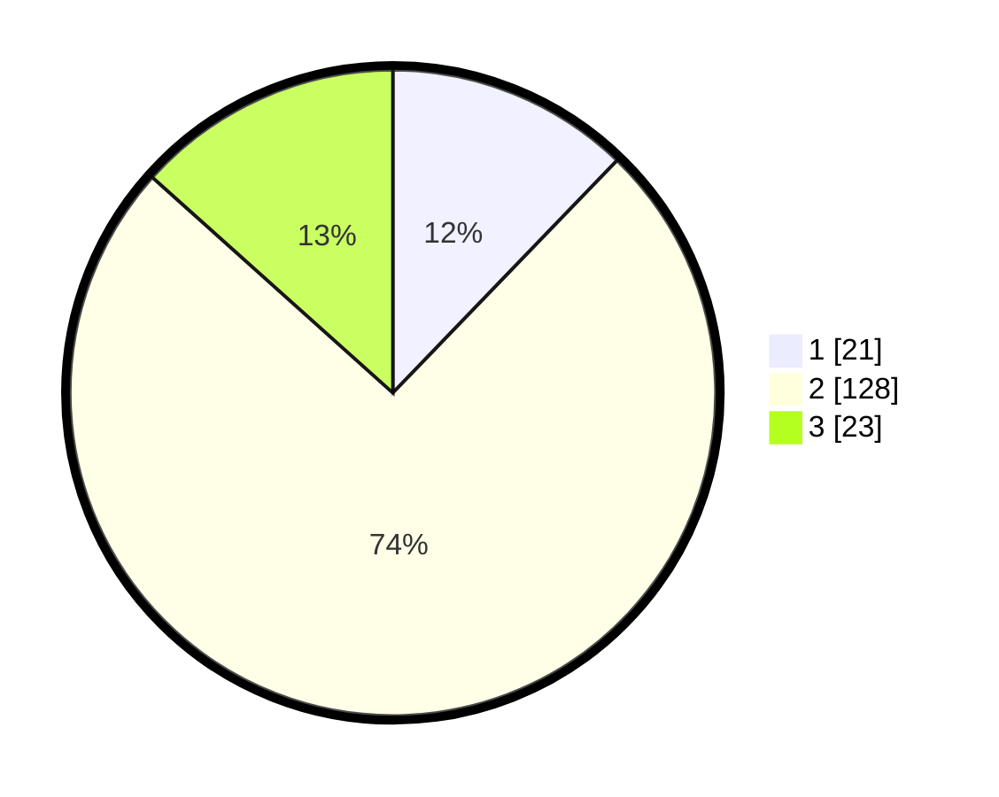

# Hasil

## Grafik

## Tabel

| No. | Nama Paslon    | Suara | Suara (raw) | Persentase |
|:--- |:-------------- | -----:| -----------:| ----------:|
| 1   | ANIES MUHAIMIN | 21    | [21][p-1]   | 12,21      |
| 2   | PRABOWO GIBRAN | 128   | [128][p-2]  | 74,42      |
| 3   | GANJAR MAHFUD  | 23    | [23][p-3]   | 13,37      |

[p-1]: https://github.com/gigit-pemilu/pemilu-2024/blob/main/pilpres/hitung-suara/sub/35-jawa-timur/sub/78-kota-surabaya/sub/28-asem-rowo/sub/1005-tambak-sarioso/sub/007-tps/sub/paslon-1.txt
[p-2]: https://github.com/gigit-pemilu/pemilu-2024/blob/main/pilpres/hitung-suara/sub/35-jawa-timur/sub/78-kota-surabaya/sub/28-asem-rowo/sub/1005-tambak-sarioso/sub/007-tps/sub/paslon-2.txt
[p-3]: https://github.com/gigit-pemilu/pemilu-2024/blob/main/pilpres/hitung-suara/sub/35-jawa-timur/sub/78-kota-surabaya/sub/28-asem-rowo/sub/1005-tambak-sarioso/sub/007-tps/sub/paslon-3.txt

## Foto C Plano

https://sirekap-obj-formc.kpu.go.id/0cf0/pemilu/ppwp/35/78/28/10/05/3578281005007-20240215-180313--b0d57a7f-6ee6-484c-b460-bd3c04ce41d8.jpg

https://sirekap-obj-formc.kpu.go.id/0cf0/pemilu/ppwp/35/78/28/10/05/3578281005007-20240215-175223--e4f0bdc2-b6c9-4aaa-9725-e12329e71f23.jpg

https://sirekap-obj-formc.kpu.go.id/0cf0/pemilu/ppwp/35/78/28/10/05/3578281005007-20240215-175327--906f645a-bf73-49a8-a256-05b5e7976b2b.jpg

## Metadata

| Key        | Value               |
| ---------- | ------------------- |
| Time Stamp | 2024-02-24 22:31:28 |

