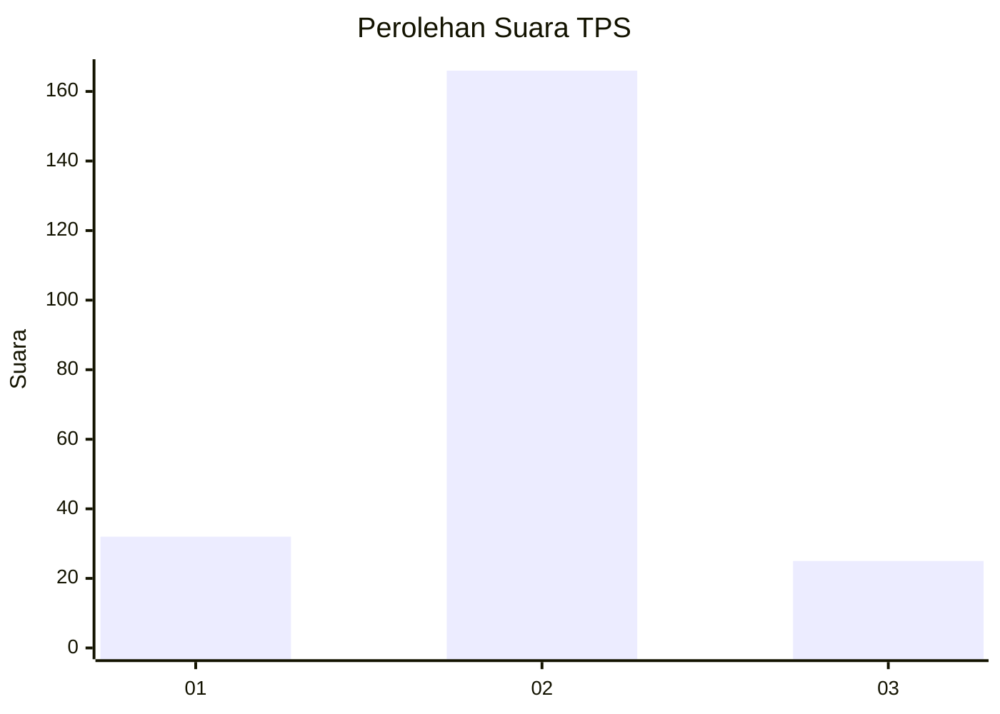
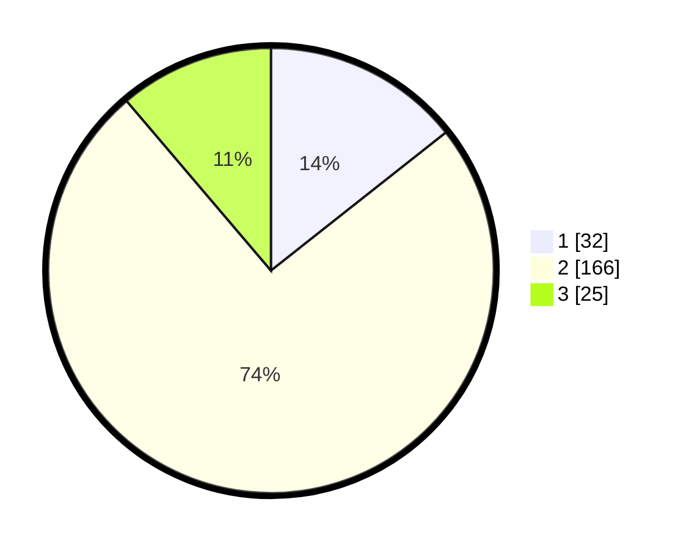

# Hasil

## Grafik

## Tabel

| No. | Nama Paslon    | Suara | Suara (raw) | Persentase |
|:--- |:-------------- | -----:| -----------:| ----------:|
| 1   | ANIES MUHAIMIN | 32    | [32][p-1]   | 14,35      |
| 2   | PRABOWO GIBRAN | 166   | [166][p-2]  | 74,44      |
| 3   | GANJAR MAHFUD  | 25    | [25][p-3]   | 11,21      |

[p-1]: https://github.com/gigit-pemilu/pemilu-2024-35-jawa-timur/blob/main/pilpres/hitung-suara/sub/35-jawa-timur/sub/78-kota-surabaya/sub/29-bulak/sub/1001-kedung-cowek/sub/001-tps/sub/paslon-1.txt
[p-2]: https://github.com/gigit-pemilu/pemilu-2024-35-jawa-timur/blob/main/pilpres/hitung-suara/sub/35-jawa-timur/sub/78-kota-surabaya/sub/29-bulak/sub/1001-kedung-cowek/sub/001-tps/sub/paslon-2.txt
[p-3]: https://github.com/gigit-pemilu/pemilu-2024-35-jawa-timur/blob/main/pilpres/hitung-suara/sub/35-jawa-timur/sub/78-kota-surabaya/sub/29-bulak/sub/1001-kedung-cowek/sub/001-tps/sub/paslon-3.txt

## Foto C Plano

https://sirekap-obj-formc.kpu.go.id/d2c3/pemilu/ppwp/35/78/29/10/01/3578291001001-20240214-224157--441d0ab9-9260-4603-8fb2-8be131405a20.jpg

https://sirekap-obj-formc.kpu.go.id/d2c3/pemilu/ppwp/35/78/29/10/01/3578291001001-20240215-022459--40df08fb-e0d7-4a3a-aec8-16cd3d9d3af8.jpg

https://sirekap-obj-formc.kpu.go.id/d2c3/pemilu/ppwp/35/78/29/10/01/3578291001001-20240214-224412--d37c704a-0287-4782-abc2-55aeadfa6f70.jpg

## Metadata

| Key        | Value               |
| ---------- | ------------------- |
| Time Stamp | 2024-02-25 16:00:00 |

