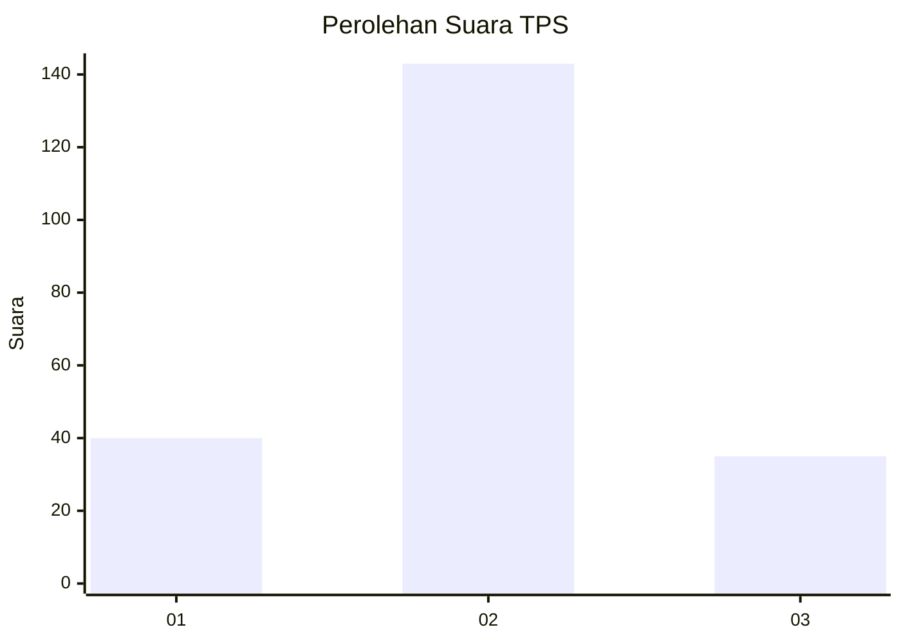
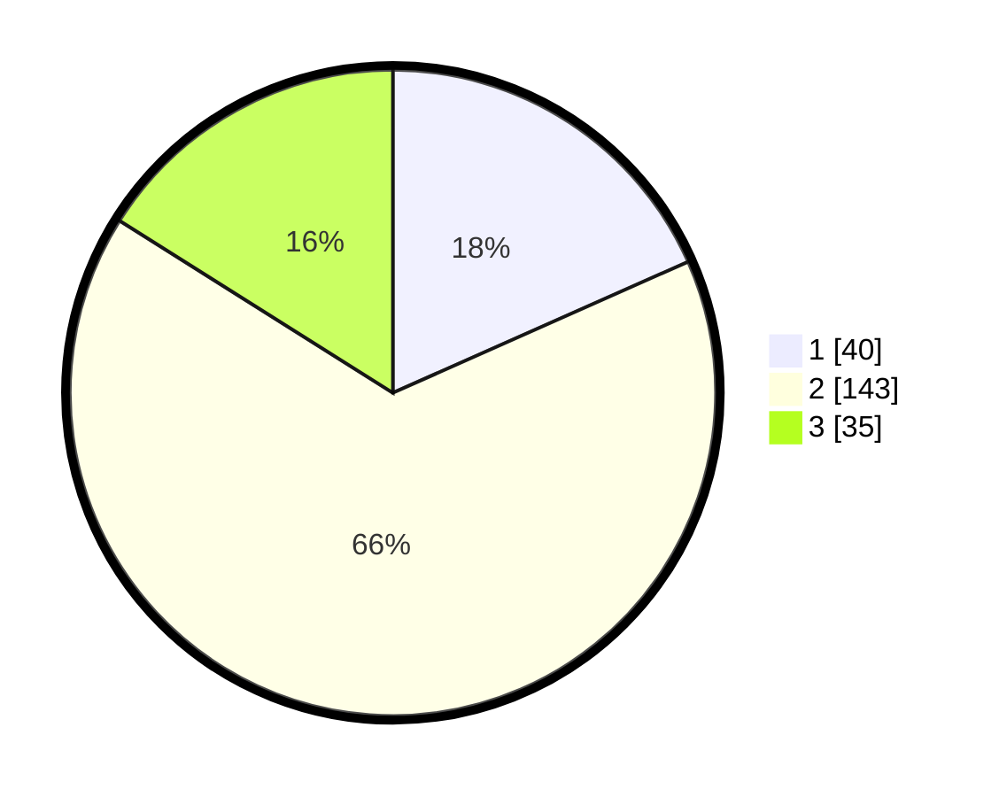

# Hasil

## Grafik

## Tabel

| No. | Nama Paslon    | Suara | Suara (raw) | Persentase |
|:--- |:-------------- | -----:| -----------:| ----------:|
| 1   | ANIES MUHAIMIN | 40    | [40][p-1]   | 18,35      |
| 2   | PRABOWO GIBRAN | 143   | [143][p-2]  | 65,60      |
| 3   | GANJAR MAHFUD  | 35    | [35][p-3]   | 16,06      |

[p-1]: https://github.com/gigit-pemilu/pemilu-2024-35-jawa-timur/blob/main/pilpres/hitung-suara/sub/35-jawa-timur/sub/78-kota-surabaya/sub/29-bulak/sub/1001-kedung-cowek/sub/002-tps/sub/paslon-1.txt
[p-2]: https://github.com/gigit-pemilu/pemilu-2024-35-jawa-timur/blob/main/pilpres/hitung-suara/sub/35-jawa-timur/sub/78-kota-surabaya/sub/29-bulak/sub/1001-kedung-cowek/sub/002-tps/sub/paslon-2.txt
[p-3]: https://github.com/gigit-pemilu/pemilu-2024-35-jawa-timur/blob/main/pilpres/hitung-suara/sub/35-jawa-timur/sub/78-kota-surabaya/sub/29-bulak/sub/1001-kedung-cowek/sub/002-tps/sub/paslon-3.txt

## Foto C Plano

https://sirekap-obj-formc.kpu.go.id/0344/pemilu/ppwp/35/78/29/10/01/3578291001002-20240214-213745--438165f5-a29c-42f3-a601-9abd08fd0217.jpg

https://sirekap-obj-formc.kpu.go.id/0344/pemilu/ppwp/35/78/29/10/01/3578291001002-20240214-213847--b9c4e7fb-09a6-4458-9102-caa5cc4bf071.jpg

https://sirekap-obj-formc.kpu.go.id/0344/pemilu/ppwp/35/78/29/10/01/3578291001002-20240214-213927--a8ccbead-da53-45c4-9414-f2d74b318579.jpg

## Metadata

| Key        | Value               |
| ---------- | ------------------- |
| Time Stamp | 2024-02-25 17:00:00 |

