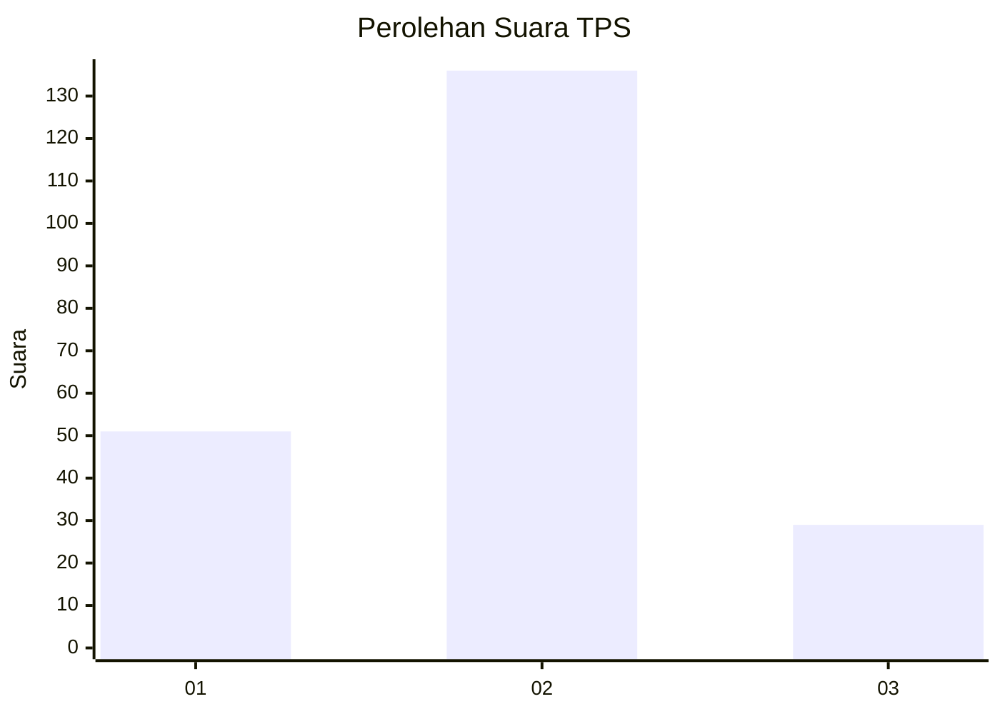
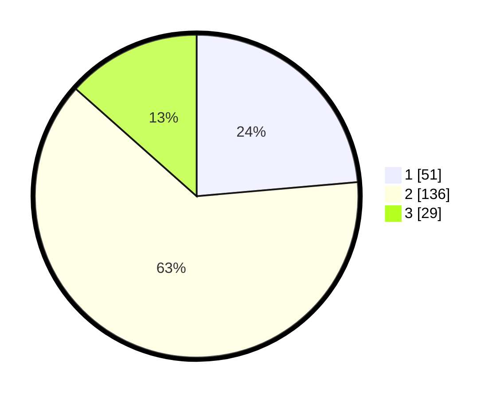

# Hasil

## Grafik

## Tabel

| No. | Nama Paslon    | Suara | Suara (raw) | Persentase |
|:--- |:-------------- | -----:| -----------:| ----------:|
| 1   | ANIES MUHAIMIN | 51    | [51][p-1]   | 23,61      |
| 2   | PRABOWO GIBRAN | 136   | [136][p-2]  | 62,96      |
| 3   | GANJAR MAHFUD  | 29    | [29][p-3]   | 13,43      |

[p-1]: https://github.com/gigit-pemilu/pemilu-2024/blob/main/pilpres/hitung-suara/sub/35-jawa-timur/sub/78-kota-surabaya/sub/29-bulak/sub/1001-kedung-cowek/sub/004-tps/sub/paslon-1.txt
[p-2]: https://github.com/gigit-pemilu/pemilu-2024/blob/main/pilpres/hitung-suara/sub/35-jawa-timur/sub/78-kota-surabaya/sub/29-bulak/sub/1001-kedung-cowek/sub/004-tps/sub/paslon-2.txt
[p-3]: https://github.com/gigit-pemilu/pemilu-2024/blob/main/pilpres/hitung-suara/sub/35-jawa-timur/sub/78-kota-surabaya/sub/29-bulak/sub/1001-kedung-cowek/sub/004-tps/sub/paslon-3.txt

## Foto C Plano

https://sirekap-obj-formc.kpu.go.id/cf11/pemilu/ppwp/35/78/29/10/01/3578291001004-20240215-032848--35fc541f-793f-4be5-93cc-8aad609d3b88.jpg

https://sirekap-obj-formc.kpu.go.id/cf11/pemilu/ppwp/35/78/29/10/01/3578291001004-20240215-033013--1e20e5e0-51f4-4727-8bdc-872c757101e6.jpg

https://sirekap-obj-formc.kpu.go.id/cf11/pemilu/ppwp/35/78/29/10/01/3578291001004-20240215-033125--f1f7691d-a33f-4395-89ea-1c5efbbee828.jpg

## Metadata

| Key        | Value               |
| ---------- | ------------------- |
| Time Stamp | 2024-02-25 16:00:00 |

