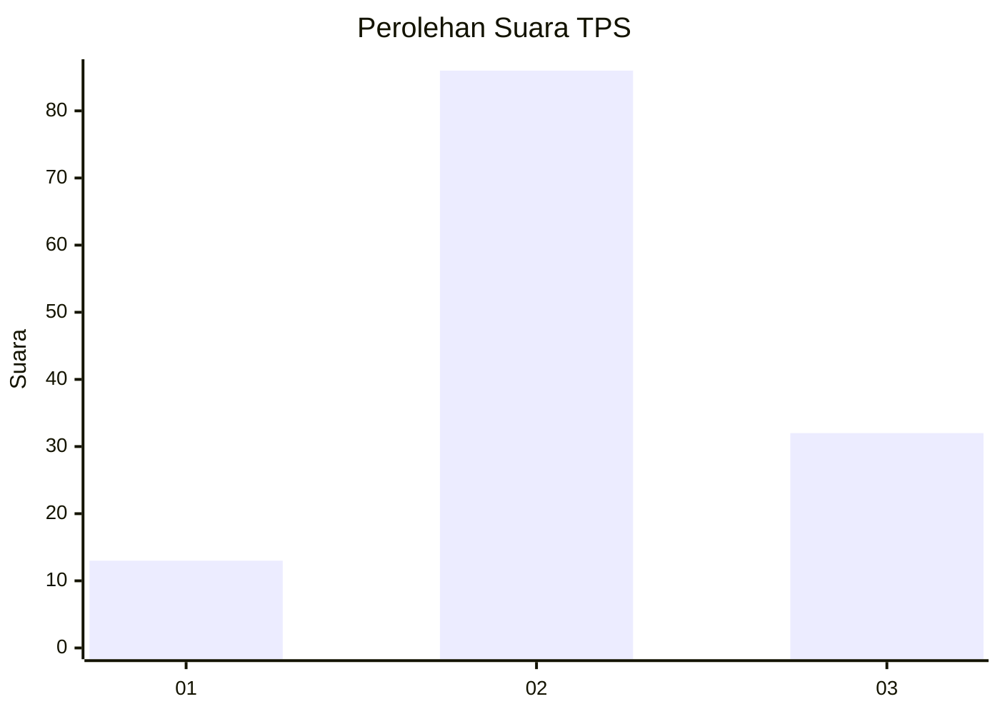
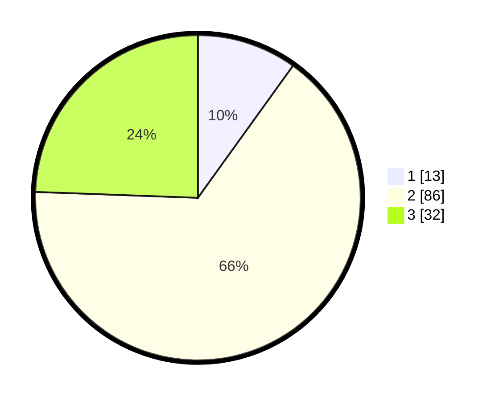

# Hasil

## Grafik

## Tabel

| No. | Nama Paslon    | Suara | Suara (raw) | Persentase |
|:--- |:-------------- | -----:| -----------:| ----------:|
| 1   | ANIES MUHAIMIN | 13    | [13][p-1]   | 9,92       |
| 2   | PRABOWO GIBRAN | 86    | [86][p-2]   | 65,65      |
| 3   | GANJAR MAHFUD  | 32    | [32][p-3]   | 24,43      |

[p-1]: https://github.com/gigit-pemilu/pemilu-2024-35-jawa-timur/blob/main/pilpres/hitung-suara/sub/35-jawa-timur/sub/78-kota-surabaya/sub/29-bulak/sub/1003-kenjeran/sub/005-tps/sub/paslon-1.txt
[p-2]: https://github.com/gigit-pemilu/pemilu-2024-35-jawa-timur/blob/main/pilpres/hitung-suara/sub/35-jawa-timur/sub/78-kota-surabaya/sub/29-bulak/sub/1003-kenjeran/sub/005-tps/sub/paslon-2.txt
[p-3]: https://github.com/gigit-pemilu/pemilu-2024-35-jawa-timur/blob/main/pilpres/hitung-suara/sub/35-jawa-timur/sub/78-kota-surabaya/sub/29-bulak/sub/1003-kenjeran/sub/005-tps/sub/paslon-3.txt

## Foto C Plano

https://sirekap-obj-formc.kpu.go.id/b80b/pemilu/ppwp/35/78/29/10/03/3578291003005-20240214-224254--76dc5016-030d-47c3-a864-b1396d76109c.jpg

https://sirekap-obj-formc.kpu.go.id/b80b/pemilu/ppwp/35/78/29/10/03/3578291003005-20240214-224327--d907bb6f-990a-492f-851a-06b71b081d59.jpg

https://sirekap-obj-formc.kpu.go.id/b80b/pemilu/ppwp/35/78/29/10/03/3578291003005-20240214-224459--63c62d75-ba7b-4a00-90c9-325cc700b28d.jpg

## Metadata

| Key        | Value               |
| ---------- | ------------------- |
| Time Stamp | 2024-02-25 17:00:00 |

