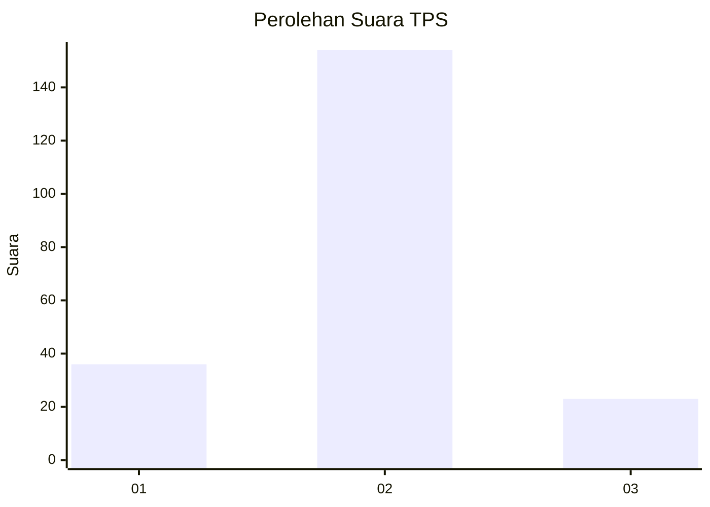
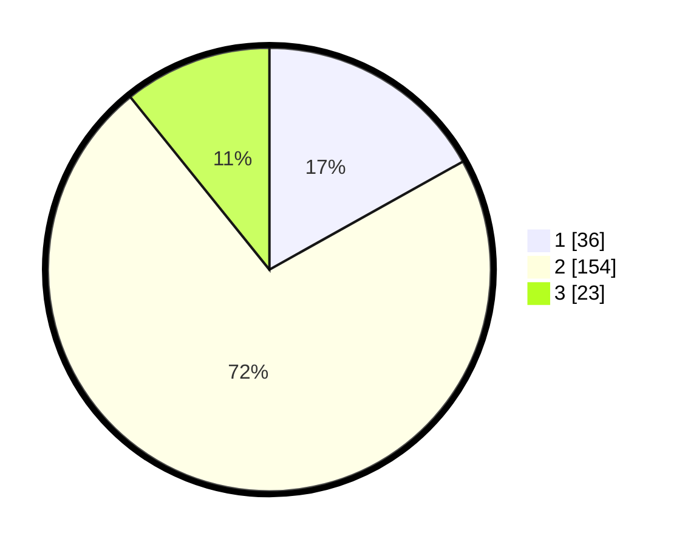

# Hasil

## Grafik

## Tabel

| No. | Nama Paslon    | Suara | Suara (raw) | Persentase |
|:--- |:-------------- | -----:| -----------:| ----------:|
| 1   | ANIES MUHAIMIN | 36    | [36][p-1]   | 16,90      |
| 2   | PRABOWO GIBRAN | 154   | [154][p-2]  | 72,30      |
| 3   | GANJAR MAHFUD  | 23    | [23][p-3]   | 10,80      |

[p-1]: https://github.com/gigit-pemilu/pemilu-2024/blob/main/pilpres/hitung-suara/sub/35-jawa-timur/sub/78-kota-surabaya/sub/29-bulak/sub/1003-kenjeran/sub/007-tps/sub/paslon-1.txt
[p-2]: https://github.com/gigit-pemilu/pemilu-2024/blob/main/pilpres/hitung-suara/sub/35-jawa-timur/sub/78-kota-surabaya/sub/29-bulak/sub/1003-kenjeran/sub/007-tps/sub/paslon-2.txt
[p-3]: https://github.com/gigit-pemilu/pemilu-2024/blob/main/pilpres/hitung-suara/sub/35-jawa-timur/sub/78-kota-surabaya/sub/29-bulak/sub/1003-kenjeran/sub/007-tps/sub/paslon-3.txt

## Foto C Plano

https://sirekap-obj-formc.kpu.go.id/d739/pemilu/ppwp/35/78/29/10/03/3578291003007-20240223-104312--98b53089-2bdd-4ec7-9ea1-055fd159f17a.jpg

https://sirekap-obj-formc.kpu.go.id/d739/pemilu/ppwp/35/78/29/10/03/3578291003007-20240223-104623--aaca508f-04ea-4891-87d4-87d1a614474b.jpg

https://sirekap-obj-formc.kpu.go.id/d739/pemilu/ppwp/35/78/29/10/03/3578291003007-20240223-104732--7218ebc8-c856-466a-a234-5cadce012b59.jpg

## Metadata

| Key        | Value               |
| ---------- | ------------------- |
| Time Stamp | 2024-02-24 22:31:28 |

## DATA PEMILIH TETAP

Jumlah pemilih dalam DPT: **221**.
 * L: **143**.
 * P: **283**.

## DATA PENGGUNA HAK PILIH

Jumlah pengguna hak pilih dalam DPT: **226**.
 * L: **116**.
 * P: **110**.

Jumlah pengguna hak pilih dalam DPTb: **5**.
 * L: **700**.
 * P: **0**.

Jumlah pengguna hak pilih dalam DPK: **0**.
 * L: **70**.
 * P: **0**.

Jumlah pengguna hak pilih: **225**.
 * L: **816**.
 * P: **110**.

## JUMLAH SUARA SAH DAN TIDAK SAH

JUMLAH SELURUH SUARA SAH: **213**.

JUMLAH SUARA TIDAK SAH: **410**.

JUMLAH SELURUH SUARA SAH DAN SUARA TIDAK SAH: **520**.

