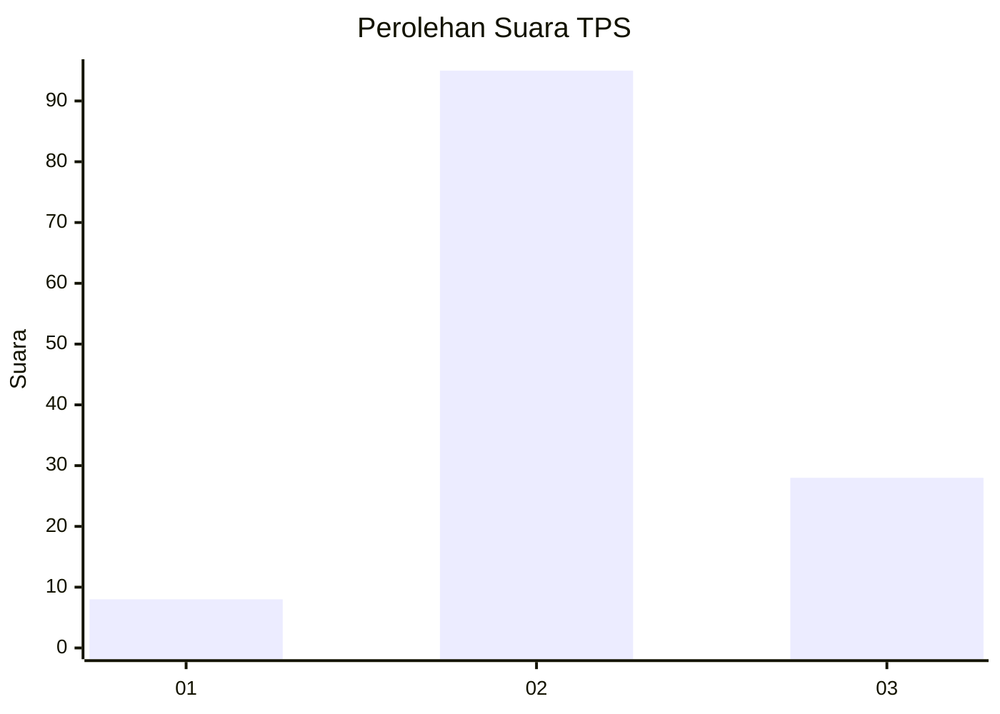

# Hasil

## Grafik

## Tabel

| No. | Nama Paslon    | Suara | Suara (raw) | Persentase |
|:--- |:-------------- | -----:| -----------:| ----------:|
| 1   | ANIES MUHAIMIN | 8     | [8][p-1]    | 6,11       |
| 2   | PRABOWO GIBRAN | 95    | [95][p-2]   | 72,52      |
| 3   | GANJAR MAHFUD  | 28    | [28][p-3]   | 21,37      |

[p-1]: https://github.com/gigit-pemilu/pemilu-2024/blob/main/pilpres/hitung-suara/sub/35-jawa-timur/sub/78-kota-surabaya/sub/29-bulak/sub/1003-kenjeran/sub/010-tps/sub/paslon-1.txt
[p-2]: https://github.com/gigit-pemilu/pemilu-2024/blob/main/pilpres/hitung-suara/sub/35-jawa-timur/sub/78-kota-surabaya/sub/29-bulak/sub/1003-kenjeran/sub/010-tps/sub/paslon-2.txt
[p-3]: https://github.com/gigit-pemilu/pemilu-2024/blob/main/pilpres/hitung-suara/sub/35-jawa-timur/sub/78-kota-surabaya/sub/29-bulak/sub/1003-kenjeran/sub/010-tps/sub/paslon-3.txt

## Foto C Plano

https://sirekap-obj-formc.kpu.go.id/a469/pemilu/ppwp/35/78/29/10/03/3578291003010-20240215-020812--e56d7cf0-60a9-4482-afd2-e7104682715f.jpg

https://sirekap-obj-formc.kpu.go.id/a469/pemilu/ppwp/35/78/29/10/03/3578291003010-20240215-020956--9eac973e-83c7-432b-8485-e05fe383b8f8.jpg

https://sirekap-obj-formc.kpu.go.id/a469/pemilu/ppwp/35/78/29/10/03/3578291003010-20240215-021130--21ab710a-8acc-49ca-b8c1-70bd4d503a3c.jpg

## Metadata

| Key        | Value               |
| ---------- | ------------------- |
| Time Stamp | 2024-02-25 11:00:00 |

