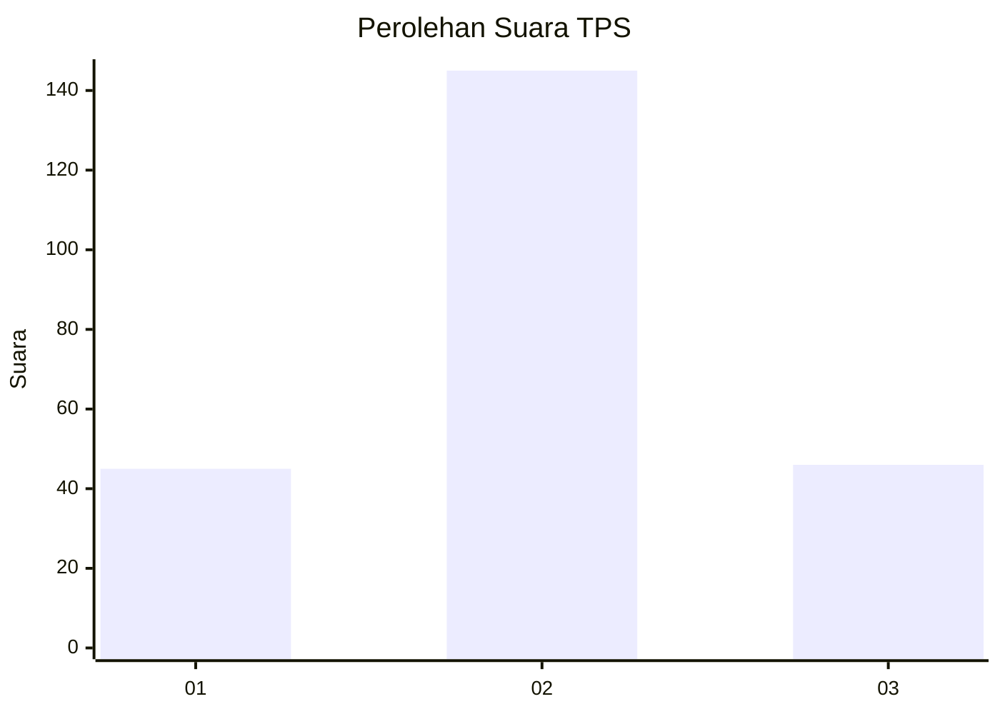
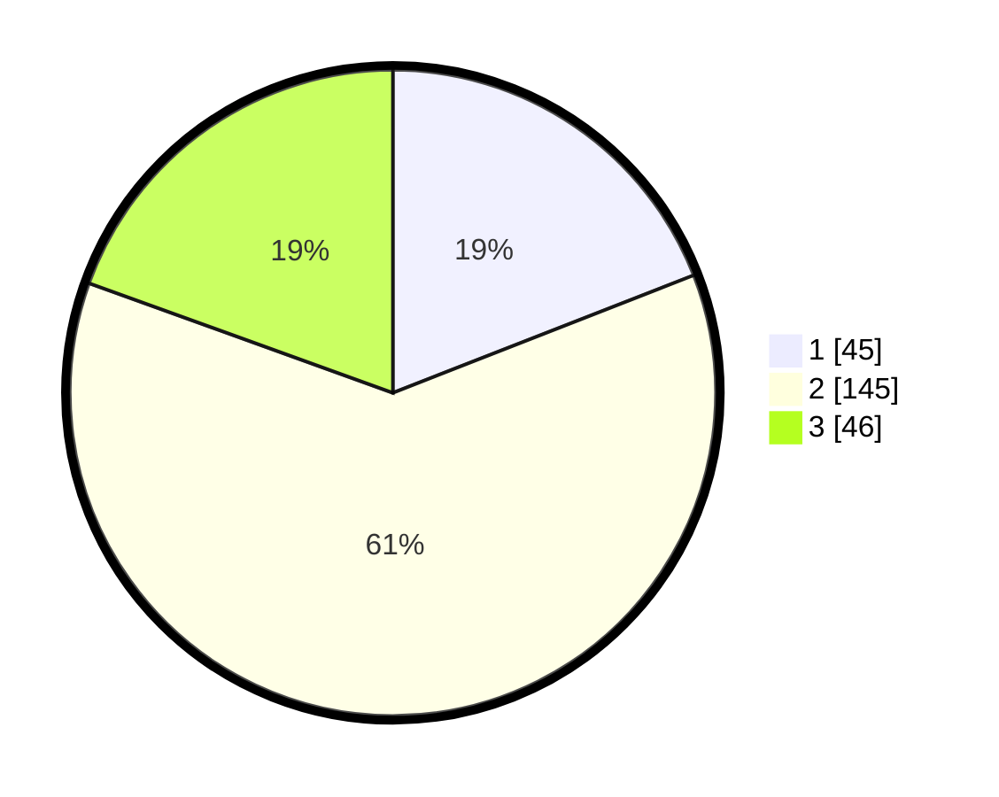

# Hasil

## Grafik

## Tabel

| No. | Nama Paslon    | Suara | Suara (raw) | Persentase |
|:--- |:-------------- | -----:| -----------:| ----------:|
| 1   | ANIES MUHAIMIN | 45    | [45][p-1]   | 19,07      |
| 2   | PRABOWO GIBRAN | 145   | [145][p-2]  | 61,44      |
| 3   | GANJAR MAHFUD  | 46    | [46][p-3]   | 19,49      |

[p-1]: https://github.com/gigit-pemilu/pemilu-2024/blob/main/pilpres/hitung-suara/sub/35-jawa-timur/sub/78-kota-surabaya/sub/29-bulak/sub/1005-sukolilo-baru/sub/004-tps/sub/paslon-1.txt
[p-2]: https://github.com/gigit-pemilu/pemilu-2024/blob/main/pilpres/hitung-suara/sub/35-jawa-timur/sub/78-kota-surabaya/sub/29-bulak/sub/1005-sukolilo-baru/sub/004-tps/sub/paslon-2.txt
[p-3]: https://github.com/gigit-pemilu/pemilu-2024/blob/main/pilpres/hitung-suara/sub/35-jawa-timur/sub/78-kota-surabaya/sub/29-bulak/sub/1005-sukolilo-baru/sub/004-tps/sub/paslon-3.txt

## Foto C Plano

https://sirekap-obj-formc.kpu.go.id/1537/pemilu/ppwp/35/78/29/10/05/3578291005004-20240221-133851--70c513a1-9bdc-41ad-b90c-abf2162e1aad.jpg

https://sirekap-obj-formc.kpu.go.id/1537/pemilu/ppwp/35/78/29/10/05/3578291005004-20240214-190431--dba20e4a-5fc5-4120-9d87-c15209021ab2.jpg

https://sirekap-obj-formc.kpu.go.id/1537/pemilu/ppwp/35/78/29/10/05/3578291005004-20240214-194348--912697e8-701e-4087-bd2e-5d41c46a866c.jpg

## Metadata

| Key        | Value               |
| ---------- | ------------------- |
| Time Stamp | 2024-02-21 14:00:00 |

## DATA PEMILIH TETAP

Jumlah pemilih dalam DPT: **821**.
 * L: **144**.
 * P: **644**.

## DATA PENGGUNA HAK PILIH

Jumlah pengguna hak pilih dalam DPT: **421**.
 * L: **200**.
 * P: **444**.

Jumlah pengguna hak pilih dalam DPTb: **1**.
 * L: **8**.
 * P: **444**.

Jumlah pengguna hak pilih dalam DPK: **1**.
 * L: **0**.
 * P: **664**.

Jumlah pengguna hak pilih: **424**.
 * L: **123**.
 * P: **444**.

## JUMLAH SUARA SAH DAN TIDAK SAH

JUMLAH SELURUH SUARA SAH: **236**.

JUMLAH SUARA TIDAK SAH: **6**.

JUMLAH SELURUH SUARA SAH DAN SUARA TIDAK SAH: **242**.

