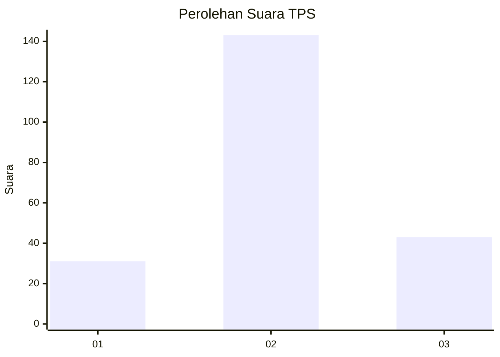
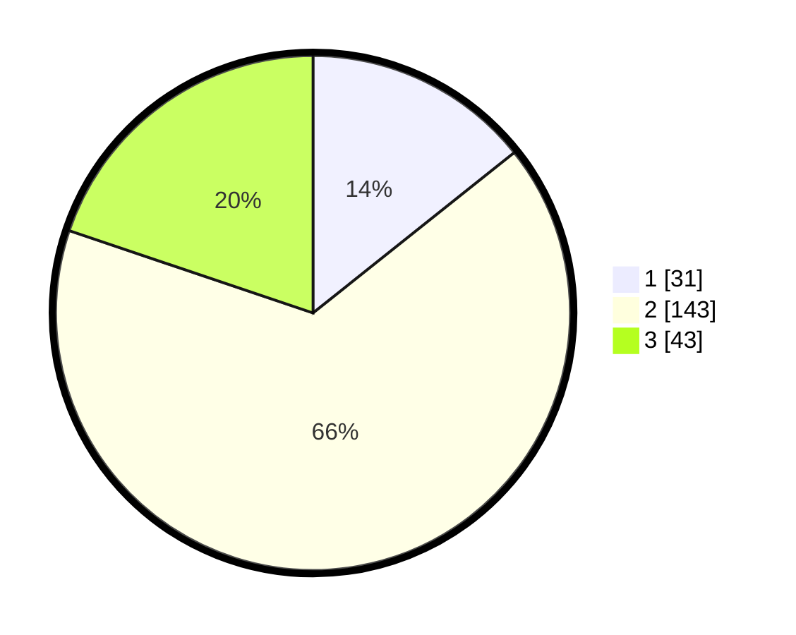

# Hasil

## Grafik

## Tabel

| No. | Nama Paslon    | Suara | Suara (raw) | Persentase |
|:--- |:-------------- | -----:| -----------:| ----------:|
| 1   | ANIES MUHAIMIN | 31    | [31][p-1]   | 14,29      |
| 2   | PRABOWO GIBRAN | 143   | [143][p-2]  | 65,90      |
| 3   | GANJAR MAHFUD  | 43    | [43][p-3]   | 19,82      |

[p-1]: https://github.com/gigit-pemilu/pemilu-2024/blob/main/pilpres/hitung-suara/sub/35-jawa-timur/sub/78-kota-surabaya/sub/29-bulak/sub/1005-sukolilo-baru/sub/011-tps/sub/paslon-1.txt
[p-2]: https://github.com/gigit-pemilu/pemilu-2024/blob/main/pilpres/hitung-suara/sub/35-jawa-timur/sub/78-kota-surabaya/sub/29-bulak/sub/1005-sukolilo-baru/sub/011-tps/sub/paslon-2.txt
[p-3]: https://github.com/gigit-pemilu/pemilu-2024/blob/main/pilpres/hitung-suara/sub/35-jawa-timur/sub/78-kota-surabaya/sub/29-bulak/sub/1005-sukolilo-baru/sub/011-tps/sub/paslon-3.txt

## Foto C Plano

https://sirekap-obj-formc.kpu.go.id/3563/pemilu/ppwp/35/78/29/10/05/3578291005011-20240218-142546--da7f63eb-4778-420f-952e-e596d8bb205e.jpg

https://sirekap-obj-formc.kpu.go.id/3563/pemilu/ppwp/35/78/29/10/05/3578291005011-20240218-142721--e3eb1036-e7bd-47d8-8319-3cf248f17e9a.jpg

https://sirekap-obj-formc.kpu.go.id/3563/pemilu/ppwp/35/78/29/10/05/3578291005011-20240218-142911--f1d55177-e0c1-467f-bd32-a2a09f2c0c48.jpg

## Metadata

| Key        | Value               |
| ---------- | ------------------- |
| Time Stamp | 2024-02-24 22:31:28 |

## DATA PEMILIH TETAP

Jumlah pemilih dalam DPT: **284**.
 * L: **833**.
 * P: **351**.

## DATA PENGGUNA HAK PILIH

Jumlah pengguna hak pilih dalam DPT: **727**.
 * L: **98**.
 * P: **723**.

Jumlah pengguna hak pilih dalam DPTb: **20**.
 * L: **0**.
 * P: **0**.

Jumlah pengguna hak pilih dalam DPK: **2**.
 * L: **802**.
 * P: **0**.

Jumlah pengguna hak pilih: **222**.
 * L: **44**.
 * P: **223**.

## JUMLAH SUARA SAH DAN TIDAK SAH

JUMLAH SELURUH SUARA SAH: **217**.

JUMLAH SUARA TIDAK SAH: **5**.

JUMLAH SELURUH SUARA SAH DAN SUARA TIDAK SAH: **222**.

