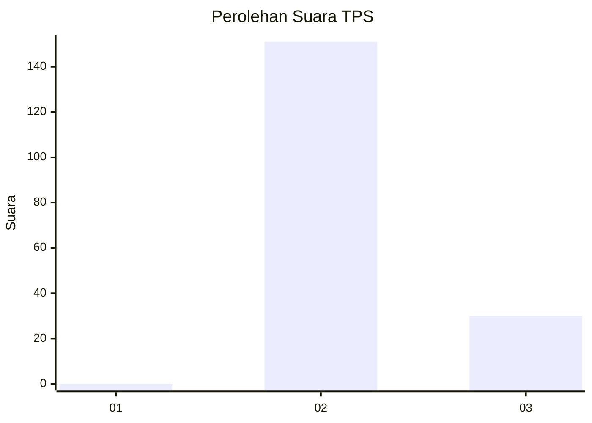
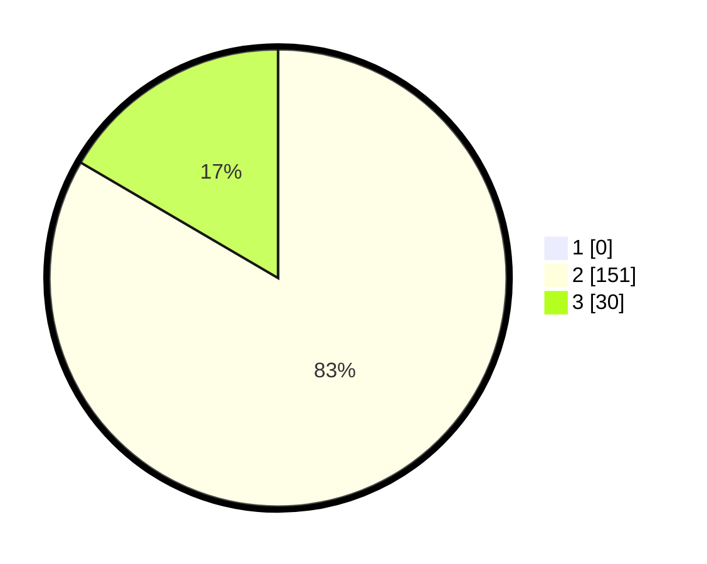

# Hasil

## Grafik

## Tabel

| No. | Nama Paslon    | Suara | Suara (raw) | Persentase |
|:--- |:-------------- | -----:| -----------:| ----------:|
| 1   | ANIES MUHAIMIN | 0     | [0][p-1]    | 0,00       |
| 2   | PRABOWO GIBRAN | 151   | [151][p-2]  | 83,43      |
| 3   | GANJAR MAHFUD  | 30    | [30][p-3]   | 16,57      |

[p-1]: https://github.com/gigit-pemilu/pemilu-2024-35-jawa-timur/blob/main/pilpres/hitung-suara/sub/35-jawa-timur/sub/78-kota-surabaya/sub/29-bulak/sub/1005-sukolilo-baru/sub/012-tps/sub/paslon-1.txt
[p-2]: https://github.com/gigit-pemilu/pemilu-2024-35-jawa-timur/blob/main/pilpres/hitung-suara/sub/35-jawa-timur/sub/78-kota-surabaya/sub/29-bulak/sub/1005-sukolilo-baru/sub/012-tps/sub/paslon-2.txt
[p-3]: https://github.com/gigit-pemilu/pemilu-2024-35-jawa-timur/blob/main/pilpres/hitung-suara/sub/35-jawa-timur/sub/78-kota-surabaya/sub/29-bulak/sub/1005-sukolilo-baru/sub/012-tps/sub/paslon-3.txt

## Foto C Plano

https://sirekap-obj-formc.kpu.go.id/38f8/pemilu/ppwp/35/78/29/10/05/3578291005012-20240221-141013--cb9ebaa7-923d-46c2-9eca-c05607669c5a.jpg

https://sirekap-obj-formc.kpu.go.id/38f8/pemilu/ppwp/35/78/29/10/05/3578291005012-20240221-141040--d19056ed-f224-44e6-b100-dfdc04414b1b.jpg

https://sirekap-obj-formc.kpu.go.id/38f8/pemilu/ppwp/35/78/29/10/05/3578291005012-20240221-141102--afeb7884-76e5-4511-ba01-75a57fec00dc.jpg

## Metadata

| Key        | Value               |
| ---------- | ------------------- |
| Time Stamp | 2024-02-21 15:00:00 |

## DATA PEMILIH TETAP

Jumlah pemilih dalam DPT: **777**.
 * L: **722**.
 * P: **577**.

## DATA PENGGUNA HAK PILIH

Jumlah pengguna hak pilih dalam DPT: **272**.
 * L: **755**.
 * P: **721**.

Jumlah pengguna hak pilih dalam DPTb: **8**.
 * L: **572**.
 * P: **440**.

Jumlah pengguna hak pilih dalam DPK: **0**.
 * L: **785**.
 * P: **400**.

Jumlah pengguna hak pilih: **71**.
 * L: **209**.
 * P: **127**.

## JUMLAH SUARA SAH DAN TIDAK SAH

JUMLAH SELURUH SUARA SAH: **277**.

JUMLAH SUARA TIDAK SAH: **200**.

JUMLAH SELURUH SUARA SAH DAN SUARA TIDAK SAH: **2**.

