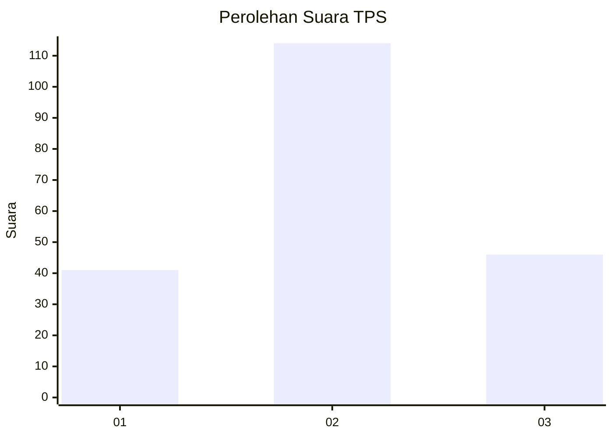
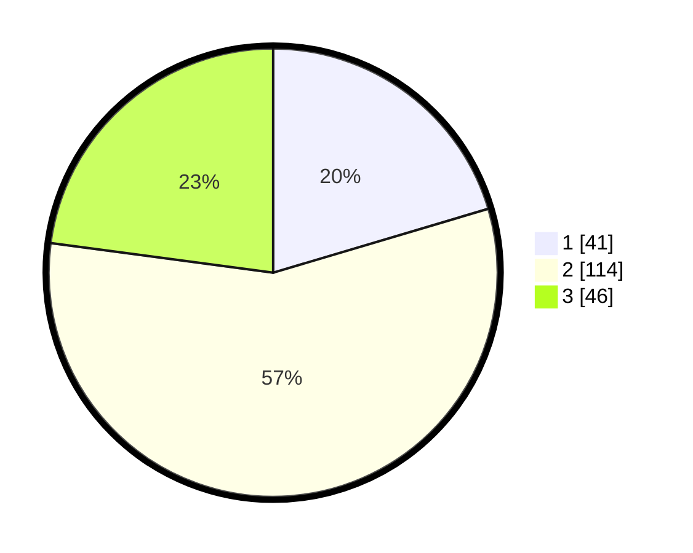

# Hasil

## Grafik

## Tabel

| No. | Nama Paslon    | Suara | Suara (raw) | Persentase |
|:--- |:-------------- | -----:| -----------:| ----------:|
| 1   | ANIES MUHAIMIN | 41    | [41][p-1]   | 20,40      |
| 2   | PRABOWO GIBRAN | 114   | [114][p-2]  | 56,72      |
| 3   | GANJAR MAHFUD  | 46    | [46][p-3]   | 22,89      |

[p-1]: https://github.com/gigit-pemilu/pemilu-2024-35-jawa-timur/blob/main/pilpres/hitung-suara/sub/35-jawa-timur/sub/78-kota-surabaya/sub/29-bulak/sub/1005-sukolilo-baru/sub/019-tps/sub/paslon-1.txt
[p-2]: https://github.com/gigit-pemilu/pemilu-2024-35-jawa-timur/blob/main/pilpres/hitung-suara/sub/35-jawa-timur/sub/78-kota-surabaya/sub/29-bulak/sub/1005-sukolilo-baru/sub/019-tps/sub/paslon-2.txt
[p-3]: https://github.com/gigit-pemilu/pemilu-2024-35-jawa-timur/blob/main/pilpres/hitung-suara/sub/35-jawa-timur/sub/78-kota-surabaya/sub/29-bulak/sub/1005-sukolilo-baru/sub/019-tps/sub/paslon-3.txt

## Foto C Plano

https://sirekap-obj-formc.kpu.go.id/84c2/pemilu/ppwp/35/78/29/10/05/3578291005019-20240221-141245--1f11c047-09a6-45d9-adbd-ad8499ce8a3a.jpg

https://sirekap-obj-formc.kpu.go.id/84c2/pemilu/ppwp/35/78/29/10/05/3578291005019-20240221-141410--f0895ee9-b14f-4836-a9ca-78395cbf0e0e.jpg

https://sirekap-obj-formc.kpu.go.id/84c2/pemilu/ppwp/35/78/29/10/05/3578291005019-20240221-141513--c1af8216-7ccc-4cfd-b65e-4072ae689d2d.jpg

## Metadata

| Key        | Value               |
| ---------- | ------------------- |
| Time Stamp | 2024-02-21 15:00:00 |

## DATA PEMILIH TETAP

Jumlah pemilih dalam DPT: **271**.
 * L: **110**.
 * P: **861**.

## DATA PENGGUNA HAK PILIH

Jumlah pengguna hak pilih dalam DPT: **198**.
 * L: **72**.
 * P: **126**.

Jumlah pengguna hak pilih dalam DPTb: **8**.
 * L: **8**.
 * P: **3**.

Jumlah pengguna hak pilih dalam DPK: **902**.
 * L: **408**.
 * P: **4**.

Jumlah pengguna hak pilih: **208**.
 * L: **78**.
 * P: **130**.

## JUMLAH SUARA SAH DAN TIDAK SAH

JUMLAH SELURUH SUARA SAH: **205**.

JUMLAH SUARA TIDAK SAH: **3**.

JUMLAH SELURUH SUARA SAH DAN SUARA TIDAK SAH: **208**.

