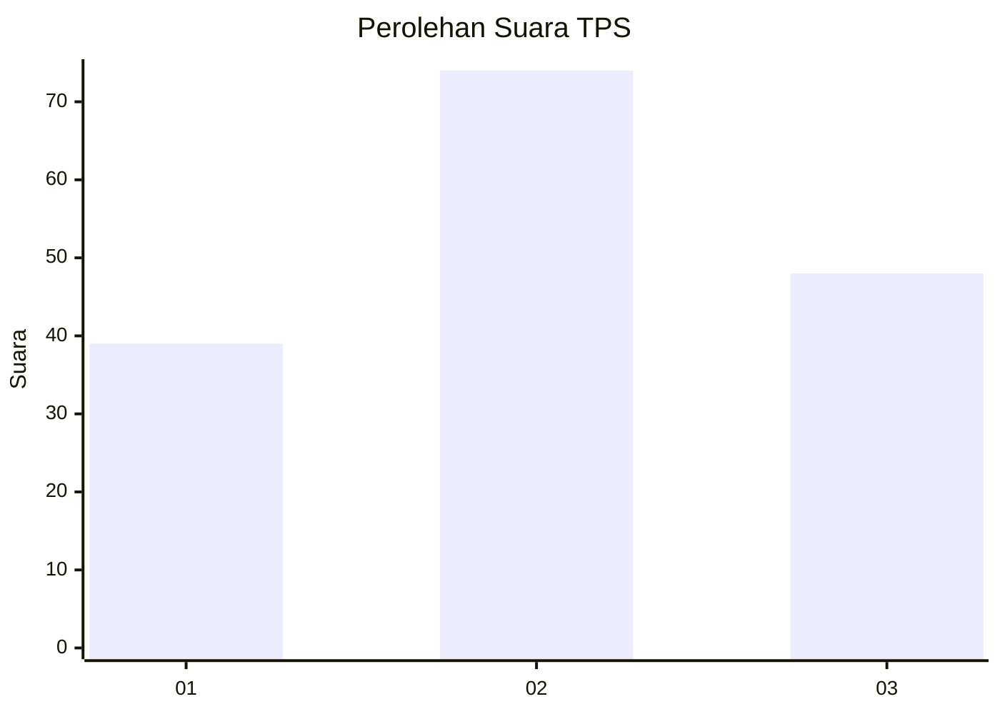
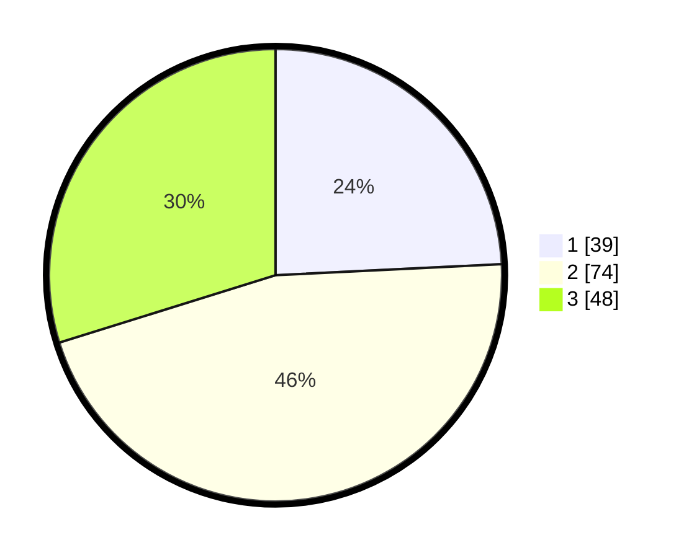

# Hasil

## Grafik

## Tabel

| No. | Nama Paslon    | Suara | Suara (raw) | Persentase |
|:--- |:-------------- | -----:| -----------:| ----------:|
| 1   | ANIES MUHAIMIN | 39    | [39][p-1]   | 24,22      |
| 2   | PRABOWO GIBRAN | 74    | [74][p-2]   | 45,96      |
| 3   | GANJAR MAHFUD  | 48    | [48][p-3]   | 29,81      |

[p-1]: https://github.com/gigit-pemilu/pemilu-2024/blob/main/pilpres/hitung-suara/sub/35-jawa-timur/sub/78-kota-surabaya/sub/29-bulak/sub/1005-sukolilo-baru/sub/026-tps/sub/paslon-1.txt
[p-2]: https://github.com/gigit-pemilu/pemilu-2024/blob/main/pilpres/hitung-suara/sub/35-jawa-timur/sub/78-kota-surabaya/sub/29-bulak/sub/1005-sukolilo-baru/sub/026-tps/sub/paslon-2.txt
[p-3]: https://github.com/gigit-pemilu/pemilu-2024/blob/main/pilpres/hitung-suara/sub/35-jawa-timur/sub/78-kota-surabaya/sub/29-bulak/sub/1005-sukolilo-baru/sub/026-tps/sub/paslon-3.txt

## Foto C Plano

https://sirekap-obj-formc.kpu.go.id/a5b0/pemilu/ppwp/35/78/29/10/05/3578291005026-20240214-155615--dcb747c2-4af8-467d-a62b-2dbf2103fa91.jpg

https://sirekap-obj-formc.kpu.go.id/a5b0/pemilu/ppwp/35/78/29/10/05/3578291005026-20240214-155716--65cb6ec0-034c-4ff7-be12-d2481ee2475e.jpg

https://sirekap-obj-formc.kpu.go.id/a5b0/pemilu/ppwp/35/78/29/10/05/3578291005026-20240214-155811--d27bb97d-ecf2-4919-809a-c256e16bab05.jpg

## Metadata

| Key        | Value               |
| ---------- | ------------------- |
| Time Stamp | 2024-02-25 15:00:00 |

