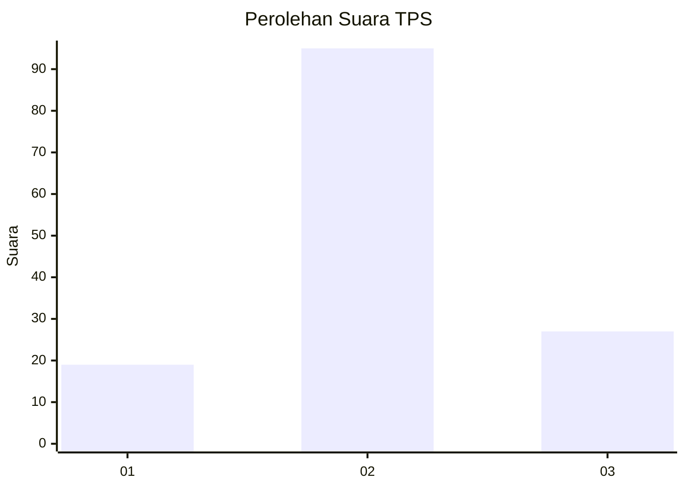
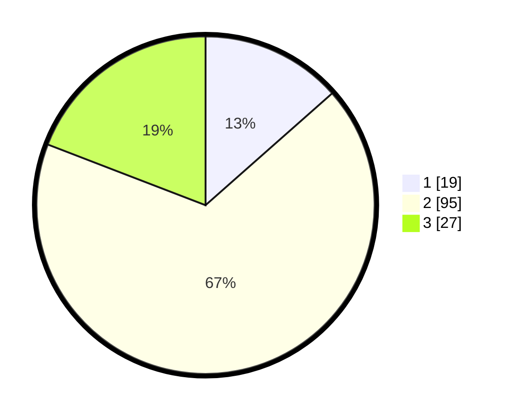

# Hasil

## Grafik

## Tabel

| No. | Nama Paslon    | Suara | Suara (raw) | Persentase |
|:--- |:-------------- | -----:| -----------:| ----------:|
| 1   | ANIES MUHAIMIN | 19    | [19][p-1]   | 13,48      |
| 2   | PRABOWO GIBRAN | 95    | [95][p-2]   | 67,38      |
| 3   | GANJAR MAHFUD  | 27    | [27][p-3]   | 19,15      |

[p-1]: https://github.com/gigit-pemilu/pemilu-2024-35-jawa-timur/blob/main/pilpres/hitung-suara/sub/35-jawa-timur/sub/78-kota-surabaya/sub/30-pakal/sub/1004-sumber-rejo/sub/027-tps/sub/paslon-1.txt
[p-2]: https://github.com/gigit-pemilu/pemilu-2024-35-jawa-timur/blob/main/pilpres/hitung-suara/sub/35-jawa-timur/sub/78-kota-surabaya/sub/30-pakal/sub/1004-sumber-rejo/sub/027-tps/sub/paslon-2.txt
[p-3]: https://github.com/gigit-pemilu/pemilu-2024-35-jawa-timur/blob/main/pilpres/hitung-suara/sub/35-jawa-timur/sub/78-kota-surabaya/sub/30-pakal/sub/1004-sumber-rejo/sub/027-tps/sub/paslon-3.txt

## Foto C Plano

https://sirekap-obj-formc.kpu.go.id/9945/pemilu/ppwp/35/78/30/10/04/3578301004027-20240214-222306--f3c7dece-e917-441d-abbb-61aba4f8c4c2.jpg

https://sirekap-obj-formc.kpu.go.id/9945/pemilu/ppwp/35/78/30/10/04/3578301004027-20240214-222432--9dd85828-2d87-4225-8798-881688d2735b.jpg

https://sirekap-obj-formc.kpu.go.id/9945/pemilu/ppwp/35/78/30/10/04/3578301004027-20240214-222715--2bd34da5-5c6f-4c64-b19e-183774d17e70.jpg

## Metadata

| Key        | Value               |
| ---------- | ------------------- |
| Time Stamp | 2024-02-24 22:31:28 |

