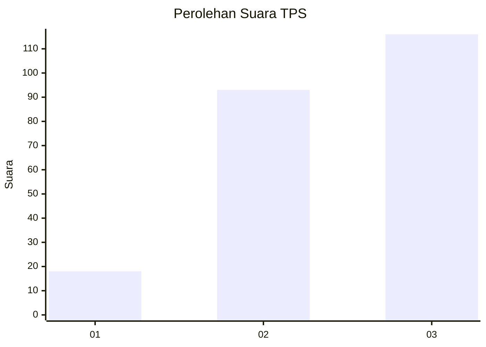
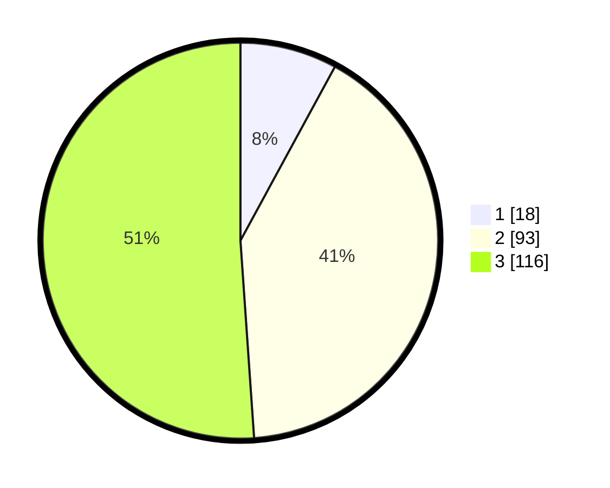

# Hasil

## Grafik

## Tabel

| No. | Nama Paslon    | Suara | Suara (raw) | Persentase |
|:--- |:-------------- | -----:| -----------:| ----------:|
| 1   | ANIES MUHAIMIN | 18    | [18][p-1]   | 7,93       |
| 2   | PRABOWO GIBRAN | 93    | [93][p-2]   | 40,97      |
| 3   | GANJAR MAHFUD  | 116   | [116][p-3]  | 51,10      |

[p-1]: https://github.com/gigit-pemilu/pemilu-2024/blob/main/pilpres/hitung-suara/sub/35-jawa-timur/sub/78-kota-surabaya/sub/31-sambikerep/sub/1001-sambikerep/sub/056-tps/sub/paslon-1.txt
[p-2]: https://github.com/gigit-pemilu/pemilu-2024/blob/main/pilpres/hitung-suara/sub/35-jawa-timur/sub/78-kota-surabaya/sub/31-sambikerep/sub/1001-sambikerep/sub/056-tps/sub/paslon-2.txt
[p-3]: https://github.com/gigit-pemilu/pemilu-2024/blob/main/pilpres/hitung-suara/sub/35-jawa-timur/sub/78-kota-surabaya/sub/31-sambikerep/sub/1001-sambikerep/sub/056-tps/sub/paslon-3.txt

## Foto C Plano

https://sirekap-obj-formc.kpu.go.id/0be5/pemilu/ppwp/35/78/31/10/01/3578311001056-20240214-212307--7ee05615-040c-4b92-be2e-7e9d908e6b63.jpg

https://sirekap-obj-formc.kpu.go.id/0be5/pemilu/ppwp/35/78/31/10/01/3578311001056-20240214-212521--0e646f4d-f2ac-400d-a2de-818ff35fcfe9.jpg

https://sirekap-obj-formc.kpu.go.id/0be5/pemilu/ppwp/35/78/31/10/01/3578311001056-20240214-212507--27b03fc5-c968-49c7-8ecb-ca51fc55f960.jpg

## Metadata

| Key        | Value               |
| ---------- | ------------------- |
| Time Stamp | 2024-02-25 13:00:00 |

