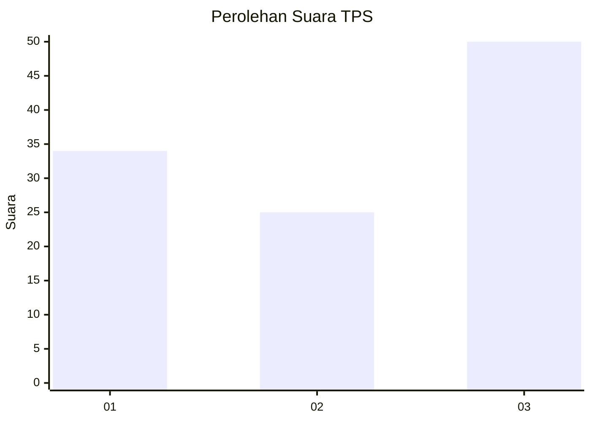
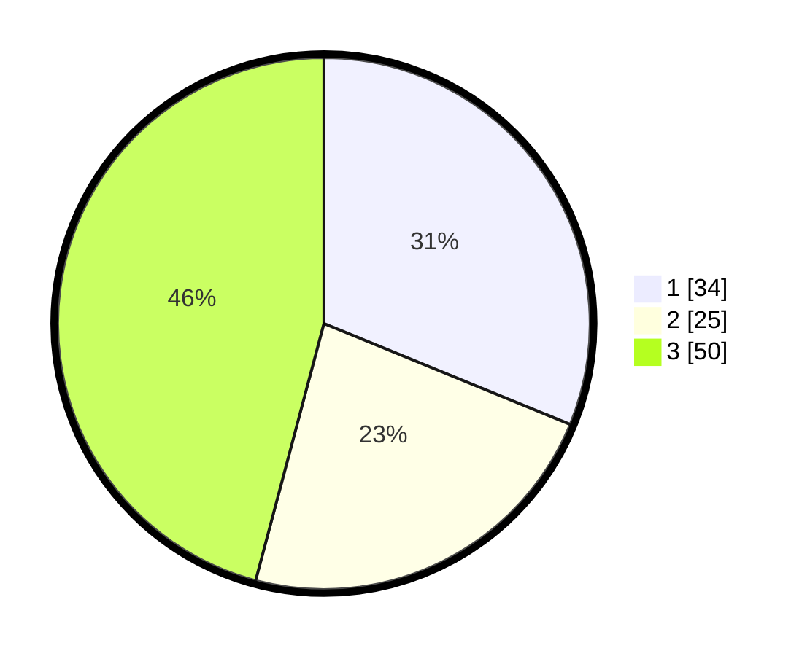

# Hasil

## Grafik

## Tabel

| No. | Nama Paslon    | Suara | Suara (raw) | Persentase |
|:--- |:-------------- | -----:| -----------:| ----------:|
| 1   | ANIES MUHAIMIN | 34    | [34][p-1]   | 31,19      |
| 2   | PRABOWO GIBRAN | 25    | [25][p-2]   | 22,94      |
| 3   | GANJAR MAHFUD  | 50    | [50][p-3]   | 45,87      |

[p-1]: https://github.com/gigit-pemilu/pemilu-2024-35-jawa-timur/blob/main/pilpres/hitung-suara/sub/35-jawa-timur/sub/78-kota-surabaya/sub/31-sambikerep/sub/1004-lontar/sub/017-tps/sub/paslon-1.txt
[p-2]: https://github.com/gigit-pemilu/pemilu-2024-35-jawa-timur/blob/main/pilpres/hitung-suara/sub/35-jawa-timur/sub/78-kota-surabaya/sub/31-sambikerep/sub/1004-lontar/sub/017-tps/sub/paslon-2.txt
[p-3]: https://github.com/gigit-pemilu/pemilu-2024-35-jawa-timur/blob/main/pilpres/hitung-suara/sub/35-jawa-timur/sub/78-kota-surabaya/sub/31-sambikerep/sub/1004-lontar/sub/017-tps/sub/paslon-3.txt

## Foto C Plano

https://sirekap-obj-formc.kpu.go.id/72ab/pemilu/ppwp/35/78/31/10/04/3578311004017-20240220-202332--b2892c5e-93a2-424b-a4d1-78b34f9d39ca.jpg

https://sirekap-obj-formc.kpu.go.id/72ab/pemilu/ppwp/35/78/31/10/04/3578311004017-20240220-202808--bf03f4f7-11d5-4743-805d-b545b6d59151.jpg

https://sirekap-obj-formc.kpu.go.id/72ab/pemilu/ppwp/35/78/31/10/04/3578311004017-20240220-203201--13d965fc-291f-43d7-97c9-44a7fcb121a0.jpg

## Metadata

| Key        | Value               |
| ---------- | ------------------- |
| Time Stamp | 2024-02-20 21:00:00 |

## DATA PEMILIH TETAP

Jumlah pemilih dalam DPT: **262**.
 * L: **478**.
 * P: **454**.

## DATA PENGGUNA HAK PILIH

Jumlah pengguna hak pilih dalam DPT: **204**.
 * L: **896**.
 * P: **498**.

Jumlah pengguna hak pilih dalam DPTb: **6**.
 * L: **884**.
 * P: **84**.

Jumlah pengguna hak pilih dalam DPK: **400**.
 * L: **88**.
 * P: **808**.

Jumlah pengguna hak pilih: **205**.
 * L: **497**.
 * P: **404**.

## JUMLAH SUARA SAH DAN TIDAK SAH

JUMLAH SELURUH SUARA SAH: **201**.

JUMLAH SUARA TIDAK SAH: **4**.

JUMLAH SELURUH SUARA SAH DAN SUARA TIDAK SAH: **205**.

