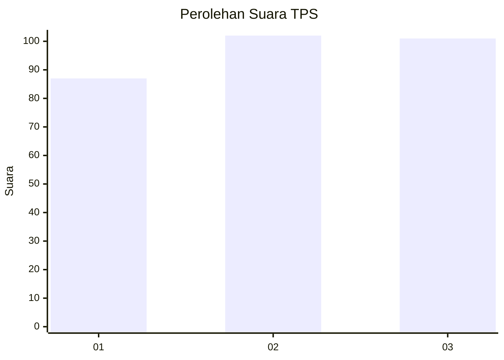
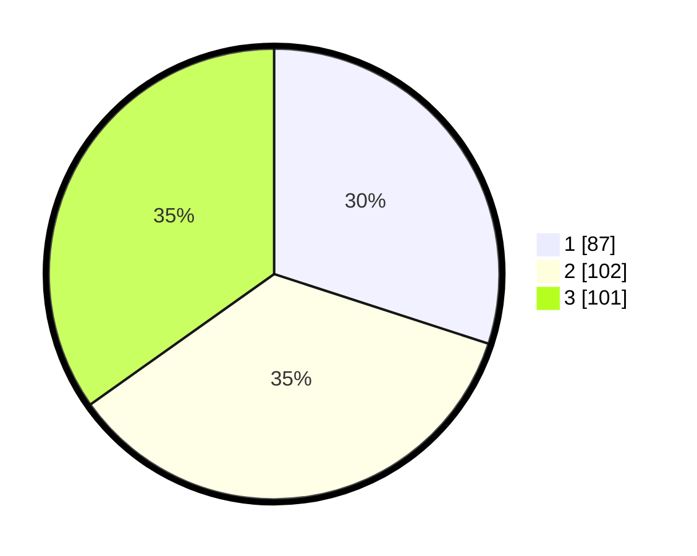

# Hasil

## Grafik

## Tabel

| No. | Nama Paslon    | Suara | Suara (raw) | Persentase |
|:--- |:-------------- | -----:| -----------:| ----------:|
| 1   | ANIES MUHAIMIN | 87    | [87][p-1]   | 30,00      |
| 2   | PRABOWO GIBRAN | 102   | [102][p-2]  | 35,17      |
| 3   | GANJAR MAHFUD  | 101   | [101][p-3]  | 34,83      |

[p-1]: https://github.com/gigit-pemilu/pemilu-2024/blob/main/pilpres/hitung-suara/sub/35-jawa-timur/sub/78-kota-surabaya/sub/31-sambikerep/sub/1004-lontar/sub/082-tps/sub/paslon-1.txt
[p-2]: https://github.com/gigit-pemilu/pemilu-2024/blob/main/pilpres/hitung-suara/sub/35-jawa-timur/sub/78-kota-surabaya/sub/31-sambikerep/sub/1004-lontar/sub/082-tps/sub/paslon-2.txt
[p-3]: https://github.com/gigit-pemilu/pemilu-2024/blob/main/pilpres/hitung-suara/sub/35-jawa-timur/sub/78-kota-surabaya/sub/31-sambikerep/sub/1004-lontar/sub/082-tps/sub/paslon-3.txt

## Foto C Plano

https://sirekap-obj-formc.kpu.go.id/6319/pemilu/ppwp/35/78/31/10/04/3578311004082-20240220-223658--5c2e9f17-4809-4dfa-9e3a-2e5b1abcb09d.jpg

https://sirekap-obj-formc.kpu.go.id/6319/pemilu/ppwp/35/78/31/10/04/3578311004082-20240220-224610--426e42bf-6580-41a4-82e6-ee65098f3af2.jpg

https://sirekap-obj-formc.kpu.go.id/6319/pemilu/ppwp/35/78/31/10/04/3578311004082-20240220-224614--9fa956ae-b172-4989-8a5f-8067df5f9980.jpg

## Metadata

| Key        | Value               |
| ---------- | ------------------- |
| Time Stamp | 2024-02-20 23:00:00 |

## DATA PEMILIH TETAP

Jumlah pemilih dalam DPT: **293**.
 * L: **142**.
 * P: **151**.

## DATA PENGGUNA HAK PILIH

Jumlah pengguna hak pilih dalam DPT: **192**.
 * L: **896**.
 * P: **896**.

Jumlah pengguna hak pilih dalam DPTb: **810**.
 * L: **886**.
 * P: **884**.

Jumlah pengguna hak pilih dalam DPK: **812**.
 * L: **884**.
 * P: **848**.

Jumlah pengguna hak pilih: **214**.
 * L: **106**.
 * P: **108**.

## JUMLAH SUARA SAH DAN TIDAK SAH

JUMLAH SELURUH SUARA SAH: **211**.

JUMLAH SUARA TIDAK SAH: **883**.

JUMLAH SELURUH SUARA SAH DAN SUARA TIDAK SAH: **214**.

