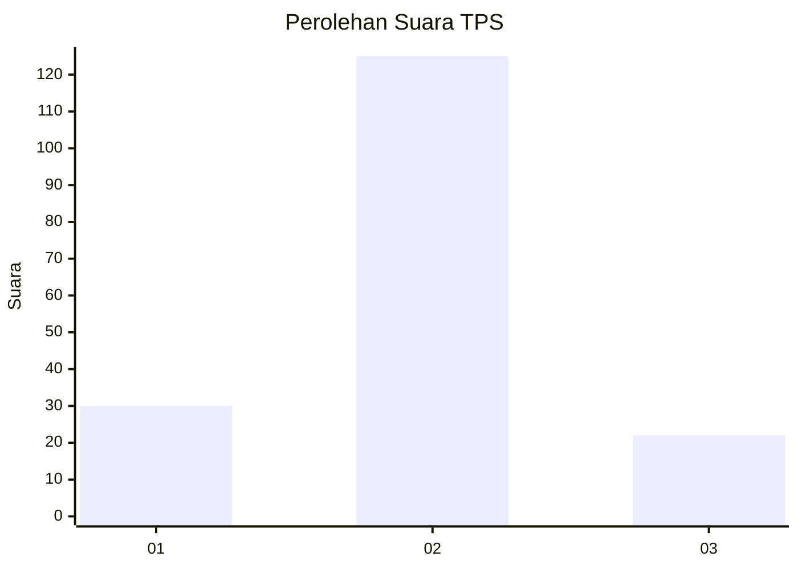
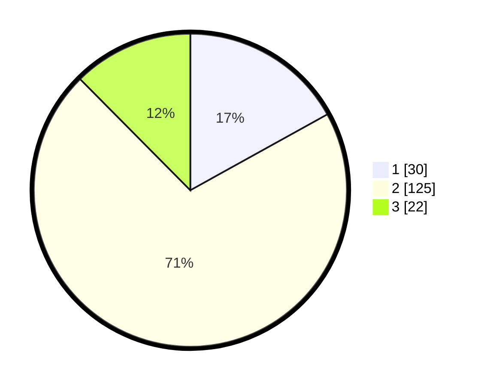

# Hasil

## Grafik

## Tabel

| No. | Nama Paslon    | Suara | Suara (raw) | Persentase |
|:--- |:-------------- | -----:| -----------:| ----------:|
| 1   | ANIES MUHAIMIN | 30    | [30][p-1]   | 16,95      |
| 2   | PRABOWO GIBRAN | 125   | [125][p-2]  | 70,62      |
| 3   | GANJAR MAHFUD  | 22    | [22][p-3]   | 12,43      |

[p-1]: https://github.com/gigit-pemilu/pemilu-2024/blob/main/pilpres/hitung-suara/sub/35-jawa-timur/sub/79-kota-batu/sub/01-batu/sub/1001-temas/sub/001-tps/sub/paslon-1.txt
[p-2]: https://github.com/gigit-pemilu/pemilu-2024/blob/main/pilpres/hitung-suara/sub/35-jawa-timur/sub/79-kota-batu/sub/01-batu/sub/1001-temas/sub/001-tps/sub/paslon-2.txt
[p-3]: https://github.com/gigit-pemilu/pemilu-2024/blob/main/pilpres/hitung-suara/sub/35-jawa-timur/sub/79-kota-batu/sub/01-batu/sub/1001-temas/sub/001-tps/sub/paslon-3.txt

## Foto C Plano

https://sirekap-obj-formc.kpu.go.id/298d/pemilu/ppwp/35/79/01/10/01/3579011001001-20240217-202252--541a8c87-7b91-4aa4-962c-f916a62f3fcf.jpg

https://sirekap-obj-formc.kpu.go.id/298d/pemilu/ppwp/35/79/01/10/01/3579011001001-20240217-202308--18420bee-ef64-4e13-b015-c93b213e1197.jpg

https://sirekap-obj-formc.kpu.go.id/298d/pemilu/ppwp/35/79/01/10/01/3579011001001-20240217-202352--46ee480a-17af-49b8-a678-3b98881f892f.jpg

## Metadata

| Key        | Value               |
| ---------- | ------------------- |
| Time Stamp | 2024-02-19 06:16:00 |

