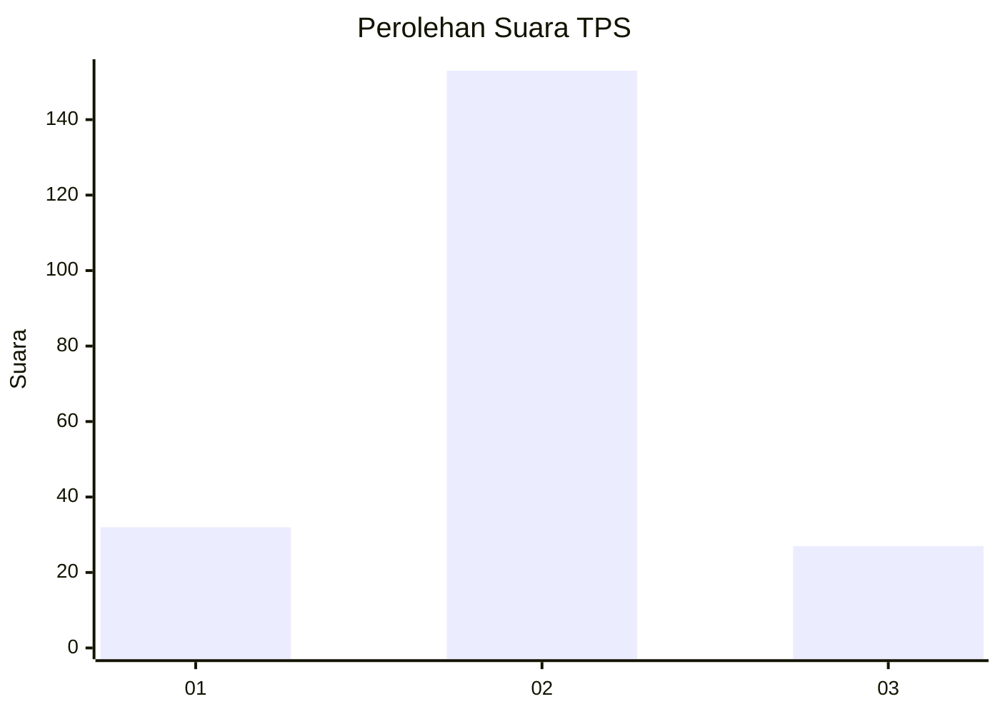
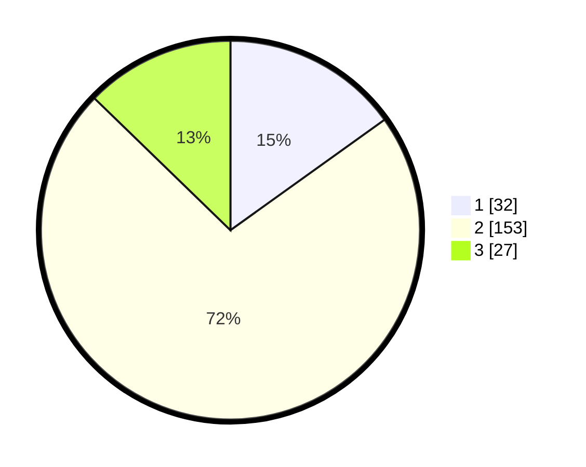

# Hasil

## Grafik

## Tabel

| No. | Nama Paslon    | Suara | Suara (raw) | Persentase |
|:--- |:-------------- | -----:| -----------:| ----------:|
| 1   | ANIES MUHAIMIN | 32    | [32][p-1]   | 15,09      |
| 2   | PRABOWO GIBRAN | 153   | [153][p-2]  | 72,17      |
| 3   | GANJAR MAHFUD  | 27    | [27][p-3]   | 12,74      |

[p-1]: https://github.com/gigit-pemilu/pemilu-2024/blob/main/pilpres/hitung-suara/sub/35-jawa-timur/sub/79-kota-batu/sub/01-batu/sub/1001-temas/sub/002-tps/sub/paslon-1.txt
[p-2]: https://github.com/gigit-pemilu/pemilu-2024/blob/main/pilpres/hitung-suara/sub/35-jawa-timur/sub/79-kota-batu/sub/01-batu/sub/1001-temas/sub/002-tps/sub/paslon-2.txt
[p-3]: https://github.com/gigit-pemilu/pemilu-2024/blob/main/pilpres/hitung-suara/sub/35-jawa-timur/sub/79-kota-batu/sub/01-batu/sub/1001-temas/sub/002-tps/sub/paslon-3.txt

## Foto C Plano

https://sirekap-obj-formc.kpu.go.id/57a6/pemilu/ppwp/35/79/01/10/01/3579011001002-20240217-194203--2849b002-7f85-4cf6-a3f2-6343f188ca83.jpg

https://sirekap-obj-formc.kpu.go.id/57a6/pemilu/ppwp/35/79/01/10/01/3579011001002-20240217-194233--c378a9ea-faef-4f6a-95e9-7d12d145f2e8.jpg

https://sirekap-obj-formc.kpu.go.id/57a6/pemilu/ppwp/35/79/01/10/01/3579011001002-20240217-194304--3839c30d-962b-4c87-9a9b-0fc4cf3e174e.jpg

## Metadata

| Key        | Value               |
| ---------- | ------------------- |
| Time Stamp | 2024-02-19 06:16:00 |

