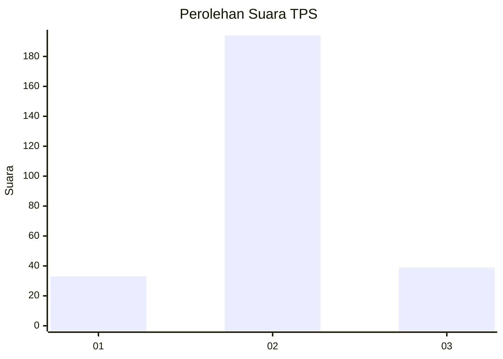
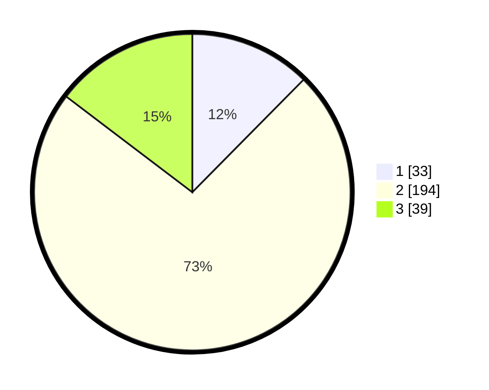

# Hasil

## Grafik

## Tabel

| No. | Nama Paslon    | Suara | Suara (raw) | Persentase |
|:--- |:-------------- | -----:| -----------:| ----------:|
| 1   | ANIES MUHAIMIN | 33    | [33][p-1]   | 12,41      |
| 2   | PRABOWO GIBRAN | 194   | [194][p-2]  | 72,93      |
| 3   | GANJAR MAHFUD  | 39    | [39][p-3]   | 14,66      |

[p-1]: https://github.com/gigit-pemilu/pemilu-2024/blob/main/pilpres/hitung-suara/sub/35-jawa-timur/sub/79-kota-batu/sub/01-batu/sub/1001-temas/sub/018-tps/sub/paslon-1.txt
[p-2]: https://github.com/gigit-pemilu/pemilu-2024/blob/main/pilpres/hitung-suara/sub/35-jawa-timur/sub/79-kota-batu/sub/01-batu/sub/1001-temas/sub/018-tps/sub/paslon-2.txt
[p-3]: https://github.com/gigit-pemilu/pemilu-2024/blob/main/pilpres/hitung-suara/sub/35-jawa-timur/sub/79-kota-batu/sub/01-batu/sub/1001-temas/sub/018-tps/sub/paslon-3.txt

## Foto C Plano

https://sirekap-obj-formc.kpu.go.id/d49e/pemilu/ppwp/35/79/01/10/01/3579011001018-20240218-153101--528bc935-ba3a-45db-9f30-9f852fb839c7.jpg

https://sirekap-obj-formc.kpu.go.id/d49e/pemilu/ppwp/35/79/01/10/01/3579011001018-20240218-153144--dbd2cdfc-ab6a-4174-b26c-da018eb53a93.jpg

https://sirekap-obj-formc.kpu.go.id/d49e/pemilu/ppwp/35/79/01/10/01/3579011001018-20240218-153214--927036c5-35f3-4c5b-91fd-7f60ba9621a6.jpg

## Metadata

| Key        | Value               |
| ---------- | ------------------- |
| Time Stamp | 2024-02-19 06:16:00 |

