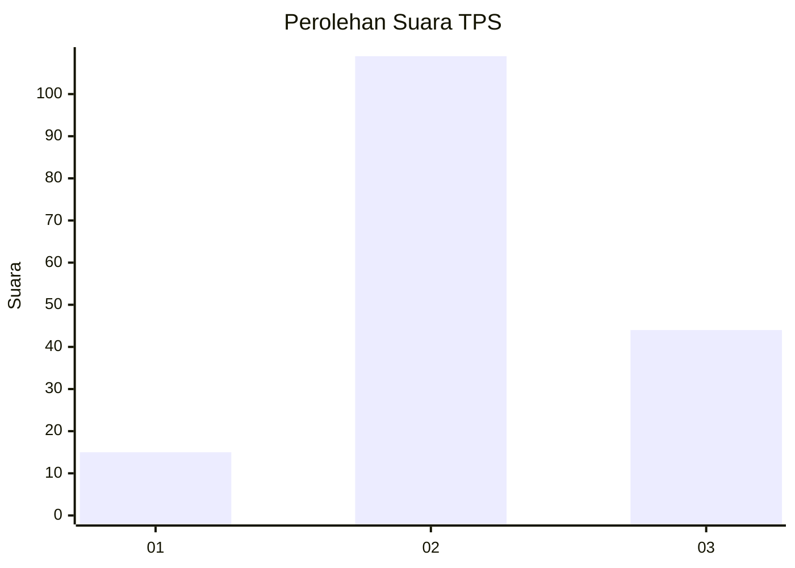
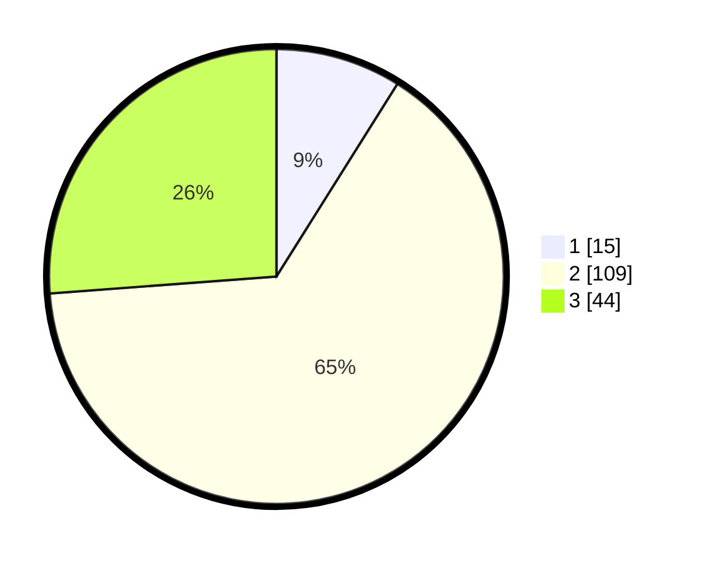

# Hasil

## Grafik

## Tabel

| No. | Nama Paslon    | Suara | Suara (raw) | Persentase |
|:--- |:-------------- | -----:| -----------:| ----------:|
| 1   | ANIES MUHAIMIN | 15    | [15][p-1]   | 8,93       |
| 2   | PRABOWO GIBRAN | 109   | [109][p-2]  | 64,88      |
| 3   | GANJAR MAHFUD  | 44    | [44][p-3]   | 26,19      |

[p-1]: https://github.com/gigit-pemilu/pemilu-2024/blob/main/pilpres/hitung-suara/sub/35-jawa-timur/sub/79-kota-batu/sub/01-batu/sub/1001-temas/sub/038-tps/sub/paslon-1.txt
[p-2]: https://github.com/gigit-pemilu/pemilu-2024/blob/main/pilpres/hitung-suara/sub/35-jawa-timur/sub/79-kota-batu/sub/01-batu/sub/1001-temas/sub/038-tps/sub/paslon-2.txt
[p-3]: https://github.com/gigit-pemilu/pemilu-2024/blob/main/pilpres/hitung-suara/sub/35-jawa-timur/sub/79-kota-batu/sub/01-batu/sub/1001-temas/sub/038-tps/sub/paslon-3.txt

## Foto C Plano

https://sirekap-obj-formc.kpu.go.id/8ac0/pemilu/ppwp/35/79/01/10/01/3579011001038-20240219-224928--8c7e4902-9e3a-4c7a-9419-5362d1b309eb.jpg

https://sirekap-obj-formc.kpu.go.id/8ac0/pemilu/ppwp/35/79/01/10/01/3579011001038-20240219-224717--ecf6e770-efc9-482a-a768-d342591f6796.jpg

https://sirekap-obj-formc.kpu.go.id/8ac0/pemilu/ppwp/35/79/01/10/01/3579011001038-20240219-224852--e69a60f9-2a4d-4cbb-b6b3-f233a1bc477c.jpg

## Metadata

| Key        | Value               |
| ---------- | ------------------- |
| Time Stamp | 2024-02-24 22:31:28 |

