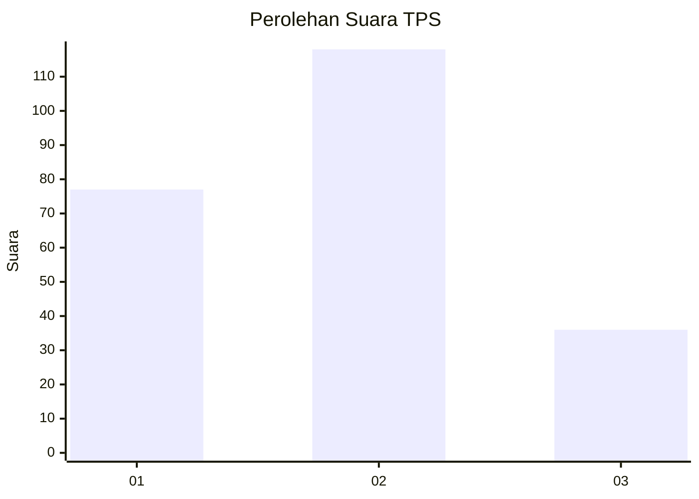
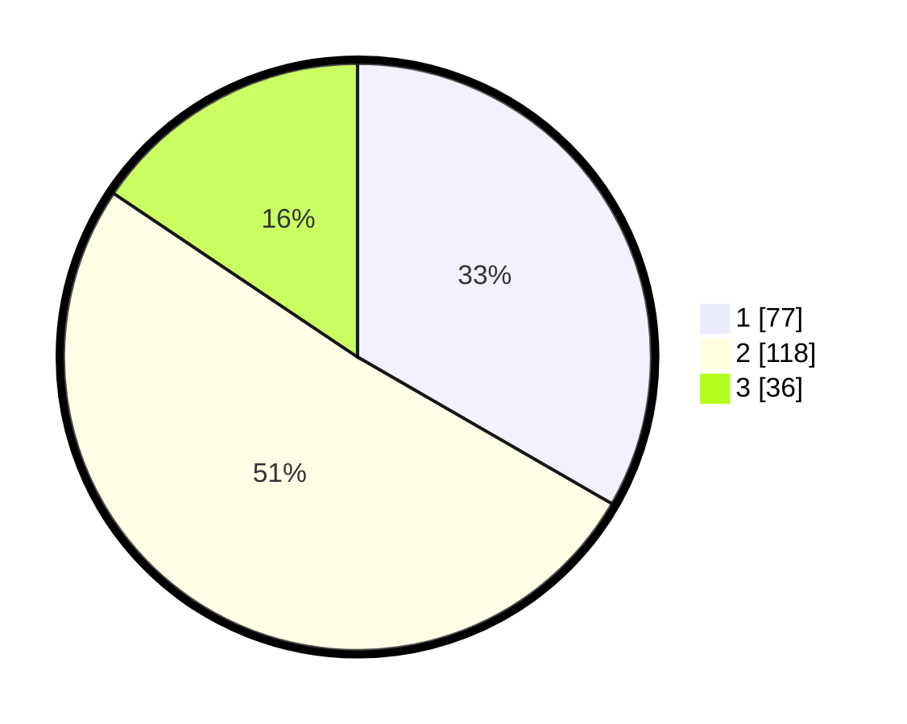

# Hasil

## Grafik

## Tabel

| No. | Nama Paslon    | Suara | Suara (raw) | Persentase |
|:--- |:-------------- | -----:| -----------:| ----------:|
| 1   | ANIES MUHAIMIN | 77    | [77][p-1]   | 33,33      |
| 2   | PRABOWO GIBRAN | 118   | [118][p-2]  | 51,08      |
| 3   | GANJAR MAHFUD  | 36    | [36][p-3]   | 15,58      |

[p-1]: https://github.com/gigit-pemilu/pemilu-2024/blob/main/pilpres/hitung-suara/sub/35-jawa-timur/sub/79-kota-batu/sub/01-batu/sub/1002-ngaglik/sub/003-tps/sub/paslon-1.txt
[p-2]: https://github.com/gigit-pemilu/pemilu-2024/blob/main/pilpres/hitung-suara/sub/35-jawa-timur/sub/79-kota-batu/sub/01-batu/sub/1002-ngaglik/sub/003-tps/sub/paslon-2.txt
[p-3]: https://github.com/gigit-pemilu/pemilu-2024/blob/main/pilpres/hitung-suara/sub/35-jawa-timur/sub/79-kota-batu/sub/01-batu/sub/1002-ngaglik/sub/003-tps/sub/paslon-3.txt

## Foto C Plano

https://sirekap-obj-formc.kpu.go.id/a47d/pemilu/ppwp/35/79/01/10/02/3579011002003-20240220-213925--10252ff3-1ac8-45ff-b127-bac949a1c3d8.jpg

https://sirekap-obj-formc.kpu.go.id/a47d/pemilu/ppwp/35/79/01/10/02/3579011002003-20240220-213953--1eb801df-dec0-4d65-a573-f681d32b274b.jpg

https://sirekap-obj-formc.kpu.go.id/a47d/pemilu/ppwp/35/79/01/10/02/3579011002003-20240220-213846--06c9e9cb-1f08-41a5-8f39-61931879af2a.jpg

## Metadata

| Key        | Value               |
| ---------- | ------------------- |
| Time Stamp | 2024-02-24 22:31:28 |

